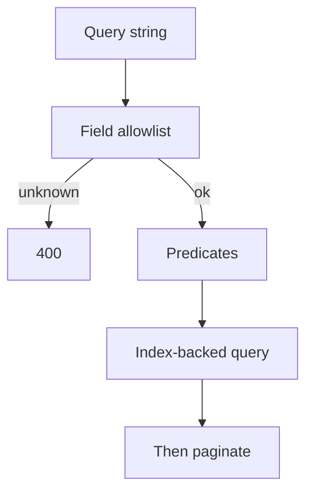

import { ConceptTemplate } from '@/features/kb/components/templates/ConceptTemplate'
import { Callout } from '@/features/kb/components/mdx/Callout'
import { ComparisonTable } from '@/features/kb/components/mdx/ComparisonTable'

export default function Layout({ children }) {
  return (
    <ConceptTemplate title="Filtering">
      {children}
    </ConceptTemplate>
  )
}

**Filtering** lets a client say which subset of a collection it wants: status, date range, owner, free text. The server applies predicates *before* pagination. A list API without filters becomes an export job wearing a GET.

## 1. Deep Dive and Mechanics

**Allowlist fields.** Map query keys to columns or indexes you intend to support. `?status=open&owner=me` is a contract. Do not accept arbitrary SQL fragments.

**Operators.** Equality is the default. Ranges (`created_after`), membership (`status=a,b`), and full-text need explicit syntax. JSON:API, OData, and custom `filter[status]=open` are common dialects.

**Index alignment.** A filter that cannot use an index is a sequential scan. Publish only filters you can satisfy at p99. The rest belong in a search or analytics store.

**Empty versus error.** Unknown filter keys: 400 (strict) or ignore (lenient). Strict is better for a public API; silent ignore hides client bugs.

<Callout icon="error" title="Never interpolate query strings into SQL">
Filter values are data. Parameterize. An allowlist of field names is not enough if the operator or value is concatenated.
</Callout>

## 2. Mathematical / Theoretical Foundation

**Selectivity.** A predicate’s selectivity is the fraction of rows that pass. Pagination plus a low-selectivity filter still touches many rows if you sort on a different key. Composite indexes should match filter-plus-sort.

**Boolean structure.** Filters are a conjunction of predicates (usually AND). OR-across-fields is harder to index; consider a search engine.

**Pushdown.** Same idea as specification-to-SQL: evaluate as close to the store as you can. Filtering in the app after `SELECT *` is a last resort.

<ComparisonTable
  headers={['Dialect', 'Shape', 'Fits']}
  rows={[
    ['Flat query keys', 'status=open', 'Simple public APIs'],
    ['filter bracket', 'filter[status]=open', 'JSON:API style'],
    ['OData / RSQL', 'Rich operators', 'Internal tooling'],
    ['Search DSL', 'JSON body', 'Full-text, relevance'],
  ]}
/>

## 3. Real-World Implementation

```python
ALLOWED = {"status", "owner"}

def parse_filters(args):
    out = {}
    for key, val in args.items():
        if key not in ALLOWED:
            raise BadRequest(key)
        out[key] = val
    return out
```

Unknown keys fail closed. Values bind as parameters in the repository.

## 4. Visualizations



## 5. Interview Prep

**Q: Filter then page, or page then filter?**
**A:** Filter first in the store, then paginate the result. Paging a full table and filtering in memory skips and duplicates rows.

**Q: How do you filter on a computed field?**
**A:** Persist it, use a generated column, or refuse the filter. Computing per row at query time will not scale.

**Q: GET with a huge filter?**
**A:** Query strings have length limits. Complex search belongs on POST `/search` with a body, even if it is semantically a read.

## 6. Production Use Cases

- **Admin list views** (status, assignee, date).
- **Partner collection APIs** with documented filter keys.
- **Multi-tenant** queries that always include `tenant_id` in addition to client filters.

<Callout icon="tip" title="Document the index-backed set">
If a filter is “best effort” and slow, say so or do not ship it. Clients will put it on the hot path.
</Callout>
