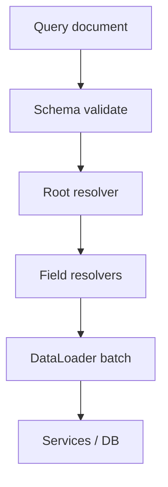

import { ConceptTemplate } from '@/features/kb/components/templates/ConceptTemplate'
import { Callout } from '@/features/kb/components/mdx/Callout'
import { ComparisonTable } from '@/features/kb/components/mdx/ComparisonTable'

export default function Layout({ children }) {
  return (
    <ConceptTemplate title="GraphQL">
      {children}
    </ConceptTemplate>
  )
}

**GraphQL** exposes a typed schema (types, fields, arguments, mutations, subscriptions). The client sends a query document; the server resolves only the requested fields. It shines when many clients need different slices of the same graph. It is not a free lunch on caching or authz.

## 1. Deep Dive and Mechanics

**Schema and resolvers.** Each field has a resolver. Parent resolvers return objects; child field resolvers run (often in parallel) with that parent as `source`.

**N+1.** A naive `author` resolver per `Post` in a list is one query per row. DataLoader (or equivalent batching) collapses them into one `WHERE id IN (...)`.

**Mutations.** One entry point per write, executed serially in a request. Design them as verbs (`placeOrder`), not generic `update`.

**Persisted queries.** Production APIs often allow only hashed, allowlisted documents. That caps complexity and stops ad-hoc expensive queries from unknown clients.

<Callout icon="warning" title="A single POST is still many resolvers">
One GraphQL request can fan out to dozens of services. Complexity analysis, depth limits, and timeouts are mandatory on public schemas.
</Callout>

## 2. Mathematical / Theoretical Foundation

**Selection sets.** A query is a tree projected onto the schema graph. Cost is roughly the number of leaves times resolver work, not the number of HTTP calls from the client.

**Graph traversal.** Unbounded nesting (`friends of friends...`) is a denial-of-service. Depth and node-count limits are the usual cutoffs.

**Caching.** REST maps URLs to cache keys. GraphQL’s default POST body does not. Persisted queries plus GET, or field-level caches, restore some of that.

<ComparisonTable
  headers={['Style', 'Shape of a read', 'Cache']}
  rows={[
    ['GraphQL', 'One query tree', 'Harder at the edge'],
    ['REST', 'One resource URL', 'Natural HTTP cache'],
    ['BFF aggregate', 'Fixed server shape', 'Per BFF'],
    ['gRPC', 'Typed RPC', 'App-level'],
  ]}
/>

## 3. Real-World Implementation

```graphql
type Query {
  order(id: ID!): Order
}

type Order {
  id: ID!
  lines: [Line!]!
}

query OrderPage($id: ID!) {
  order(id: $id) {
    id
    lines { sku qty }
  }
}
```

Resolvers for `order` and `lines` must not become N+1 when a list of orders is queried.

## 4. Visualizations



## 5. Interview Prep

**Q: GraphQL versus REST?**
**A:** GraphQL reduces over/under-fetch and round-trips for product UIs. REST is simpler to cache, rate-limit per resource, and document as HTTP. Many platforms expose both.

**Q: How do you authorize?**
**A:** Per field or per type, in resolvers, using the same principal as REST. A query that asks for `ssn` must fail even if `name` is allowed.

**Q: What is the N+1 problem?**
**A:** Resolving a list of N parents each triggers a child query. Batch and cache by key within the request.

## 6. Production Use Cases

- **Mobile and SPA** screens that would otherwise waterfall REST.
- **BFF-as-schema** over many microservices.
- **Partner graphs** with persisted queries and strict cost limits.

<Callout icon="tip" title="Treat the schema as a product">
Deprecate fields, do not yank them. GraphQL’s `@deprecated` plus usage metrics is your versioning story.
</Callout>
