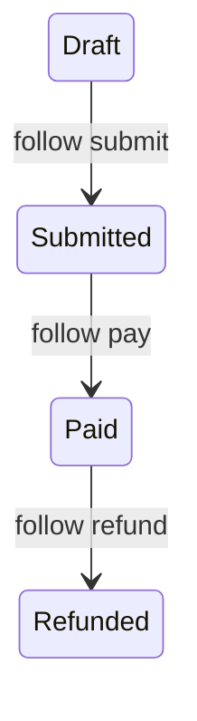

import { ConceptTemplate } from '@/features/kb/components/templates/ConceptTemplate'
import { Callout } from '@/features/kb/components/mdx/Callout'
import { ComparisonTable } from '@/features/kb/components/mdx/ComparisonTable'

export default function Layout({ children }) {
  return (
    <ConceptTemplate title="HATEOAS">
      {children}
    </ConceptTemplate>
  )
}

**HATEOAS** is Richardson level 3: a resource representation includes links (`self`, `next`, `cancel`, `pay`) that describe what the client can do *now*. The client follows relations, not a path it built from a wiki. Few public APIs fully commit; many steal the link idea for pagination.

## 1. Deep Dive and Mechanics

**Relation types.** `rel` names are the contract (`pay`, `items`). Hrefs can change. Clients key off `rel`, not URL templates they guessed.

**State in links.** An order in `draft` offers `submit`. After pay, `submit` disappears and `refund` appears. The payload’s links *are* the allowed transition set.

**Formats.** HAL, JSON:API `links`, Siren, Collection+JSON. Pick one. Ad-hoc `_links` is fine if you document the rels.

**Why teams skip it.** Mobile apps still ship compiled flows. A hypermedia client is extra machinery. You pay the cost when many clients and a changing URL space exist.

<Callout icon="info" title="Links are an affordance, not decoration">
If the client still concatenates `/orders/` plus an id it cached from v1, you are not doing HATEOAS. You are adding noise to JSON.
</Callout>

## 2. Mathematical / Theoretical Foundation

**State machine in the message.** The server encodes the current node’s outgoing edges as links. The client is a walker on that graph. That is how HTML forms worked; HATEOAS copies it to APIs.

**Coupling.** URL structure coupling is replaced by rel-name coupling. You still have a contract — a smaller, more stable one if you never rename rels.

**Richardson.** Level 0: one POST. Level 1: resources. Level 2: HTTP verbs and codes. Level 3: hypermedia. Interviews expect this ladder.

<ComparisonTable
  headers={['Level', 'Client knows', 'Server can change']}
  rows={[
    ['2 REST', 'Paths and verbs', 'Hard — URLs leak'],
    ['3 HATEOAS', 'Rels and media type', 'Hrefs freely'],
    ['GraphQL', 'Schema fields', 'Field names'],
    ['RPC', 'Method names', 'Little'],
  ]}
/>

## 3. Real-World Implementation

```json
{
  "id": "123",
  "status": "draft",
  "_links": {
    "self": { "href": "/orders/123" },
    "submit": { "href": "/orders/123/submit", "method": "POST" }
  }
}
```

A paid order would omit `submit` and include `refund`.

## 4. Visualizations



## 5. Interview Prep

**Q: Is HATEOAS required for REST?**
**A:** Fielding’s REST includes hypermedia. Industry “REST” often stops at level 2. Say both sentences.

**Q: Where is HATEOAS worth it?**
**A:** Long-lived clients, workflow APIs, and when you want to relocate resources without an app release. Pagination `next` links are the gateway drug.

**Q: How do you test a hypermedia client?**
**A:** Assert on rels present/absent for each state, not on full URL strings.

## 6. Production Use Cases

- **Checkout and case-management** workflows.
- **Pagination and discovery** (`next`, `prev`, `collection`).
- **API gateways** that rewrite hrefs when exposing internals.

<Callout icon="tip" title="Start with next and self">
Ship `self` and pagination links first. Add action rels when a workflow actually branches. Full HAL on day one is rarely the blocker you think.
</Callout>
