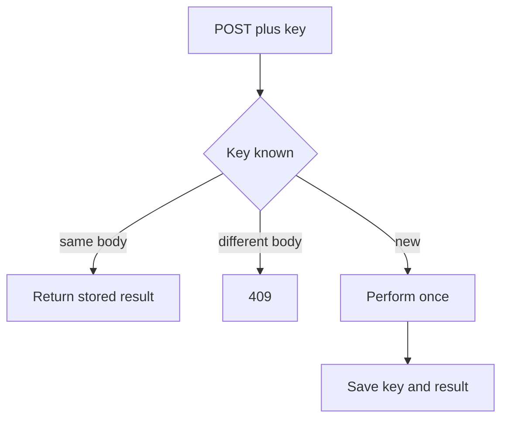

import { ConceptTemplate } from '@/features/kb/components/templates/ConceptTemplate'
import { Callout } from '@/features/kb/components/mdx/Callout'
import { ComparisonTable } from '@/features/kb/components/mdx/ComparisonTable'

export default function Layout({ children }) {
  return (
    <ConceptTemplate title="Idempotency">
      {children}
    </ConceptTemplate>
  )
}

**Idempotency** means applying an operation once or many times leaves the same stored state (and usually the same response). HTTP GET, PUT, and DELETE are specified as idempotent. POST is not — unless you add an **Idempotency-Key** (or a natural key) so retries do not double-charge.

## 1. Deep Dive and Mechanics

**HTTP verbs.** GET: no side effect. PUT: replace this resource with this body. DELETE: resource is gone. POST `/charges`: each call may create a new charge. That is why payment APIs require a key.

**Idempotency-Key.** Client generates a unique key per *intent*. Server stores key -> result. A replay with the same key returns the stored result. A replay with the same key and a *different* body is a 409.

**In-flight.** Two parallel POSTs with the same key need a unique constraint or a lock. The second waits or gets a 409 conflict until the first commits.

**Window.** Keys expire (24h is common). After expiry, a retry is a new intent. Document that.

<Callout icon="warning" title="Idempotent is not the same as safe">
PUT is idempotent and not safe (it writes). GET is both. Interviews ding people who mix the words.
</Callout>

## 2. Mathematical / Theoretical Foundation

**Algebra.** A function f is idempotent if f(f(x)) = f(x). For HTTP, x is server state. Two DELETEs of the same id: still deleted.

**At-least-once delivery.** Networks retry. Exactly-once *effects* are implemented as at-least-once *messages* plus idempotent handlers (dedupe table, unique constraint).

**Natural keys.** `PUT /users/9/email` with the full value needs no extra key. `POST /transfers` has no natural unique; you supply one.

<ComparisonTable
  headers={['Verb / pattern', 'Idempotent', 'Typical use']}
  rows={[
    ['GET', 'Yes', 'Read'],
    ['PUT / PATCH with full intent', 'Yes if replace', 'Update'],
    ['DELETE', 'Yes', 'Remove'],
    ['POST plus Idempotency-Key', 'By construction', 'Create / pay'],
  ]}
/>

## 3. Real-World Implementation

```python
def charge(key, body):
    row = store.get(key)
    if row:
        if row.body != body:
            raise Conflict()
        return row.response
    result = provider.charge(body)
    store.put(key, body, result)
    return result
```

`store.put` must be unique on `key` so two racers cannot both charge.

## 4. Visualizations



## 5. Interview Prep

**Q: Why can POST still be idempotent?**
**A:** The spec does not require it. You add application-level dedupe. Stripe’s Idempotency-Key is the usual citation.

**Q: What if the server crashes after the charge but before storing the key?**
**A:** The next retry charges again unless the provider also dedupes (pass the key through) or you write the key first in the same transaction as an “intent” row.

**Q: Is PATCH idempotent?**
**A:** JSON Merge Patch can be. JSON Patch that increments a counter is not. Treat PATCH as “it depends” and document it.

## 6. Production Use Cases

- **Payments, transfers, and inventory reserves**.
- **Webhook receivers** that dedupe delivery ids.
- **Job queues** with at-least-once workers.

<Callout icon="tip" title="The client owns the key">
Generate the key with the user gesture (UUID), persist it with the form, and reuse it on retry. A new key per HTTP retry is a double submit.
</Callout>
