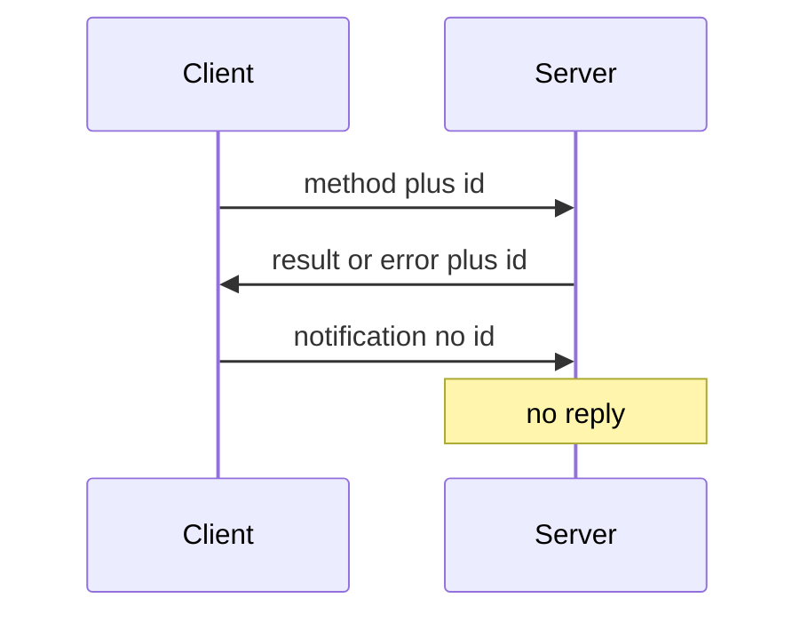

import { ConceptTemplate } from '@/features/kb/components/templates/ConceptTemplate'
import { Callout } from '@/features/kb/components/mdx/Callout'
import { ComparisonTable } from '@/features/kb/components/mdx/ComparisonTable'

export default function Layout({ children }) {
  return (
    <ConceptTemplate title="JSON-RPC">
      {children}
    </ConceptTemplate>
  )
}

**JSON-RPC** (2.0) is RPC with JSON: a request names a `method`, `params`, and a correlation `id`. The response echoes the `id` with `result` or `error`. There are no resources or HTTP verbs in the protocol — HTTP is just a pipe (often one POST URL). Ethereum nodes and many editor/language servers speak it.

## 1. Deep Dive and Mechanics

**Request.** `jsonrpc: 2.0`, `method`, `params` (array or object), `id`. A notification omits `id`; the server must not reply.

**Response.** Same `id`, plus `result` xor `error` (code, message, optional data). Do not mix HTTP 200-with-error-body conventions unless you document a mapping.

**Batch.** An array of request objects. The response is an array of results (order not specified — match by `id`). Partial failure is normal.

**Transport.** HTTP POST, WebSocket, stdio (LSP). Framing and auth live on the transport, not in JSON-RPC itself.

<Callout icon="info" title="One URL, many methods">
`POST /rpc` with `orders.place` is JSON-RPC. `POST /orders` is REST. Do not call a REST API “JSON-RPC” because the body is JSON.
</Callout>

## 2. Mathematical / Theoretical Foundation

**Correlation.** The `id` is a bijection key between request and response on a multiplexed stream. Notifications are fire-and-forget (no key).

**Error codes.** Reserved ranges (-32768 to -32000) versus application codes. Clients branch on code, not on HTTP status, when the transport is not HTTP.

**Versus REST.** REST maps nouns and verbs onto HTTP cache and intermediaries. JSON-RPC maps procedures. Caching and intermediary policy are weaker unless you invent them.

<ComparisonTable
  headers={['Protocol', 'Unit', 'HTTP role']}
  rows={[
    ['JSON-RPC', 'Method call', 'Often just POST'],
    ['REST', 'Resource', 'Verbs, codes, cache'],
    ['gRPC', 'Typed RPC', 'HTTP/2 transport'],
    ['SOAP', 'Envelope + WSDL', 'Usually POST'],
  ]}
/>

## 3. Real-World Implementation

```json
{
  "jsonrpc": "2.0",
  "method": "subtract",
  "params": [42, 23],
  "id": 1
}
```

A successful reply repeats `"id": 1` and a `result` of `19`.

## 4. Visualizations



## 5. Interview Prep

**Q: JSON-RPC versus REST?**
**A:** JSON-RPC is procedures and is easy to generate. REST is resources and uses HTTP semantics. Use JSON-RPC for internal tools and protocol-ish APIs (chain nodes, LSP). Use REST/GraphQL for public product APIs unless you already standardized on RPC.

**Q: How do you version methods?**
**A:** Names like `orders.place.v2` or a `version` param. There is no standard. Be explicit.

**Q: What is a notification for?**
**A:** Events and fire-and-forget logs. If you need an ack, it is a normal request.

## 6. Production Use Cases

- **Language Server Protocol** and editor plugins.
- **Blockchain node** APIs.
- **Internal admin CLIs** talking to a single RPC endpoint.

<Callout icon="tip" title="Map errors to something clients can branch on">
A string message is for humans. A stable `code` is for machines. Do not recycle codes.
</Callout>
