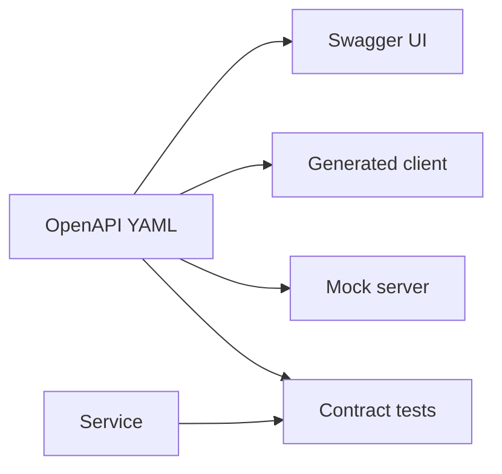

import { ConceptTemplate } from '@/features/kb/components/templates/ConceptTemplate'
import { Callout } from '@/features/kb/components/mdx/Callout'
import { ComparisonTable } from '@/features/kb/components/mdx/ComparisonTable'

export default function Layout({ children }) {
  return (
    <ConceptTemplate title="OpenAPI">
      {children}
    </ConceptTemplate>
  )
}

**OpenAPI** (formerly Swagger spec) is a YAML/JSON description of an HTTP API: paths, operations, parameters, JSON Schema bodies, and security schemes. It is the source for Swagger UI, generated clients, mock servers, and contract tests. The spec is the product; the UI is a viewer.

## 1. Deep Dive and Mechanics

**Document structure.** `info`, `servers`, `paths`, `components` (schemas, responses, parameters, securitySchemes). `$ref` keeps the file from becoming one blob.

**Source of truth.** Design-first: write OpenAPI, generate stubs. Code-first: annotations emit OpenAPI. Either works if CI fails when implementation and spec drift.

**Validation.** Gateways and test harnesses validate requests/responses against the schemas. `additionalProperties: false` catches unknown fields you did not mean to accept.

**Version of the spec.** OpenAPI 3.0 versus 3.1 (JSON Schema alignment). Tooling support lags; pick one and stick to it per API.

<Callout icon="warning" title="A spec nobody generates from will rot">
If engineers edit handlers and never the YAML, OpenAPI becomes fiction. Fail the build on drift or generate one side from the other.
</Callout>

## 2. Mathematical / Theoretical Foundation

**Contract testing.** The spec is a language of allowed messages. A producer is compatible if every response it emits is in the spec. A consumer is compatible if it accepts at least that set (unknown-field tolerance is a policy).

**Refs and composition.** `allOf` / `oneOf` are schema algebra. Overuse makes generated types ugly. Prefer named schemas.

**Compatibility.** Additive optional properties are the safe arrow. Removing or retyping a property is a breaking change — same as API versioning.

<ComparisonTable
  headers={['Artifact', 'Role', 'Not the same as']}
  rows={[
    ['OpenAPI document', 'HTTP contract', 'Swagger UI'],
    ['JSON Schema', 'Body shape', 'The whole API'],
    ['Protobuf', 'RPC contract', 'OpenAPI'],
    ['Postman collection', 'Manual tests', 'A spec'],
  ]}
/>

## 3. Real-World Implementation

```yaml
openapi: 3.0.3
info:
  title: Orders
  version: "1.0.0"
paths:
  /orders/{id}:
    get:
      parameters:
        - in: path
          name: id
          required: true
          schema: { type: string }
      responses:
        "200":
          description: OK
```

Path params stay in the spec file (YAML). In prose we write `/orders/:id`.

## 4. Visualizations



## 5. Interview Prep

**Q: OpenAPI versus Swagger?**
**A:** Swagger was the old name. OpenAPI is the spec (Linux Foundation). Swagger UI / Editor are tools. Say “OpenAPI spec, Swagger UI.”

**Q: Design-first or code-first?**
**A:** Design-first for public APIs and multiple consumers. Code-first for small internal services if generation is in CI. The failure mode is the same: drift.

**Q: Can OpenAPI describe GraphQL or gRPC?**
**A:** Not well. Use the GraphQL schema or `.proto`. Some gateways expose a transcoded REST view with OpenAPI on the side.

## 6. Production Use Cases

- **Public REST products** with generated SDKs.
- **Gateway import** (rate limits and routes from the spec).
- **Partner onboarding** via an interactive console.

<Callout icon="tip" title="Examples are part of the contract">
A schema without examples ships ambiguous enums and date formats. Add `example` on the fields clients always get wrong.
</Callout>
