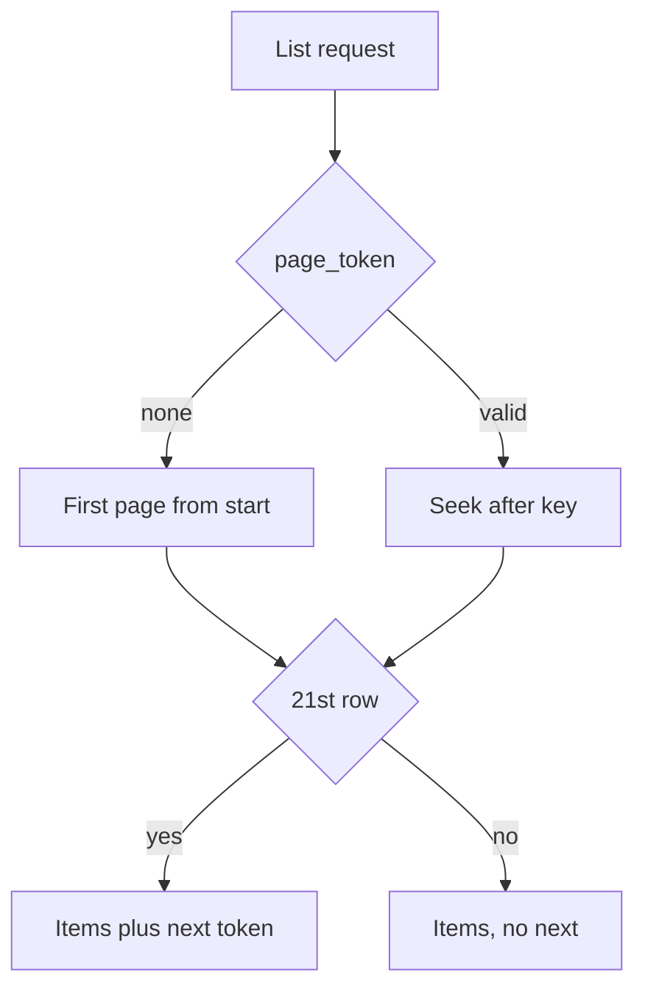

import { ConceptTemplate } from '@/features/kb/components/templates/ConceptTemplate'
import { Callout } from '@/features/kb/components/mdx/Callout'
import { ComparisonTable } from '@/features/kb/components/mdx/ComparisonTable'

export default function Layout({ children }) {
  return (
    <ConceptTemplate title="Pagination">
      {children}
    </ConceptTemplate>
  )
}

**Pagination** splits a large collection into pages. **Offset** (`limit` plus `offset`) is simple and breaks under inserts. **Cursor / keyset** (`after=id` plus a sort key) is stable for infinite scroll. Always return a `next` token or link; do not make clients invent the next offset.

## 1. Deep Dive and Mechanics

**Offset.** `OFFSET 10000` still walks 10000 rows in many stores. Concurrent inserts make page 2 contain rows the client already saw, or skip rows.

**Keyset.** `WHERE (created_at, id) < (:t, :id) ORDER BY created_at DESC, id DESC LIMIT 21`. The extra row tells you whether a next page exists. Opaque `page_token` hides this.

**Cursor contents.** Sign or encrypt the token so clients cannot scan other tenants. Include the sort keys, not a raw offset.

**Totals.** `COUNT(*)` over a fat filter is often as expensive as the page. Offer `has_more` instead of an exact total unless a product manager truly needs the number.

<Callout icon="warning" title="Offset plus live writes equals duplicates">
Feeds, inboxes, and logs should use keyset. Offset is for stable, mostly-append-only admin tables where users jump to page 17.
</Callout>

## 2. Mathematical / Theoretical Foundation

**Stability.** A page is a slice of a total order. Keyset pagination is “the next k elements strictly after this position in that order.” Offset is “skip n, take k,” which is not stable if the order’s prefix grows.

**Cost.** Offset is O of offset plus limit in naive plans. Keyset with a matching index is O of limit.

**Seek method.** The seek / keyset pattern is an old SQL technique. Cursor APIs are that pattern with an opaque envelope.

<ComparisonTable
  headers={['Style', 'Jump to page N', 'Live writes']}
  rows={[
    ['Offset', 'Yes', 'Duplicates / skips'],
    ['Keyset / cursor', 'No', 'Stable'],
    ['Cursor as offset', 'Yes', 'Still unstable'],
    ['Time windows', 'By date', 'Needs a tie-breaker id'],
  ]}
/>

## 3. Real-World Implementation

```sql
SELECT *
FROM events
WHERE (created_at, id) < (:cursor_ts, :cursor_id)
ORDER BY created_at DESC, id DESC
LIMIT 21;
```

Return 20 items and a next token built from the 20th row if a 21st exists.

## 4. Visualizations



## 5. Interview Prep

**Q: Cursor versus offset?**
**A:** Cursor/keyset for feeds. Offset for jump-to-page on stable data. “Cursor” that is a base64 offset is still offset.

**Q: Why a composite sort?**
**A:** `created_at` alone ties. Without `id` as a tie-break, rows that share a timestamp vanish or repeat.

**Q: How do you paginate filtered search?**
**A:** The cursor must include the same sort the query uses (relevance score plus id, or the search engine’s official `search_after`).

## 6. Production Use Cases

- **Infinite-scroll feeds** (keyset).
- **Admin tables** with page numbers (offset, with a cap).
- **Export jobs** that walk keyset until `has_more` is false.

<Callout icon="tip" title="Cap page size">
`limit=100000` is a denial-of-service. Default 20–50, max 100–200, unless the endpoint is a documented export with a different SLA.
</Callout>
