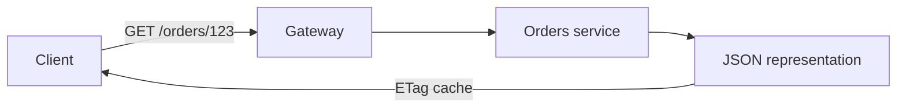

import { ConceptTemplate } from '@/features/kb/components/templates/ConceptTemplate'
import { Callout } from '@/features/kb/components/mdx/Callout'
import { ComparisonTable } from '@/features/kb/components/mdx/ComparisonTable'

export default function Layout({ children }) {
  return (
    <ConceptTemplate title="REST">
      {children}
    </ConceptTemplate>
  )
}

**REST** (Fielding) is a style: resources identified by URLs, manipulated through representations, stateless interactions, and a uniform interface (HTTP methods and status codes). Industry “REST” often means JSON CRUD. That is useful. It is not the full dissertation.

## 1. Deep Dive and Mechanics

**Resources, not RPC.** `/orders/123` is an order. `POST /orders/123/cancel` is a controller verb — common, slightly less resource-shaped. `POST /cancelOrder` is RPC on HTTP.

**Uniform interface.** GET read, POST create or action, PUT replace, PATCH partial, DELETE remove. Status codes carry outcome (201, 204, 404, 409, 412).

**Stateless.** Each request carries the credentials and the intent. The server does not owe you “step 3 of the wizard” unless you stored that as a resource.

**Representations.** The same order can be JSON or HAL. `Accept` selects. Caching and intermediaries depend on method, URL, and cache headers.

<Callout icon="info" title="JSON plus GET is not automatically REST">
If every call is `POST /api` with a method name in the body, you built JSON-RPC. REST uses the uniform interface so caches and gateways can participate.
</Callout>

## 2. Mathematical / Theoretical Foundation

**Constraints.** Fielding lists client-server, stateless, cache, uniform interface, layered system, optional code-on-demand. Each constraint buys a property (scalability, evolvability) at a cost (chatty clients, less conversational state).

**Cacheability.** GET plus `Cache-Control` / ETag is the mathematical win over opaque POST: intermediaries can reuse responses.

**Richardson ladder.** Level 2 (resources + verbs) is the industry bar. Level 3 adds HATEOAS.

<ComparisonTable
  headers={['Style', 'Identifier', 'Verb lives in']}
  rows={[
    ['REST', 'URL of a resource', 'HTTP method'],
    ['RPC', 'Method name', 'Body or path'],
    ['GraphQL', 'Schema field', 'Query document'],
    ['SOAP', 'Operation', 'Envelope'],
  ]}
/>

## 3. Real-World Implementation

```http
GET /orders/123 HTTP/1.1
Accept: application/json
If-None-Match: "v7"

HTTP/1.1 304 Not Modified
ETag: "v7"
```

Conditional GET is REST using HTTP, not a custom `hasChanged` RPC.

## 4. Visualizations



## 5. Interview Prep

**Q: What makes an API RESTful?**
**A:** Resources, uniform HTTP interface, statelessness, and (strictly) hypermedia. Then admit most APIs stop at level 2.

**Q: PUT versus PATCH?**
**A:** PUT replaces the resource with the body you sent. PATCH applies a delta. PUT is easier to make idempotent.

**Q: Where do actions go?**
**A:** As sub-resources (`/cancellations`) or as state changes via PUT on a field. A verb path is acceptable if you do not pretend it is a noun.

## 6. Production Use Cases

- **Public CRUD APIs** for partners and mobile.
- **Internal resource APIs** that sit well with HTTP caches and gateways.
- **Webhook catalogs** of resources clients already understand.

<Callout icon="tip" title="Model the noun the client names">
If users say “order,” the URL should say order. If you expose `tbl_ord_hdr`, you leaked a table, not a resource.
</Callout>
