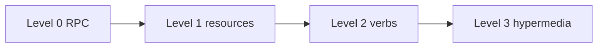

import { ConceptTemplate } from '@/features/kb/components/templates/ConceptTemplate'
import { Callout } from '@/features/kb/components/mdx/Callout'
import { ComparisonTable } from '@/features/kb/components/mdx/ComparisonTable'

export default function Layout({ children }) {
  return (
    <ConceptTemplate title="RESTful maturity model (Richardson)">
      {children}
    </ConceptTemplate>
  )
}

The **Richardson Maturity Model** grades HTTP APIs. **Level 0** is a single endpoint that tunnels RPC. **Level 1** introduces resources. **Level 2** uses HTTP methods and status codes. **Level 3** adds hypermedia (HATEOAS). It is a teaching ladder, not a certification.

## 1. Deep Dive and Mechanics

**Level 0 — The swamp of POX.** `POST /service` with an XML or JSON envelope and an action name. HTTP is a dumb pipe. SOAP-over-HTTP often lives here.

**Level 1 — Resources.** `/orders/123` and `/customers/9` exist, but you might still `POST` everything.

**Level 2 — HTTP verbs.** GET to read, POST to create, PUT/PATCH to update, DELETE to remove. 404, 409, 412 mean something. This is what most teams call REST.

**Level 3 — Hypermedia.** Responses include links that drive the next transitions. Rare in public JSON APIs; common in the original REST argument.

<Callout icon="info" title="Level 2 is a fine production target">
Do not apologize for skipping level 3 if your clients are compiled apps. Apologize for level 0 dressed up as REST.
</Callout>

## 2. Mathematical / Theoretical Foundation

**Coupling decreases up the ladder.** Level 0 couples clients to a procedure catalog. Level 1 couples them to a noun map. Level 2 couples them to HTTP semantics (which intermediaries already know). Level 3 couples them to rel names instead of URL templates.

**Not a partial order of quality.** A level-3 blog API can still be insecure and slow. The model measures *use of HTTP*, not product fitness.

**Fielding versus Richardson.** Fielding’s REST includes hypermedia. Richardson made a ladder so teams could talk about “how REST is this?” without a fight.

<ComparisonTable
  headers={['Level', 'What you added', 'Typical smell if missing']}
  rows={[
    ['0', 'HTTP as tunnel', 'One URL, method in body'],
    ['1', 'Noun URLs', 'Everything is POST to a thing'],
    ['2', 'Verbs and status codes', 'GET that mutates'],
    ['3', 'Links as affordances', 'Hard-coded path templates'],
  ]}
/>

## 3. Real-World Implementation

```text
L0  POST /api  body: { "action": "getOrder", "id": "123" }
L1  POST /orders/123  body: { "action": "get" }
L2  GET /orders/123
L3  GET /orders/123  body includes rel pay and rel self
```

The L0 line is a code-fence example of a JSON action envelope.

## 4. Visualizations



## 5. Interview Prep

**Q: What level is a typical CRUD JSON API?**
**A:** Level 2 if it uses methods and codes honestly. Level 1 if every mutation is POST. Level 0 if there is one `/api` route.

**Q: Is level 3 required?**
**A:** For Fielding-REST, yes. For getting hired to build Stripe-like APIs, level 2 plus pagination links is the expected answer.

**Q: Where does GraphQL sit?**
**A:** Off this ladder. It is a different style. Do not force a Richardson score on a schema.

## 6. Production Use Cases

- **API reviews** (“this payment call is level 0; split the resource”).
- **Teaching HTTP** to teams coming from SOAP or RPC.
- **Migration plans** from a single SOAP action to resource URLs.

<Callout icon="tip" title="Score the worst endpoint, not the docs">
A beautiful OpenAPI file plus one `POST /doStuff` that does money movement is a level-0 hole in a level-2 API.
</Callout>
