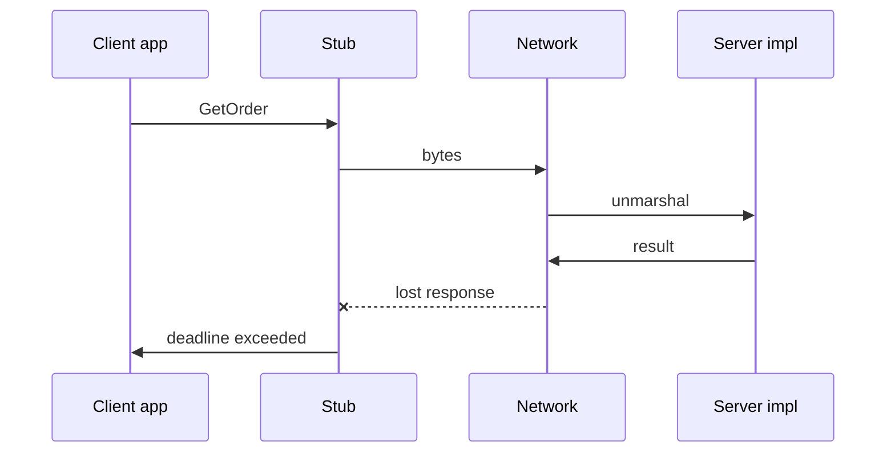

import { ConceptTemplate } from '@/features/kb/components/templates/ConceptTemplate'
import { Callout } from '@/features/kb/components/mdx/Callout'
import { ComparisonTable } from '@/features/kb/components/mdx/ComparisonTable'

export default function Layout({ children }) {
  return (
    <ConceptTemplate title="RPC">
      {children}
    </ConceptTemplate>
  )
}

**RPC** is the idea that `orders.get(id)` in your process becomes a network invocation of the same shape on a server. Stubs hide serialization. The network does not hide latency, retries, or a server that did the work while the response was lost. gRPC, JSON-RPC, Java RMI, and SOAP are instances.

## 1. Deep Dive and Mechanics

**Stub and skeleton.** Client stub marshals arguments and sends a message. Server unmarshals, calls the impl, marshals the return. IDLs (Protobuf, Thrift, WSDL) generate both sides.

**Failure modes.** Local calls do not time out or run twice. RPC must expose deadlines, cancellation, and idempotency. Treating the stub like a pure function is the original sin.

**Sync versus async.** Unary RPC looks like a function. Streaming and message queues are still remote invocation with different coupling.

**Location transparency.** The goal of early RPC. Modern practice is the opposite: make the network obvious (deadlines, status codes, retry policy).

<Callout icon="error" title="A timeout is not a rollback">
The server may have committed. The client must retry with an idempotency key or read the resulting state. This is why distributed systems interviews start here.
</Callout>

## 2. Mathematical / Theoretical Foundation

**Fallacies of distributed computing.** The network is not reliable, latency is not zero, bandwidth is not infinite. RPC’s type system does not encode those fallacies; your API must.

**At-least-once versus at-most-once.** At-most-once drops retries (lost updates). At-least-once retries (need idempotent handlers). Exactly-once is at-least-once plus dedupe.

**Interface definition.** A closed set of procedures and types. Evolution is additive methods/fields — same as any contract.

<ComparisonTable
  headers={['Style', 'Looks like', 'Failure is']}
  rows={[
    ['RPC', 'A function', 'Status / exception'],
    ['REST', 'A resource', 'HTTP code'],
    ['Messaging', 'An event', 'Ack / retry'],
    ['Local call', 'A function', 'Your stack'],
  ]}
/>

## 3. Real-World Implementation

```python
# Client code looks local; the stub is not.
order = orders_stub.GetOrder(GetOrderRequest(id=oid), timeout=0.2)
```

Set `timeout`. Handle `UNAVAILABLE` with a retry budget. Handle “unknown” after a timeout by querying, not by assuming failure.

## 4. Visualizations



## 5. Interview Prep

**Q: RPC versus REST?**
**A:** RPC is verb-oriented and codegen-friendly. REST is resource-oriented and HTTP-cache-friendly. Internal service meshes often pick gRPC; public APIs often pick REST.

**Q: Why did people hate CORBA/RMI?**
**A:** Location transparency, fat object graphs, and failure as a local exception. The lesson is still valid.

**Q: Is GraphQL RPC?**
**A:** It is a query language, but mutations are named procedures. Treat writes like RPC: idempotency and explicit errors.

## 6. Production Use Cases

- **Microservice-to-microservice** calls (gRPC, Thrift).
- **Language servers and plugin hosts**.
- **High-performance internal admin** tools.

<Callout icon="tip" title="Name the timeout at every hop">
Default infinite deadlines are how a leaf outage becomes a fleet outage. Budget remaining time downward.
</Callout>
