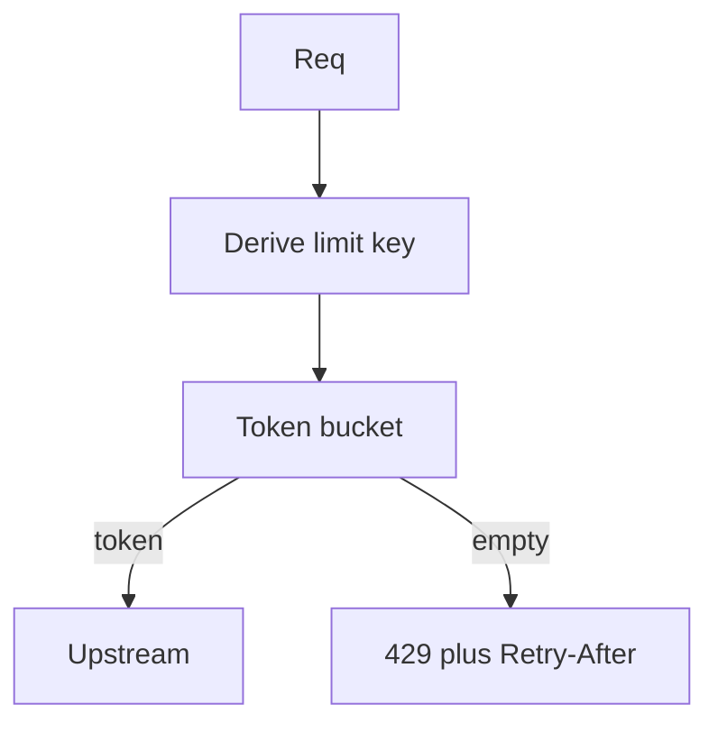

import { ConceptTemplate } from '@/features/kb/components/templates/ConceptTemplate'
import { Callout } from '@/features/kb/components/mdx/Callout'
import { ComparisonTable } from '@/features/kb/components/mdx/ComparisonTable'

export default function Layout({ children }) {
  return (
    <ConceptTemplate title="Rate limiting">
      {children}
    </ConceptTemplate>
  )
}

**Rate limiting** caps request rate per key (API key, user, IP, route). You return **429** plus `Retry-After` and `X-RateLimit-*` headers. Algorithms differ in burst behavior: fixed window, sliding window, token bucket, leaky bucket.

## 1. Deep Dive and Mechanics

**Key design.** Per-user global, per-route, per-tenant. A single IP limit punishes NAT. A single user limit still allows one fat endpoint to starve others — add per-route budgets.

**Token bucket.** Tokens refill at rate r, burst up to capacity b. Each request spends one (or a weighted cost). Smooth and allows short bursts. The usual production choice.

**Fixed window.** Count in [12:00, 12:01). Cheap, bursty at the window edge (2x if clients align).

**Where it runs.** Gateway or mesh for coarse limits. App for cost-aware limits (heavy search costs more tokens). Redis is the usual shared counter.

<Callout icon="warning" title="429 without Retry-After trains clients to hammer">
Tell them when to come back. Pair with idempotent writes so a later retry is safe.
</Callout>

## 2. Mathematical / Theoretical Foundation

**Token bucket.** At time t, tokens = min(b, tokens + r * dt). Reject when tokens would go negative. Long-run rate is r; burst is b.

**Leaky bucket.** Queue drains at r. Excess is dropped or delayed. Smoother egress, less friendly to bursts.

**Distributed count.** INCR plus EXPIRE is a fixed window. Sliding windows need more keys or a Lua script. Clocks must be close enough; do not rely on client time.

<ComparisonTable
  headers={['Algorithm', 'Burst', 'Cost']}
  rows={[
    ['Token bucket', 'Up to b', 'One counter'],
    ['Leaky bucket', 'Queued / smooth', 'Queue state'],
    ['Fixed window', 'Edge spike', 'INCR plus TTL'],
    ['Sliding log', 'Accurate', 'Memory per request'],
  ]}
/>

## 3. Real-World Implementation

```python
def allow(key, now, r, b, store):
    tokens, ts = store.get(key, (b, now))
    tokens = min(b, tokens + (now - ts) * r)
    if tokens < 1:
        return False
    store.put(key, (tokens - 1, now))
    return True
```

Use a Redis Lua script so read-modify-write is atomic across gateways.

## 4. Visualizations



## 5. Interview Prep

**Q: Token bucket versus fixed window?**
**A:** Token bucket allows controlled bursts and a steady refill. Fixed window is simpler and spikes at boundaries. Most interviewers want token bucket for APIs.

**Q: How do you limit expensive endpoints?**
**A:** Weighted tokens (search costs 10). Or a separate bucket per route class.

**Q: What do you return?**
**A:** 429, `Retry-After`, remaining count if you can. Do not 200 with an error body for a quota miss.

## 6. Production Use Cases

- **Public APIs** with plan tiers (free vs paid refill rates).
- **Login and OTP** endpoints (abuse, not capacity).
- **Webhooks outbound** so you do not melt a subscriber.

<Callout icon="tip" title="Limit the expensive dimension">
RPS is a proxy. For AI or search, limit tokens or concurrency. A 10 RPS cap still dies if each call is a 30-second scan.
</Callout>
