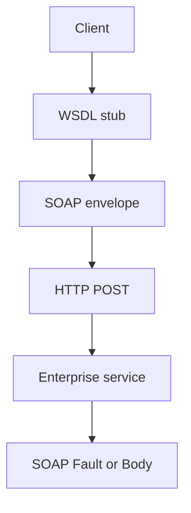

import { ConceptTemplate } from '@/features/kb/components/templates/ConceptTemplate'
import { Callout } from '@/features/kb/components/mdx/Callout'
import { ComparisonTable } from '@/features/kb/components/mdx/ComparisonTable'

export default function Layout({ children }) {
  return (
    <ConceptTemplate title="SOAP">
      {children}
    </ConceptTemplate>
  )
}

**SOAP** is an XML protocol: an Envelope with Header and Body, usually over HTTP POST. **WSDL** describes operations and types. **WS-Security**, WS-Addressing, and friends add auth, signatures, and routing. New greenfield APIs rarely pick SOAP. Integration work still does.

## 1. Deep Dive and Mechanics

**Envelope.** Headers carry metadata (auth tokens, message ids, mustUnderstand flags). Body carries the payload. A Fault is a structured error in the body.

**WSDL.** Port types, bindings, services. Tooling generates stubs. The contract is heavy and, when honored, excellent for strongly typed enterprise clients.

**WS-Security.** Sign and encrypt parts of the XML, attach timestamps and tokens. Powerful, painful to debug, easy to implement incorrectly (XML signature wrapping).

**Document versus RPC style.** Document/literal wrapped is the usual interoperable choice. RPC/encoded is a museum piece.

<Callout icon="warning" title="XML signature wrapping is a real class of bugs">
If you verify a signature then parse a different node than the one you verified, you accepted an attacker’s body. Use a stack that binds verify to the exact body you execute.
</Callout>

## 2. Mathematical / Theoretical Foundation

**Envelope + contract.** SOAP is RPC (or document exchange) with a schema. Compatibility is XSD evolution: additive optional elements, no reused names.

**MustUnderstand.** A header marked mustUnderstand=1 that the receiver does not implement is a fault. That is a protocol-level feature flag.

**Transport independence.** SOAP can ride HTTP, SMTP, JMS. In practice it is POST to one URL (Richardson level 0) with the operation in the SOAPAction or body.

<ComparisonTable
  headers={['Stack', 'Contract', 'Typical home']}
  rows={[
    ['SOAP + WSDL', 'XSD + operations', 'Enterprise / banks'],
    ['REST + OpenAPI', 'HTTP + JSON Schema', 'Public products'],
    ['gRPC', 'Protobuf', 'Internal meshes'],
    ['XML-RPC', 'Tiny XML RPC', 'Legacy scripts'],
  ]}
/>

## 3. Real-World Implementation

```xml
<s:Envelope xmlns:s="http://www.w3.org/2003/05/soap-envelope">
  <s:Body>
    <GetOrder xmlns="urn:orders">
      <id>123</id>
    </GetOrder>
  </s:Body>
</s:Envelope>
```

The HTTP route is often a single `/service` URL. The operation lives in the body.

## 4. Visualizations



## 5. Interview Prep

**Q: SOAP versus REST?**
**A:** SOAP: formal WSDL, WS-Security, transactions, one POST. REST: resources, HTTP verbs, easier web caching. Neither is “more secure” by default; SOAP just has a bigger standard for signatures.

**Q: Why is SOAP still here?**
**A:** Installed base, vendor tooling, regulated industries, and WS-Security requirements written into contracts.

**Q: What is a SOAP Fault?**
**A:** A structured error (`Code`, `Reason`, `Detail`) in the envelope, not only an HTTP 500. Map it explicitly at an anti-corruption layer.

## 6. Production Use Cases

- **Banking, insurance, government** integrations.
- **ESB and vendor packages** that only ship WSDL.
- **Anti-corruption adapters** that speak SOAP outside and REST/gRPC inside.

<Callout icon="tip" title="Wrap, do not spread">
Keep SOAP at the edge adapter. Do not leak XML types into the domain. Translate to your ubiquitous language immediately.
</Callout>
