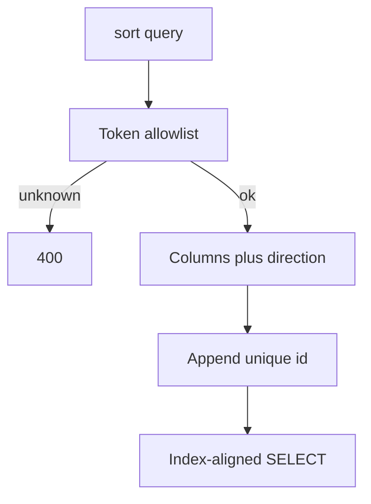

import { ConceptTemplate } from '@/features/kb/components/templates/ConceptTemplate'
import { Callout } from '@/features/kb/components/mdx/Callout'
import { ComparisonTable } from '@/features/kb/components/mdx/ComparisonTable'

export default function Layout({ children }) {
  return (
    <ConceptTemplate title="Sorting">
      {children}
    </ConceptTemplate>
  )
}

**Sorting** on a collection endpoint is a query parameter (`sort=-created_at,id`) that chooses a total order before pagination. An allowlist of fields, a required tie-breaker, and an index that matches the order are the difference between a list API and a full table sort on every request.

## 1. Deep Dive and Mechanics

**Allowlist.** Map tokens to columns. Unknown fields are 400. Descending is a prefix (`-created_at`) or a separate `order=desc`. Do not accept raw SQL `ORDER BY`.

**Tie-breaker.** Two rows with the same `created_at` need `id` (or another unique key) so pagination does not skip. Always append the unique key if the client did not.

**Default sort.** Document it. Changing the default is a breaking change for offset clients and for humans comparing screenshots.

**Expensive sorts.** `ORDER BY` a computed field or a column with no index is a filesort. Offer it only on small filtered sets, or precompute a rank.

<Callout icon="error" title="ORDER BY from the query string is SQL injection">
Even with a filter allowlist, a free-form sort string is a classic injection. Map tokens to identifiers in code.
</Callout>

## 2. Mathematical / Theoretical Foundation

**Total order.** Pagination requires a total order on the result set. A partial order (sort by non-unique column only) makes keyset pagination incorrect.

**Index matching.** A B-tree on `(tenant_id, created_at DESC, id DESC)` serves filter-plus-sort without a separate sort node when the query aligns.

**Stability.** A stable sort preserves the previous order among ties. Databases do not promise stability unless you specify the extra keys.

<ComparisonTable
  headers={['Need', 'Mechanism', 'Watch-out']}
  rows={[
    ['Newest first', 'created_at desc plus id', 'Clock skew'],
    ['Jump to page', 'Offset plus sort', 'Live inserts'],
    ['Relevance', 'Search score plus id', 'Score not in SQL'],
    ['User pick', 'Allowlisted token', 'Missing index'],
  ]}
/>

## 3. Real-World Implementation

```python
SORTS = {
    "created_at": ("created_at", "id"),
    "name": ("name", "id"),
}

def order_clause(token):
    desc = token.startswith("-")
    key = token.lstrip("-")
    cols = SORTS[key]  # KeyError -> 400
    return cols, desc
```

Unknown `key` fails. `id` is always the last column.

## 4. Visualizations



## 5. Interview Prep

**Q: Why is a unique tie-breaker mandatory?**
**A:** Keyset cursors use the sort tuple as a position. Ties make that position a set, not a point.

**Q: Can clients sort by joined fields?**
**A:** Yes if you planned the index and the join. Otherwise you just authorized a heavy query. Prefer denormalized sort keys.

**Q: How do you sort and filter together?**
**A:** The composite index should start with equality filters, then the sort columns. Inequality filters plus a different sort is the hard case.

## 6. Production Use Cases

- **Admin tables** with clickable column headers.
- **Feeds** that are always newest-first plus id.
- **Search** where the engine owns `sort` and `search_after`.

<Callout icon="tip" title="One default, few alternatives">
Three documented sorts you can index beat twelve sorts you cannot. Product can live with that.
</Callout>
