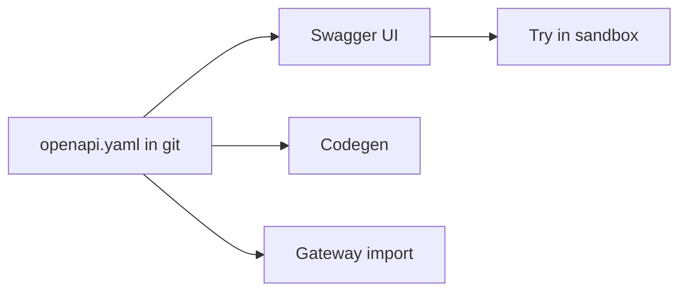

import { ConceptTemplate } from '@/features/kb/components/templates/ConceptTemplate'
import { Callout } from '@/features/kb/components/mdx/Callout'
import { ComparisonTable } from '@/features/kb/components/mdx/ComparisonTable'

export default function Layout({ children }) {
  return (
    <ConceptTemplate title="Swagger">
      {children}
    </ConceptTemplate>
  )
}

**Swagger** started as both a spec and a UI. The spec was donated and renamed **OpenAPI**. Today “Swagger” usually means **Swagger UI** (interactive docs), **Swagger Editor**, and **Swagger Codegen** / OpenAPI Generator. Saying “we use Swagger” in an interview should be followed by “OpenAPI 3 document, rendered in Swagger UI.”

## 1. Deep Dive and Mechanics

**Swagger UI.** Renders an OpenAPI document as try-it-now forms. Host it next to the API or generate a static site in CI. Lock it down: a public try-it box against prod is an abuse gift.

**Editor.** Left-pane YAML, right-pane preview. Fine for drafts. The source of truth still belongs in git.

**Codegen.** Produces clients and server stubs. Generated clients go stale if you do not regenerate in CI. Prefer official SDKs for public products when you can maintain them.

**Swagger 2 versus OpenAPI 3.** Old `swagger: "2.0"` files still exist. Convert with a published converter; do not mix keywords.

<Callout icon="warning" title="Do not expose Try it out on production with real data">
If UI can fire mutating calls as whoever is browsing, you built an unauthenticated admin console. Use a sandbox or require the user’s own token.
</Callout>

## 2. Mathematical / Theoretical Foundation

**View versus model.** OpenAPI is the model (contract). Swagger UI is a view. Multiple views (Redoc, Stoplight, Postman) can bind the same model.

**Generation.** Codegen is a compiler from schema to types. Incomplete mappings (oneOf, callbacks) are the usual lossy step — audit generated types.

**Naming debt.** Teams still say Swagger for both. Precise language avoids “update the Swagger” meaning “edit YAML” versus “tweak the UI theme.”

<ComparisonTable
  headers={['Name', 'What it is', 'You edit it']}
  rows={[
    ['OpenAPI', 'The spec document', 'Yes — contract'],
    ['Swagger UI', 'A renderer', 'Config / theme'],
    ['Swagger 2.0', 'Legacy spec', 'Migrate to 3.x'],
    ['OpenAPI Generator', 'Codegen fork', 'Templates'],
  ]}
/>

## 3. Real-World Implementation

```yaml
# docker-compose snippet
swagger-ui:
  image: swaggerapi/swagger-ui
  environment:
    SWAGGER_JSON: /spec/openapi.yaml
```

Mount the git-tracked OpenAPI file. Do not hand-edit a JSON dump inside the container.

## 4. Visualizations



## 5. Interview Prep

**Q: Swagger versus OpenAPI?**
**A:** OpenAPI is the specification. Swagger is the old name plus a family of tools. Use OpenAPI for the document, Swagger UI for the console.

**Q: Should generated clients ship to customers?**
**A:** Only if you version them and run their tests. Otherwise publish the spec and let partners generate, or maintain a first-party SDK.

**Q: Why does Try it out fail CORS?**
**A:** The UI origin is not the API origin. Either host UI on the API origin, or set CORS for the sandbox, not for the whole internet.

## 6. Production Use Cases

- **Internal developer portals** with a rendered spec per service.
- **Partner sandboxes** with sample tokens.
- **Contract reviews** in PRs (UI preview of the YAML diff).

<Callout icon="tip" title="One file in git, many renderers">
Fight over Redoc versus Swagger UI is cheap. Drift between three handwritten specs is not.
</Callout>
