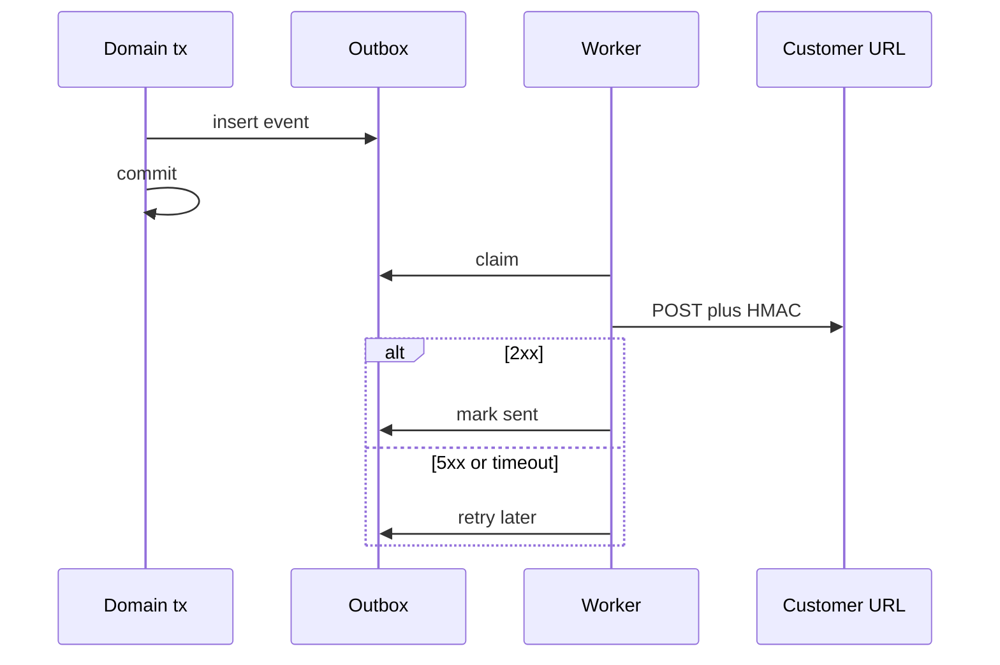

import { ConceptTemplate } from '@/features/kb/components/templates/ConceptTemplate'
import { Callout } from '@/features/kb/components/mdx/Callout'
import { ComparisonTable } from '@/features/kb/components/mdx/ComparisonTable'

export default function Layout({ children }) {
  return (
    <ConceptTemplate title="Webhooks">
      {children}
    </ConceptTemplate>
  )
}

**Webhooks** invert the usual request: your server POSTs an event to a URL the customer registered. Payments, CI, and SaaS products use them so clients do not poll. Delivery is **at-least-once**. Receivers must be idempotent. Senders must sign payloads and retry with backoff.

## 1. Deep Dive and Mechanics

**Subscription.** Customer stores a URL plus a secret. You POST JSON (or form) with an event type and id. They return 2xx to ack.

**Signatures.** HMAC of the raw body with the secret, sent in a header (`X-Hub-Signature-256`). Receivers verify before parsing. Timestamps stop replay.

**Retries.** 5xx and timeouts retry with exponential backoff. 4xx (except 429) often should not retry forever — the URL is wrong. Give a dead-letter and a replay UI.

**Fan-out.** One domain event may notify many subscriptions. A worker per delivery keeps the request path fast. The outbox pattern commits the event with the business transaction.

<Callout icon="error" title="Do not trust the webhook body without a signature">
Anyone who guesses your receiver URL can POST a fake `invoice.paid`. Verify HMAC (or mTLS) on the raw bytes.
</Callout>

## 2. Mathematical / Theoretical Foundation

**At-least-once.** The sender retries until ack or give-up. Duplicates happen (timeout after the receiver committed). Idempotency key = event id.

**Ordering.** Per-aggregate order is possible (sequence numbers). Global order across customers is not worth it. Receivers that need order buffer by sequence.

**SSRF.** If you fetch a customer-supplied URL from your VPC, they can hit your metadata service. Validate scheme (https), block private ranges, and use a dedicated egress.

<ComparisonTable
  headers={['Style', 'Who calls', 'Dedupe']}
  rows={[
    ['Webhook', 'Producer POSTs', 'Event id'],
    ['Polling', 'Consumer GETs', 'Client cursor'],
    ['WebSocket', 'Persistent push', 'App-level'],
    ['Message bus', 'Shared infra', 'Offset / ack'],
  ]}
/>

## 3. Real-World Implementation

```python
def deliver(url, secret, body, event_id):
    sig = hmac_sha256(secret, body)
    headers = {
        "X-Event-Id": event_id,
        "X-Signature": sig,
    }
    r = http.post(url, data=body, headers=headers, timeout=5)
    if r.status >= 500:
        raise Retry()
```

Sign the exact bytes you send. Do not re-serialize JSON after signing.

## 4. Visualizations



## 5. Interview Prep

**Q: Why at-least-once?**
**A:** You cannot know if a 200 was lost. Retry. The receiver uses event id to ignore duplicates.

**Q: Webhook versus WebSocket?**
**A:** Webhooks are server-to-server, fire-and-forget per event, work through firewalls that allow inbound HTTPS to the customer. WebSockets suit interactive clients.

**Q: How do you rotate secrets?**
**A:** Dual-verify (old and new) during a window, then drop the old. Offer a signed ping event so customers can test.

## 6. Production Use Cases

- **Stripe-like payment events** to merchant backends.
- **CI and git** (`push`, `pull_request`) notifications.
- **SaaS integration** platforms that refuse to poll.

<Callout icon="tip" title="Return 2xx fast">
The receiver should enqueue and ack. Doing five minutes of work in the webhook handler causes sender retries and duplicate work.
</Callout>
