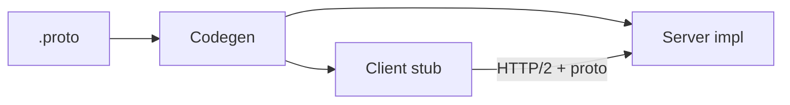

import { ConceptTemplate } from '@/features/kb/components/templates/ConceptTemplate'
import { Callout } from '@/features/kb/components/mdx/Callout'
import { ComparisonTable } from '@/features/kb/components/mdx/ComparisonTable'

export default function Layout({ children }) {
  return (
    <ConceptTemplate title="gRPC">
      {children}
    </ConceptTemplate>
  )
}

**gRPC** is Google’s RPC stack: you define services in `.proto`, generate clients and servers, and speak HTTP/2 with binary Protobuf payloads. It is the default for many internal meshes. Browsers still need gRPC-Web or a REST gateway.

## 1. Deep Dive and Mechanics

**IDL first.** `service` plus `rpc` methods. Unary, server-stream, client-stream, bidi. Generated code is the contract.

**HTTP/2.** Multiplexed streams, headers as HPACK, trailers for status (`grpc-status`). One TCP connection carries many RPCs.

**Deadlines.** Clients set a deadline; servers cancel work when it expires. This is not optional in production — it is how you bound fan-out.

**Interop.** Protobuf versions use field numbers. You add fields; you do not reuse numbers. That is the compatibility story.

<Callout icon="info" title="gRPC is not a browser-native API">
Fetch cannot speak raw gRPC trailers everywhere. Use grpc-web, Connect, or an edge transcode to JSON if first-party web is a client.
</Callout>

## 2. Mathematical / Theoretical Foundation

**Contract = generated types.** The schema is a closed set of messages. Evolution is additive field numbers. Removing a required-like assumption (presence) is the usual break.

**Head-of-line.** HTTP/2 multiplexing avoids HTTP/1 HOL on the socket, but TCP HOL remains. For lossy last miles, HTTP/3 / QUIC is the next step; many gRPC stacks are growing that.

**Backpressure.** Streams apply flow control. A fast sender and slow receiver must not buffer unbounded in the stub.

<ComparisonTable
  headers={['RPC stack', 'Payload', 'Typical client']}
  rows={[
    ['gRPC', 'Protobuf on HTTP/2', 'Services, mobile'],
    ['REST/JSON', 'JSON on HTTP/1.1 or 2', 'Browsers, partners'],
    ['Connect / gRPC-Web', 'Proto or JSON', 'Browsers'],
    ['JSON-RPC', 'JSON on HTTP', 'Simple internals'],
  ]}
/>

## 3. Real-World Implementation

```protobuf
syntax = "proto3";
service Orders {
  rpc GetOrder (GetOrderRequest) returns (Order);
}
message GetOrderRequest { string id = 1; }
message Order { string id = 1; int64 total_cents = 2; }
```

Field numbers `1` and `2` are forever. Never recycle them for a new meaning.

## 4. Visualizations



## 5. Interview Prep

**Q: Why gRPC over REST internally?**
**A:** Generated stubs, smaller payloads, streams, and first-class deadlines. The cost is tooling and weaker ad-hoc debug (you need grpcurl, not only curl).

**Q: How do you version?**
**A:** Add fields. For breaking RPCs, add a new method or package. Some teams run a JSON gateway with its own `/vN`.

**Q: What does `UNAVAILABLE` versus `DEADLINE_EXCEEDED` mean?**
**A:** Unavailable: you may retry (with budget). Deadline exceeded: the caller’s time budget is gone; retrying without a new budget repeats the pile-up.

## 6. Production Use Cases

- **Microservice meshes** (orders talking to catalog).
- **Mobile clients** with generated stubs and small payloads.
- **Streaming** (telemetry, chat, watch APIs).

<Callout icon="tip" title="Propagate the deadline">
When A calls B calls C, pass remaining time. A generous default on each hop is how a 200ms SLO becomes 2 seconds.
</Callout>
