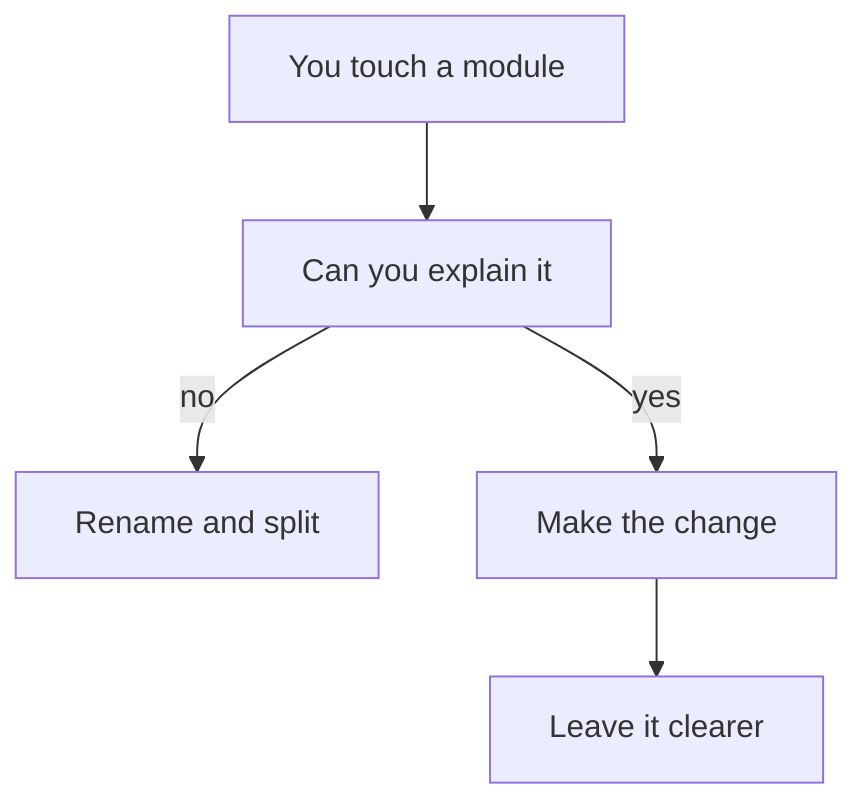

import { ConceptTemplate } from '@/features/kb/components/templates/ConceptTemplate'
import { Callout } from '@/features/kb/components/mdx/Callout'
import { ComparisonTable } from '@/features/kb/components/mdx/ComparisonTable'

export default function Layout({ children }) {
  return (
    <ConceptTemplate title="Clean code">
      {children}
    </ConceptTemplate>
  )
}

**Clean code** (Martin and many others) is a quality bar: a reader can predict behavior from names, functions do one job, and incidental complexity is stripped. It is not a framework. It is the habit of leaving the module better than you found it without rewriting the product for style points.

## 1. Deep Dive and Mechanics

**Names.** A name is a comment you cannot ignore. `d` is a crime; `elapsed_days` is a design. If you need a comment to explain the identifier, rename it.

**Small units.** Functions that fit on a screen, modules with one reason to change. Size is a proxy for focus, not a religion (20-line functions can still do two jobs).

**No dead abstraction.** A one-implementation interface and a `Helper` god-module are dirtier than a concrete function. Clean means *as simple as the domain allows*.

**Boy Scout.** Each PR removes a smell it touched. Large “cleanup” PRs that mix behavior change are how you ship regressions.

<Callout icon="warning" title="Clean is not clever">
One-liners that win Twitter lose on-call. Prefer the boring form the next intern can patch at 2 a.m.
</Callout>

## 2. Mathematical / Theoretical Foundation

**Cognitive load.** Working memory holds a handful of chunks. Deep nesting, surprising side effects, and lying names explode the graph the reader must hold. Clean code minimizes that graph.

**Signal versus noise.** Comments that repeat the code are noise. Comments that record *why* (a constraint, a bug number) are signal.

**Locality.** Change cost grows when related knowledge is scattered. Clean structure is high cohesion of the idea, not necessarily fewer files.

<ComparisonTable
  headers={['Trait', 'Clean', 'Not clean']}
  rows={[
    ['Name', 'Says the role', 'Needs a comment'],
    ['Function', 'One job', 'Flag soup'],
    ['Comment', 'Why / constraint', 'What, restated'],
    ['Abstraction', 'Earns its keep', 'Interface per class'],
  ]}
/>

## 3. Real-World Implementation

```python
# dirty
def p(o):
    return o.t * o.q * (1 - o.d) if o.d else o.t * o.q

# clean
def line_total(line):
    discount = line.discount_rate or 0
    return line.unit_price * line.qty * (1 - discount)
```

Same arithmetic. The second version is reviewable without tribal knowledge.

## 4. Visualizations



## 5. Interview Prep

**Q: What is clean code?**
**A:** Code that communicates intent, keeps units small and honest, and avoids accidental complexity. Quote a principle (naming, one-responsibility functions), not just “it looks nice.”

**Q: How do you apply it on a messy legacy file?**
**A:** Do not boil the ocean. Add tests around the behavior you will change, then rename and extract on that path.

**Q: Is clean code slow?**
**A:** Readable structure is usually faster to change. Micro-optimizations that destroy names are the opposite of clean — measure first.

## 6. Production Use Cases

- **PR culture** that reviews names and structure, not only tests.
- **Onboarding** where a new hire can ship a small fix in a week.
- **Incident response** where the hot path is obvious.

<Callout icon="tip" title="Prefer delete">
The cleanest code is code you did not ship. YAGNI and clean code agree more often than they fight.
</Callout>
