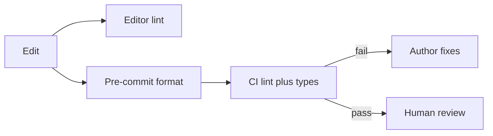

import { ConceptTemplate } from '@/features/kb/components/templates/ConceptTemplate'
import { Callout } from '@/features/kb/components/mdx/Callout'
import { ComparisonTable } from '@/features/kb/components/mdx/ComparisonTable'

export default function Layout({ children }) {
  return (
    <ConceptTemplate title="Code linting">
      {children}
    </ConceptTemplate>
  )
}

**Linting** runs static rules on source: unused vars, missing awaits, banned APIs, import order. Formatters (`gofmt`, Prettier) fix layout. Linters (`eslint`, `ruff`, `clippy`) judge semantics and house style. Together they remove nits from human review.

## 1. Deep Dive and Mechanics

**Where it runs.** Editor on save, pre-commit, CI. If CI is the only gate, people waste minutes. If only the editor, style drifts on the machine that skipped the plugin.

**Rulesets.** Start from a popular recommended set. Turn on rules that catch bugs (`no-floating-promises`). Be slow to add taste rules that have no autofix.

**Autofix versus diagnose.** Formatters should be silent and total. Linters should autofix the safe subset and fail the rest. Do not autofix semantics you have not read.

**Suppressions.** `eslint-disable-next-line` with a reason is a documented exception. File-wide disables are a smell.

<Callout icon="tip" title="Format in CI, do not argue in PRs">
If a machine can settle tabs versus spaces, humans should not. Spend review on behavior and names.
</Callout>

## 2. Mathematical / Theoretical Foundation

**Soundness.** Lints are unsound approximations: they miss bugs and they false-positive. A rule’s precision/recall matters. High-noise rules get disabled and teach people to ignore the tool.

**Incremental.** Lint-on-changed-lines keeps CI cheap. Full-repo lint still runs on main to catch moved files.

**Policy as code.** The ruleset is a contract. Version it. Changing a rule from warn to error is a migration, not a surprise.

<ComparisonTable
  headers={['Tool', 'Judges', 'Autofix']}
  rows={[
    ['Formatter', 'Layout', 'Always'],
    ['Linter', 'Patterns and style', 'Sometimes'],
    ['Type checker', 'Types', 'Rarely'],
    ['SAST', 'Security sinks', 'No'],
  ]}
/>

## 3. Real-World Implementation

```json
{
  "extends": ["eslint:recommended"],
  "rules": {
    "no-unused-vars": "error",
    "eqeqeq": "error"
  }
}
```

CI runs `eslint . --max-warnings 0` so warnings cannot accumulate.

## 4. Visualizations



## 5. Interview Prep

**Q: Linter versus type checker?**
**A:** Types prove (within the type system) certain absences of errors. Linters pattern-match. You want both. `any` plus a perfect eslint config is still untyped.

**Q: How do you adopt lint on a dirty repo?**
**A:** Baseline the current violations, fail on new ones, then burn the baseline down. Flipping every rule to error on day one stalls delivery.

**Q: Should lint block merge?**
**A:** Yes for the agreed ruleset. If a rule is not worth blocking, it should not be in the ruleset.

## 6. Production Use Cases

- **Monorepos** with one formatter and per-package lint configs.
- **Banned APIs** (no `datetime.utcnow`, no raw `innerHTML`).
- **Generated code** excluded via ignore files.

<Callout icon="warning" title="Do not lint generated files">
You will lose. Ignore the output directory and lint the generator.
</Callout>
