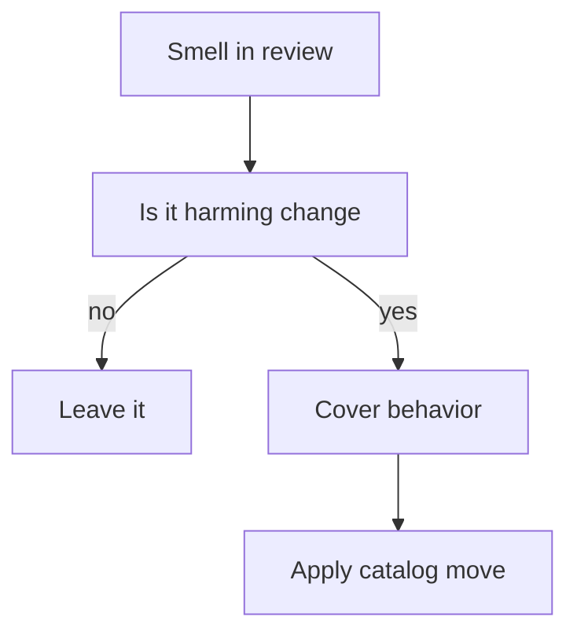

import { ConceptTemplate } from '@/features/kb/components/templates/ConceptTemplate'
import { Callout } from '@/features/kb/components/mdx/Callout'
import { ComparisonTable } from '@/features/kb/components/mdx/ComparisonTable'

export default function Layout({ children }) {
  return (
    <ConceptTemplate title="Code smells">
      {children}
    </ConceptTemplate>
  )
}

**Code smells** (Fowler) are recurring structures that often hide a deeper design problem. A long method might need Extract Function — or it might be a straight-line script that is already clear. Smells are heuristics for review, not automatic delete rules.

## 1. Deep Dive and Mechanics

**Bloaters.** Long method, large class, long parameter list, data clumps. Something wants to be a type or a function.

**Couplers.** Feature envy (a method that uses another object more than itself), inappropriate intimacy, shotgun surgery (one change edits twelve files), divergent change (one file edits for twelve reasons).

**Change preventers.** Parallel inheritance hierarchies, divergent change. The next feature will hurt.

**Dispensables.** Dead code, speculative generality, comments that replace bad names, duplicate code.

<Callout icon="info" title="A smell is a question">
Ask “is this pulling its weight?” Do not “fix” a data class that is a DTO at the HTTP edge. Context decides.
</Callout>

## 2. Mathematical / Theoretical Foundation

**Change fan-out.** Shotgun surgery is high fan-out of a requirement onto files. Divergent change is high fan-in of requirements onto one file. Both are coupling/cohesion metrics in English.

**Duplication.** The Rule of Three: the first copy may be coincidence; the third is a missing abstraction. Premature DRY is also a smell (speculative generality).

**Refactor catalog.** Each smell has a usual move (Extract Function, Move Method, Introduce Parameter Object). The catalog is the other half of the skill.

<ComparisonTable
  headers={['Smell', 'You notice', 'Typical move']}
  rows={[
    ['Long method', 'Scroll fatigue', 'Extract Function'],
    ['Feature envy', 'Other.x other.y', 'Move Method'],
    ['Shotgun surgery', '12-file feature', 'Move toward one module'],
    ['Speculative generality', 'Unused hooks', 'Delete'],
  ]}
/>

## 3. Real-World Implementation

```python
# feature envy: totals live on Order, not here
def print_invoice(order):
    tax = order.subtotal * order.tax_rate
    total = order.subtotal + tax
    print(total)

# after Move Method
def print_invoice(order):
    print(order.grand_total())
```

The tax policy belongs with `Order` (or a pricing service), not the printer.

## 4. Visualizations



## 5. Interview Prep

**Q: Name three smells and a refactor for each.**
**A:** Long method / Extract Function. Feature envy / Move Method. Long parameter list / Introduce Parameter Object. Have a fourth (shotgun surgery) ready.

**Q: Is duplication always a smell?**
**A:** Three similar blocks that change together: yes. Two similar blocks in different bounded contexts: maybe not — a shared module can couple the wrong things.

**Q: How do smells differ from bugs?**
**A:** Bugs are incorrect behavior. Smells are maintainability risks. They become bugs when the next edit misses one of the twelve sites.

## 6. Production Use Cases

- **PR checklists** that name smells instead of “looks messy.”
- **Legacy stranglers** that pick the smell blocking the next feature.
- **Static tools** (complexity, duplication clones) as smell detectors, not judges.

<Callout icon="tip" title="Refactor the path you are on">
The smell in a file you are not shipping this week can wait. The smell that makes *this* bug hard to fix cannot.
</Callout>
