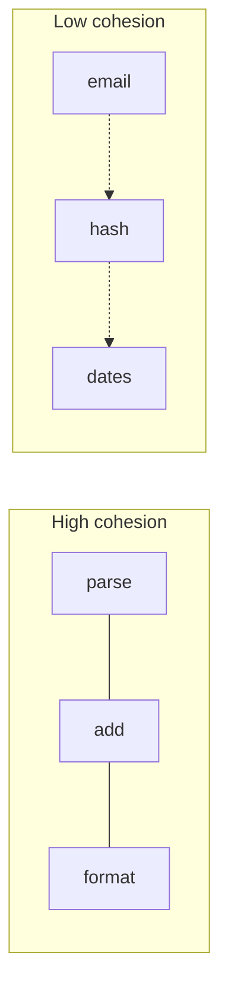

import { ConceptTemplate } from '@/features/kb/components/templates/ConceptTemplate'
import { Callout } from '@/features/kb/components/mdx/Callout'
import { ComparisonTable } from '@/features/kb/components/mdx/ComparisonTable'

export default function Layout({ children }) {
  return (
    <ConceptTemplate title="Cohesion">
      {children}
    </ConceptTemplate>
  )
}

**Cohesion** measures whether a module’s responsibilities form one idea. A `Money` type that parses, formats, and adds is cohesive. A `Utils` type that sends email, parses dates, and hashes passwords is not. High cohesion is the partner of low coupling.

## 1. Deep Dive and Mechanics

**Functional cohesion.** Every element contributes to a single task (the ideal). `PdfRenderer.render` and its helpers.

**Sequential / communicational.** Output of one part is input to the next, or they share the same data. Acceptable, still focused.

**Temporal / logical / coincidental.** “Stuff we do at startup,” “all the handlers,” “things that did not fit.” These rot into god-modules.

**SRP cousin.** Single Responsibility is cohesion at the *reason for change* level. A cohesive module can still have several functions if they change for the same reason.

<Callout icon="tip" title="Name the module after the idea">
If the honest name is `Misc` or `Manager`, cohesion is already low. Split until the name is boring and precise.
</Callout>

## 2. Mathematical / Theoretical Foundation

**LCOM.** Lack of Cohesion of Methods: if methods share no fields, they probably want different types. Use it as a hint; zeros and ones are not a style guide.

**Change sets.** If git history shows a file always changing with two unrelated ticket types, cohesion is low. History is a cohesion metric.

**Information hiding.** Secrets that always change together belong in one module. That is Parnas, not only SOLID.

<ComparisonTable
  headers={['Level', 'What binds the parts', 'Keep']}
  rows={[
    ['Functional', 'One task', 'Yes'],
    ['Sequential', 'Pipeline data', 'Usually'],
    ['Temporal', 'Same moment', 'Split when it grows'],
    ['Coincidental', 'Nothing', 'No'],
  ]}
/>

## 3. Real-World Implementation

```python
# low cohesion
class Utils:
    def send_welcome_email(self, user): ...
    def hash_password(self, raw): ...
    def parse_iso_date(self, s): ...

# higher cohesion
class PasswordHasher:
    def hash(self, raw): ...

class WelcomeMailer:
    def send(self, user): ...
```

Date parsing belongs in a date module or the stdlib wrapper, not here.

## 4. Visualizations



## 5. Interview Prep

**Q: Cohesion versus coupling?**
**A:** Cohesion is intra-module stickiness. Coupling is inter-module dependency. You want high cohesion, low coupling. They move together: a junk drawer couples everyone to junk.

**Q: Is a large file always low cohesion?**
**A:** No. A generated parser or a closed set of related functions can be long and cohesive. Ask about reasons to change, not line count.

**Q: How do you raise cohesion?**
**A:** Extract the outlier methods and the data they own. Rename. Repeat until the leftover name is true.

## 6. Production Use Cases

- **Package design** (one domain concept per package).
- **Microservice boundaries** (a service that is not cohesive becomes two).
- **Test suites** grouped by behavior, not by a `MiscTest`.

<Callout icon="info" title="Helpers are a smell when they grow">
A `helpers.py` with three functions is fine. A 2,000-line helpers module is coincidental cohesion with a polite name.
</Callout>
