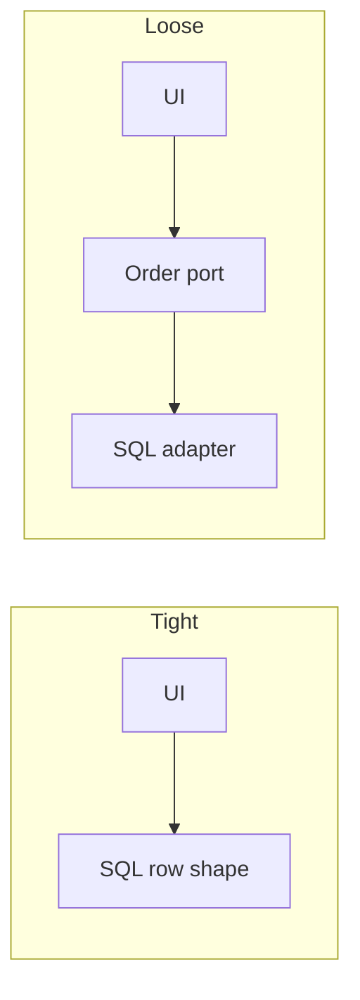

import { ConceptTemplate } from '@/features/kb/components/templates/ConceptTemplate'
import { Callout } from '@/features/kb/components/mdx/Callout'
import { ComparisonTable } from '@/features/kb/components/mdx/ComparisonTable'

export default function Layout({ children }) {
  return (
    <ConceptTemplate title="Coupling">
      {children}
    </ConceptTemplate>
  )
}

**Coupling** is the degree of interdependence between modules. Tight coupling means a change in A forces a change in B. Loose coupling means B depends on a small, stable contract. You cannot get to zero — a useful program is a graph. You choose *where* the edges go and *how wide* they are.

## 1. Deep Dive and Mechanics

**Content / common coupling.** A pokes B’s internals, or both share a global. The worst. Hide the data.

**Control coupling.** A passes a flag that tells B *how* to do its job (`mode=2`). B’s algorithm leaked into A.

**Stamp / data coupling.** A passes a fat object when it needed two fields (stamp) versus passing just those values (data). Stamp coupling drags unused schema into B.

**Message / contract coupling.** A calls a narrow interface. The healthy default. Add an anti-corruption layer when the other side is a vendor.

<Callout icon="warning" title="Shared database tables are coupling">
Two services writing the same rows are not “decoupled microservices.” They share a schema, which is a hard API.
</Callout>

## 2. Mathematical / Theoretical Foundation

**Graph degree.** Fan-out (how many others you call) and fan-in (how many call you) predict change cost. High fan-out modules become orchestrators; keep them thin. High fan-in modules must be stable.

**Stability.** A package that many others depend on should change rarely (SDP / SAP in package design). Unstable, highly depended-on packages are the pain.

**Temporal coupling.** Even without imports, “must call init before start” is coupling. Types and builders can make the order unrepresentable.

<ComparisonTable
  headers={['Kind', 'What is shared', 'Severity']}
  rows={[
    ['Content', 'Internals', 'Highest'],
    ['Common', 'Globals', 'High'],
    ['Control', 'Flags that steer', 'Medium'],
    ['Data / message', 'Values or a port', 'Lowest healthy'],
  ]}
/>

## 3. Real-World Implementation

```python
# tight: catalog internals leak
price = order.lines[0].sku.product.price_cents

# looser: ask the domain
price = order.unit_price(sku)
```

The second line survives a schema change behind `unit_price`.

## 4. Visualizations



## 5. Interview Prep

**Q: Coupling versus cohesion?**
**A:** Coupling is between modules; cohesion is inside. Target low coupling, high cohesion. A god-class has high (bad) coupling *and* low cohesion.

**Q: Is dependency injection low coupling?**
**A:** It inverts *who constructs*, which helps tests. You can still pass a 40-field god object. The interface width is the coupling.

**Q: How do you measure it?**
**A:** Import graphs, package metrics, and “how many PRs touch both.” Interviews accept qualitative answers plus one metric name (fan-out, afferent coupling).

## 6. Production Use Cases

- **Hexagonal ports** so domain code does not import SQL.
- **Published events** instead of calling every consumer.
- **API versioning** as a coupling-control tool with external clients.

<Callout icon="tip" title="Depend on things that change slower than you">
That is the dependency rule. Frameworks, databases, and vendors should sit behind adapters if they churn.
</Callout>
