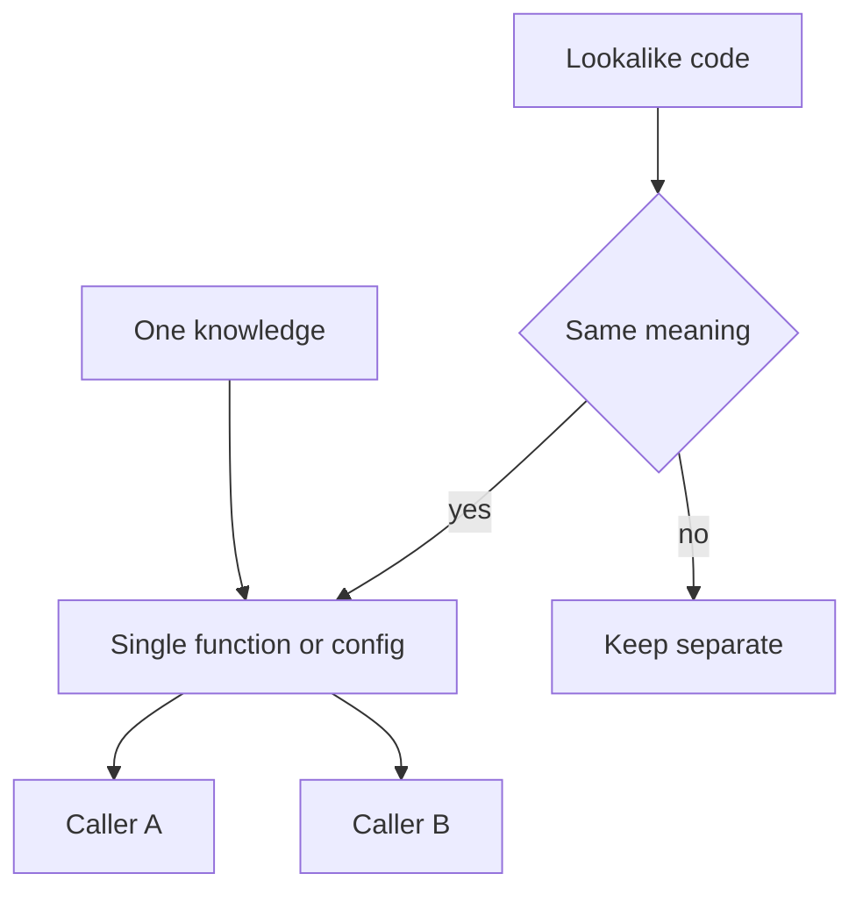

import { ConceptTemplate } from '@/features/kb/components/templates/ConceptTemplate'
import { Callout } from '@/features/kb/components/mdx/Callout'
import { ComparisonTable } from '@/features/kb/components/mdx/ComparisonTable'

export default function Layout({ children }) {
  return (
    <ConceptTemplate title="DRY">
      {children}
    </ConceptTemplate>
  )
}

**DRY** (Hunt and Thomas) says every piece of *knowledge* should have a single authoritative representation. Two functions that look alike but mean different business rules are not duplication. Two copies of the same tax rule that will diverge are. The enemy is duplicated *meaning*, not duplicated syntax.

## 1. Deep Dive and Mechanics

**Knowledge versus coincidence.** Three loops that happen to be `for item in items` are not a framework. Three implementations of “premium if spend > 500” are.

**The wrong abstraction.** Extracting too early produces a helper with flags (`kind`, `mode`) that is harder than the copies. Wait for the third copy, or for a second change that already drifted.

**Generated duplication.** OpenAPI clients and proto stubs look repetitive. Do not hand-merge them. DRY the *source* (the spec), not the output.

**Cross-context copies.** Two bounded contexts may both have `Address`. Sharing one type can couple deploys. Duplication across contexts can be the correct isolation.

<Callout icon="warning" title="DRY is not 'delete all copies'">
A shared `Utils.calc` that both billing and marketing import is how a marketing tweak breaks invoices. Repeat the formula or share a *published* domain service on purpose.
</Callout>

## 2. Mathematical / Theoretical Foundation

**Single source of truth.** A knowledge item is a function from inputs to a rule. Two stored copies are two functions that should stay equal — they will not. That is configuration drift in code form.

**Rule of Three.** Sample size: one instance is nothing; two is a smell; three plus a shared change history is an abstraction.

**WET / AHA.** Write Everything Twice and Avoid Hasty Abstractions are slogans that correct DRY zealotry. Same idea: delay the extract.

<ComparisonTable
  headers={['Situation', 'DRY move', 'Leave copies']}
  rows={[
    ['Same business rule', 'One function or table', 'No'],
    ['Same shape, different meaning', 'Do not extract', 'Yes'],
    ['Generated code', 'DRY the spec', 'Yes in output'],
    ['Two bounded contexts', 'Maybe a shared kernel', 'Often yes'],
  ]}
/>

## 3. Real-World Implementation

```python
PREMIUM_MIN = 500

def is_premium(spend_cents):
    return spend_cents >= PREMIUM_MIN
```

Call this from billing and from the badge on the profile *if* they must stay identical. If marketing wants a different threshold, they do not import this.

## 4. Visualizations



## 5. Interview Prep

**Q: What does DRY actually mean?**
**A:** One authoritative representation of each *knowledge*. Not “I saw two for-loops.” Hunt and Thomas were explicit about this.

**Q: When is duplication cheaper?**
**A:** When the copies will change for different reasons, or when a shared module would create the wrong dependency.

**Q: DRY versus YAGNI?**
**A:** YAGNI stops you from building the abstraction before the knowledge is real. DRY applies once the knowledge exists in two places that must not drift.

## 6. Production Use Cases

- **Tax and pricing rules** used by checkout and by invoices.
- **Feature flags** as the one switch, not copied booleans.
- **Schema** as the one contract (OpenAPI, proto), generating the rest.

<Callout icon="tip" title="Ask what must stay in sync">
If the answer is “nothing,” you do not have a DRY problem. You have similar text.
</Callout>
