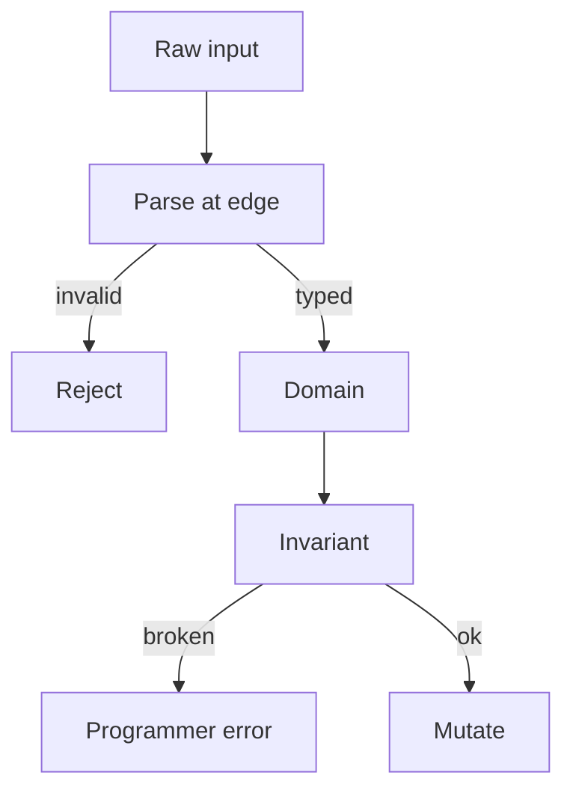

import { ConceptTemplate } from '@/features/kb/components/templates/ConceptTemplate'
import { Callout } from '@/features/kb/components/mdx/Callout'
import { ComparisonTable } from '@/features/kb/components/mdx/ComparisonTable'

export default function Layout({ children }) {
  return (
    <ConceptTemplate title="Defensive programming">
      {children}
    </ConceptTemplate>
  )
}

**Defensive programming** treats the world as hostile and buggy: validate untrusted input, enforce invariants, and choose explicit failure over silent corruption. Done well, it is boundary checking and assertions. Done badly, it is `if x is not None` on every line until nobody knows which layer owns the truth.

## 1. Deep Dive and Mechanics

**Boundaries.** HTTP, files, queues, user input, other teams’ APIs. Parse into domain types (`Email`, `Money`) once. Inside the domain, trust the types.

**Assertions.** Internal invariants (`balance >= 0`) that mean a programmer bug if they fire. Do not use asserts for user errors — those are validation.

**Fail fast versus tolerate.** At the edge, return 400. In a batch, skip a bad row and count it. In a safety-critical loop, stop. Policy is domain-specific.

**Over-defense.** Rechecking the same precondition in five private helpers hides the real contract and duplicates rules that will drift.

<Callout icon="warning" title="Catch-all except is not defense">
Swallowing errors makes the next layer lie. Catch the types you can handle; let the rest surface with context.
</Callout>

## 2. Mathematical / Theoretical Foundation

**Preconditions / postconditions / invariants.** Design by Contract (Meyer). Defense is checking the contract at the right cut. Types move many checks to compile time.

**Parse, do not validate (to a point).** A validator that returns the same untyped blob still leaves a stringly core. Parsing produces a value that cannot represent the illegal state.

**Fault isolation.** Bulkheads and timeouts are defensive programming at the architecture layer: limit how far a bad collaborator can spread.

<ComparisonTable
  headers={['Layer', 'Defense', 'On failure']}
  rows={[
    ['Edge', 'Parse and authz', '400 / 401 / 403'],
    ['Domain', 'Invariants', 'Raise / reject command'],
    ['Infra', 'Timeouts, retries', 'Degrade or fail the job'],
    ['Inside a function', 'Assert', 'Crash in dev, alert in prod'],
  ]}
/>

## 3. Real-World Implementation

```python
def create_user(raw_email: str) -> User:
    email = Email.parse(raw_email)  # raises ValidationError
    return User(id=new_id(), email=email)

def apply_debit(account, cents: int) -> None:
    if cents <= 0:
        raise ValueError("cents")
    if account.balance < cents:
        raise InsufficientFunds()
    account.balance -= cents
```

`Email.parse` is the boundary. `apply_debit` enforces a domain rule, not a None check on `account`.

## 4. Visualizations



## 5. Interview Prep

**Q: Is defensive programming the same as paranoia?**
**A:** No. Validate once at the boundary. Inside, use types and invariants. Rechecking None everywhere is a missing type.

**Q: Assert or exception?**
**A:** Assert (or panic) for broken internals. Exceptions or result types for expected domain failures (insufficient funds).

**Q: How does this interact with performance?**
**A:** Boundary checks are cheap versus corruption. Do not skip them in the name of speed without evidence. Inner-loop asserts can be compiled out in production if you accept the risk.

## 6. Production Use Cases

- **Public APIs** with schema validation.
- **Financial ledgers** with invariant checks before commit.
- **Parsers** for files and protocol messages.

<Callout icon="tip" title="Make illegal states unrepresentable">
An enum with two values beats a string plus five defenses. The type system is the cheapest defender.
</Callout>
