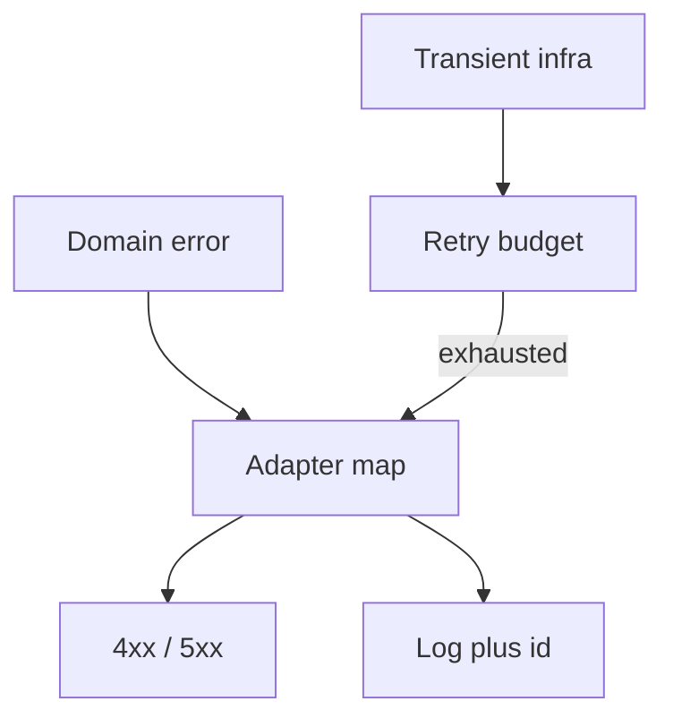

import { ConceptTemplate } from '@/features/kb/components/templates/ConceptTemplate'
import { Callout } from '@/features/kb/components/mdx/Callout'
import { ComparisonTable } from '@/features/kb/components/mdx/ComparisonTable'

export default function Layout({ children }) {
  return (
    <ConceptTemplate title="Error handling patterns">
      {children}
    </ConceptTemplate>
  )
}

**Error handling** is the design of failure as part of the API: exceptions, result types, HTTP statuses, or sentinel values. Pick one style per layer, map at the edges, and never swallow a failure that the caller must see. The pattern is how you *represent* and *propagate*, not a try/except ritual.

## 1. Deep Dive and Mechanics

**Exceptions.** Good for unexpected or rare path-breaking failures. Bad as a second return channel for common cases (`find` throwing `NotFound` in a hot loop). Document which exceptions are part of the contract.

**Result / Either.** `Ok(value)` or `Err(error)` forces the caller to branch. Popular in Rust, F#, and TS (neverthrow). Excellent for expected domain failures.

**Status codes.** HTTP and gRPC encode a closed set. Map domain errors to them once at the adapter. Do not leak stack traces.

**Sentinels.** `null` / `-1` as error. Ambiguous and easy to ignore. Prefer Optional for absence and a real error type for failure.

<Callout icon="error" title="Empty catch is an incident factory">
If you cannot handle it, do not catch it — or catch, log with context, and re-raise. A silent `pass` is a production bug with no stack.
</Callout>

## 2. Mathematical / Theoretical Foundation

**Sum types.** A result is a discriminated union. The type system makes “forgot to handle” a compile error. Exceptions are an implicit second channel (algebraic effects, but untyped in most OO languages).

**Taxonomy.** Transient (retry with budget) versus permanent (do not retry) versus user-correctable (400). Your type or code should say which.

**Boundary mapping.** Each layer has a native error. Adapters translate. If every layer uses `Exception("oops")`, you have no taxonomy.

<ComparisonTable
  headers={['Style', 'Caller must', 'Best for']}
  rows={[
    ['Exception', 'try / catch or crash', 'Rare, fatal-to-this-path'],
    ['Result type', 'Match Ok / Err', 'Expected domain failure'],
    ['HTTP status', 'Branch on code', 'Public APIs'],
    ['Sentinel', 'Remember the magic', 'Avoid'],
  ]}
/>

## 3. Real-World Implementation

```python
class NotFound(Exception):
    pass

def get_order(repo, oid):
    order = repo.get(oid)
    if order is None:
        raise NotFound(oid)
    return order

# adapter
try:
    return 200, get_order(repo, oid)
except NotFound:
    return 404, {"error": "not_found"}
```

The domain raises `NotFound`. The HTTP layer maps it. Handlers do not return mixed None-or-Order without a type.

## 4. Visualizations



## 5. Interview Prep

**Q: Exceptions versus result types?**
**A:** Results for expected failures the caller must handle. Exceptions for broken invariants or unexpected infra. Mixing both is fine if the boundary is clear.

**Q: What do you log?**
**A:** Error type, a stable code, correlation id, and inputs that are not secrets. Not the user’s password. Not five megabytes of body.

**Q: How do retries fit?**
**A:** Only on idempotent operations and transient codes. Retrying `409` or `400` is a bug.

## 6. Production Use Cases

- **API adapters** mapping domain errors to HTTP.
- **Worker jobs** with typed retry vs dead-letter.
- **Partial success** APIs that return per-item errors in the body.

<Callout icon="tip" title="Give every error a machine code">
Humans read the message. Clients and metrics need a stable identifier (`INSUFFICIENT_FUNDS`). Messages can be translated; codes cannot thrash.
</Callout>
