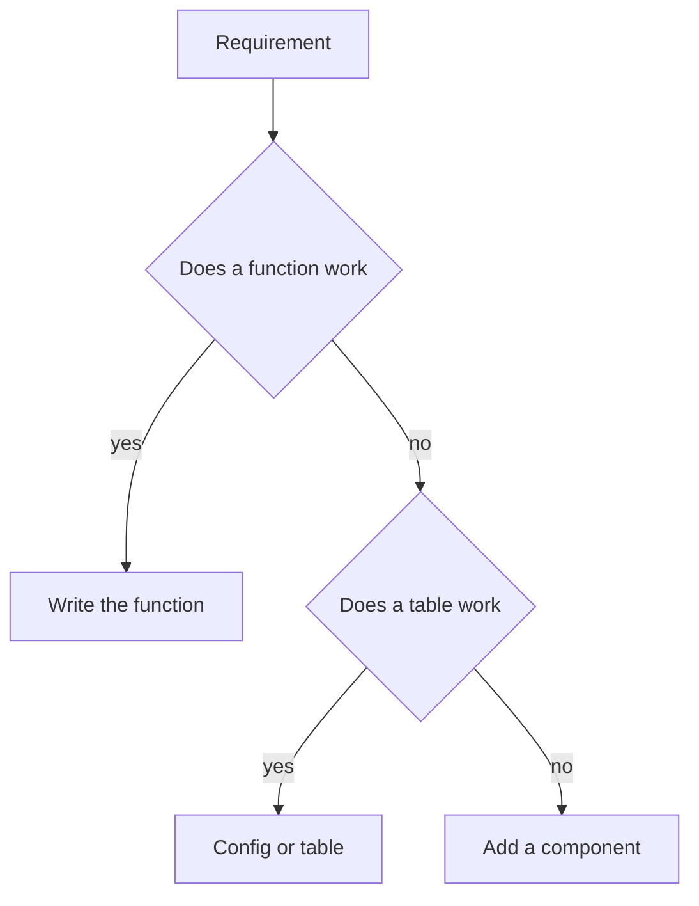

import { ConceptTemplate } from '@/features/kb/components/templates/ConceptTemplate'
import { Callout } from '@/features/kb/components/mdx/Callout'
import { ComparisonTable } from '@/features/kb/components/mdx/ComparisonTable'

export default function Layout({ children }) {
  return (
    <ConceptTemplate title="KISS">
      {children}
    </ConceptTemplate>
  )
}

**KISS** is a design filter: among solutions that meet the requirements, pick the one with fewer moving parts. Simple is not sloppy. Simple is a linear function, a boring CRUD service, a single process until scale numbers demand a queue. Complexity must pay rent.

## 1. Deep Dive and Mechanics

**Essential versus accidental.** Essential complexity is the domain (tax law). Accidental complexity is the framework forest you planted around it. KISS attacks the accidental kind.

**Premature architecture.** Kafka, a service mesh, and CQRS for a three-screen internal tool is not “future proof.” It is a team-sized tax.

**Simple to change, not simple to type.** A 200-line explicit function can be simpler than a 12-class strategy hierarchy that hides the flow.

**When to grow.** Measured pain: p99, deploy contention, a real second team. Then add the next mechanism, not five.

<Callout icon="tip" title="Simple to delete">
A design you can rip out in a day is simpler than a framework that owns your types. Prefer boring tech you can abandon.
</Callout>

## 2. Mathematical / Theoretical Foundation

**Occam.** Do not multiply entities without necessity. In software, each entity is a state space. State spaces multiply (n times m configurations).

**Gall’s law.** A complex working system is usually a simple working system that was grown. Starting from the complex diagram rarely converges.

**Cognitive graph.** Each service, topic, and flag is a node the team must hold. KISS minimizes nodes subject to meeting SLOs.

<ComparisonTable
  headers={['Choice', 'KISS pick', 'When to upgrade']}
  rows={[
    ['Compute', 'One app process', 'Need independent scale'],
    ['Async', 'Function call', 'Need buffer / retry'],
    ['Data', 'One Postgres', 'Need a real search/hot path'],
    ['Code', 'A function', 'Third copy plus drift'],
  ]}
/>

## 3. Real-World Implementation

```python
# simple enough
def discount(cents, vip):
    return int(cents * 0.9) if vip else cents

# not KISS for two rules
class DiscountStrategyFactory:
    def for_customer(self, c):
        return VipStrategy() if c.vip else NoopStrategy()
```

When you have six mutually exclusive promotions with dates, a strategy (or a rules table) earns its keep. Until then, the `if` is the design.

## 4. Visualizations



## 5. Interview Prep

**Q: KISS versus YAGNI versus DRY?**
**A:** KISS: fewest parts. YAGNI: do not build for hypotheticals. DRY: do not duplicate knowledge. They agree until someone DRYs two coincidences into a complex core — that violates KISS and YAGNI.

**Q: How do you argue against a fashionable design?**
**A:** Ask which requirement it uniquely satisfies, what it costs to operate, and what the rollback is. If the answer is “scale someday,” keep the simple path.

**Q: Is KISS anti-abstraction?**
**A:** No. The right abstraction *reduces* parts. The wrong one adds types without removing decisions.

## 6. Production Use Cases

- **MVP architectures** that still pass a security review.
- **Incident reviews** that delete unused paths.
- **Rewrites** that replace a distributed graph with a modular monolith.

<Callout icon="info" title="Simple is a product of taste plus metrics">
If the simple server is on fire, you oversimplified. KISS is not a vow of poverty; it is a demand that complexity show its work.
</Callout>
