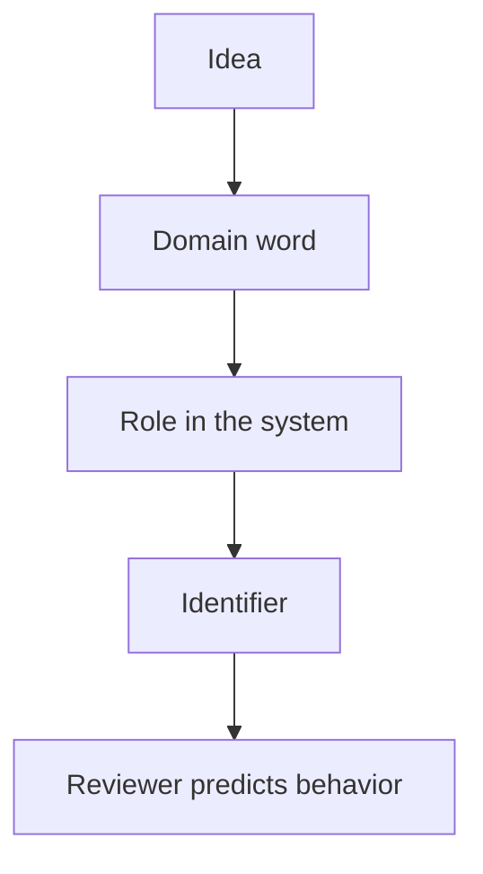

import { ConceptTemplate } from '@/features/kb/components/templates/ConceptTemplate'
import { Callout } from '@/features/kb/components/mdx/Callout'
import { ComparisonTable } from '@/features/kb/components/mdx/ComparisonTable'

export default function Layout({ children }) {
  return (
    <ConceptTemplate title="Naming conventions">
      {children}
    </ConceptTemplate>
  )
}

**Naming conventions** are the house style for identifiers: case, prefixes, and vocabulary. They are not bikeshedding when they encode *role*. `is_ready`, `fetch_order`, `OrderRepository` tell you boolean, side-effecting verb, and port. A convention that everyone follows is a compression algorithm for reviews.

## 1. Deep Dive and Mechanics

**Case.** `snake_case` functions in Python, `camelCase` in Java/TS, `PascalCase` types, `SCREAMING_SNAKE` constants. Pick the language’s default. Do not invent a fourth case.

**Booleans.** `is_`, `has_`, `can_` so `if is_ready` reads as English. `flag` and `status` as bools are lies.

**Verbs versus nouns.** Functions do (`calculate_total`). Types are (`Total`). Collections are plural (`orders`). A function named `user` is a bug.

**Ubiquitous language.** Use the domain word (`Invoice`, not `InvHdr`). If the team says “settlement,” the type should too.

<Callout icon="tip" title="A hard name means a hard design">
If you cannot name it, you do not know what it is. Do not call it `Manager`, `Processor`, or `Data`. Split until the name is obvious.
</Callout>

## 2. Mathematical / Theoretical Foundation

**Namespace collisions.** Conventions plus modules are how you keep the identifier space injective enough for humans. Prefixes (`IOrder` for interfaces) are a culture choice; many modern styles drop the `I` and use ports named after the role.

**Signal.** The name is the highest-bandwidth comment. Length should match scope: `i` in a three-line loop; `elapsed_since_last_heartbeat_sec` at a boundary.

**Stability.** Renames are cheap with tooling and expensive in public APIs. Internal names should improve; published names are versions.

<ComparisonTable
  headers={['Kind', 'Convention', 'Anti-pattern']}
  rows={[
    ['Boolean', 'is / has / can', 'flag, status, tmp'],
    ['Function', 'verb_phrase', 'data, process'],
    ['Type', 'domain noun', 'Util, Manager, Info'],
    ['Constant', 'SCREAMING_SNAKE', 'magic number inline'],
  ]}
/>

## 3. Real-World Implementation

```python
# weak
def proc(d, f):
    return d.t * d.q if f else 0

# conventional
def line_total_cents(line, is_taxable):
    if not is_taxable:
        return 0
    return line.unit_price_cents * line.qty
```

Units in the name (`cents`) prevent a class of money bugs.

## 4. Visualizations



## 5. Interview Prep

**Q: What makes a good name?**
**A:** Accurate, precise, and conventional. It says what the thing *is* in domain language, not how it is implemented (`array_list_2`).

**Q: Should we prefix member fields?**
**A:** Follow the language (`_private` in Python, no `m_` in modern Java unless the codebase already does). Consistency beats your preferred prefix.

**Q: How do you name interfaces?**
**A:** After the capability (`OrderRepository`, `Clock`). `IOrderRepositoryImpl` is a pair of smells.

## 6. Production Use Cases

- **Linters** that enforce case and banned identifiers.
- **API fields** that match the docs and the types.
- **On-call** where log field names match code names.

<Callout icon="info" title="Include units and currency">
`timeout` is incomplete. `timeout_ms` and `amount_cents` are conventions that prevent unit bugs better than comments.
</Callout>
