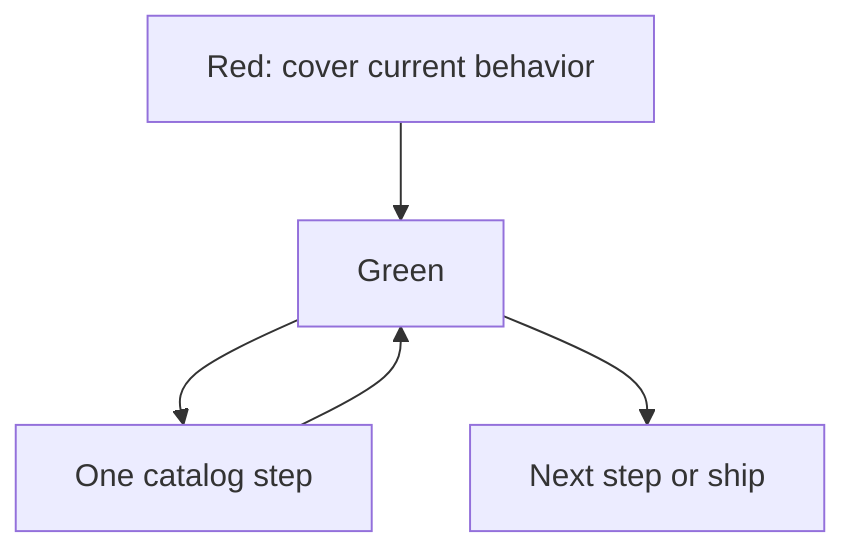

import { ConceptTemplate } from '@/features/kb/components/templates/ConceptTemplate'
import { Callout } from '@/features/kb/components/mdx/Callout'
import { ComparisonTable } from '@/features/kb/components/mdx/ComparisonTable'

export default function Layout({ children }) {
  return (
    <ConceptTemplate title="Refactoring techniques">
      {children}
    </ConceptTemplate>
  )
}

**Refactoring** is a disciplined change that improves structure without changing observable behavior. The **catalog** (Extract Function, Rename, Move Method, Replace Conditional with Polymorphism, Introduce Parameter Object, …) gives you named, reversible steps. The safety net is tests plus tiny commits.

## 1. Deep Dive and Mechanics

**Extract Function / Method.** The default move. Select a block, name the *why*, replace with a call. If you cannot name it, the block is not one idea.

**Move Method / Field.** Feature envy: the method belongs on the other type. Move it, then thin the old caller.

**Replace Conditional with Polymorphism.** A switch on type becomes methods on types. Use when the switch keeps growing with the same axis.

**Slide and sprout (Feathers).** In untested legacy: write the new logic in a fresh function (sprout) or wrap the old (wrap), then route callers. Do not start with a 400-line rewrite.

<Callout icon="warning" title="Refactor != rewrite">
A rewrite changes behavior by accident. Refactoring keeps the tests green after each step. If you cannot run the suite, you are editing, not refactoring.
</Callout>

## 2. Mathematical / Theoretical Foundation

**Behavior preservation.** Two programs are equivalent if they agree on the observable mapping (for the tested cases). Each catalog step is a local equivalence. Composition of small equivalences is why baby steps work.

**Mikado / strangler.** When the target design is far, you keep a graph of prerequisites and leave a working system at each commit. Same idea as growing a simple system (Gall).

**IDE as proof assistant.** Automated rename/extract is less likely to miss a reference than a human sed. Prefer the tool.

<ComparisonTable
  headers={['Smell', 'Technique', 'Test need']}
  rows={[
    ['Long method', 'Extract Function', 'Existing or characterization'],
    ['Feature envy', 'Move Method', 'Both types'],
    ['Type switch', 'Replace with polymorphism', 'Each branch'],
    ['No tests', 'Sprout / wrap', 'Tests on the new code'],
  ]}
/>

## 3. Real-World Implementation

```python
# before
def report(orders):
    total = 0
    for o in orders:
        total += o.cents
    print(total)

# after Extract Function
def report(orders):
    print(sum_cents(orders))

def sum_cents(orders):
    return sum(o.cents for o in orders)
```

Commit the extract alone. Then reuse `sum_cents` elsewhere in a second commit.

## 4. Visualizations



## 5. Interview Prep

**Q: Name five refactorings.**
**A:** Extract Function, Rename, Move Method, Introduce Parameter Object, Replace Magic Number with Constant. Bonus: Replace Conditional with Polymorphism, Extract Interface.

**Q: How do you refactor without tests?**
**A:** Characterization tests on the current outputs, then sprout/wrap. Or only use automated, tool-proven renames. Do not “clean up” a payment module by feel.

**Q: When do you stop?**
**A:** When the next change is easy. Refactoring is in service of a behavior change or a blocked understanding, not a purity score.

## 6. Production Use Cases

- **Preparing a feature** by extracting a seam first.
- **Legacy rescue** with characterization tests.
- **Performance work** that isolates a hot function before optimizing.

<Callout icon="tip" title="One technique per commit">
Reviewers can verify Extract Function. They cannot verify Extract plus a behavior change plus a rename plus a format pass.
</Callout>
