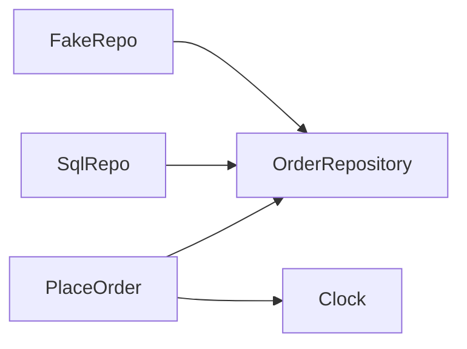

import { ConceptTemplate } from '@/features/kb/components/templates/ConceptTemplate'
import { Callout } from '@/features/kb/components/mdx/Callout'
import { ComparisonTable } from '@/features/kb/components/mdx/ComparisonTable'

export default function Layout({ children }) {
  return (
    <ConceptTemplate title="SOLID">
      {children}
    </ConceptTemplate>
  )
}

**SOLID** (Martin, after others) is a mnemonic: **S**ingle responsibility, **O**pen-closed, **L**iskov substitution, **I**nterface segregation, **D**ependency inversion. They are heuristics for object design, not laws. Interviews expect a one-line definition and a failure example for each.

## 1. Deep Dive and Mechanics

**SRP.** A module has one reason to change (one actor). A class that computes pay and writes PDF changes for two teams.

**OCP.** Add behavior by adding code (new type, new plugin), not by editing a switch that already shipped. Factories and strategies are typical.

**LSP.** Subtypes must honor the parent’s contract. A `Square` that breaks `Rectangle.set_width` is the classic violation. Preconditions cannot strengthen; postconditions cannot weaken.

**ISP.** Do not force clients to depend on methods they do not use. Split fat interfaces (`read` vs `write`).

**DIP.** High-level policy depends on abstractions; details (SQL, SMTP) implement them. The domain imports a port, not Postgres.

<Callout icon="warning" title="SOLID is not 'more interfaces'">
An interface per class with one implementor is ceremony. Extract an abstraction when you have a second implementation or a test seam you actually use.
</Callout>

## 2. Mathematical / Theoretical Foundation

**LSP as refinement.** Behavioral subtyping (Liskov, Wing): the subtype’s spec refines the supertype’s. History constraints matter (a type that forbids later `set_width` is not a `Rectangle`).

**DIP and topological sort.** Dependencies should point toward stability. The domain is stable policy; I/O is volatile. Invert so arrows point in.

**OCP and expression problem.** Open-closed along *one* axis (add types *or* add operations). Visitor versus methods is the same trade-off.

<ComparisonTable
  headers={['Letter', 'If you violate it', 'Typical fix']}
  rows={[
    ['S', 'Two actors in one type', 'Split the type'],
    ['O', 'Edit a giant switch', 'New subtype / plugin'],
    ['L', 'Subclass ifs and throws', 'Do not inherit that type'],
    ['I', 'Empty methods / fat port', 'Split the interface'],
    ['D', 'Domain imports SQL', 'Port plus adapter'],
  ]}
/>

## 3. Real-World Implementation

```python
class OrderRepository(Protocol):
    def get(self, oid) -> Order: ...

class PlaceOrder:
    def __init__(self, repo: OrderRepository, clock):
        self.repo, self.clock = repo, clock

    def execute(self, cmd):
        order = Order.open(cmd, self.clock.now())
        self.repo.add(order)
```

`PlaceOrder` depends on a protocol and a clock port (DIP, SRP). A `SqlOrderRepository` is a detail.

## 4. Visualizations



## 5. Interview Prep

**Q: Recite SOLID in one breath.**
**A:** One reason to change; open to extension closed to modification; subtypes must be substitutable; thin interfaces; depend on abstractions. Then give one example.

**Q: Is a Rectangle/Square always illegal?**
**A:** If the parent allows independent width and height mutation, yes. If shapes are immutable values, the inheritance may be fine. LSP is about contracts, not pictures.

**Q: Does functional code care?**
**A:** DIP and SRP still apply (pure core, I/O at the edges). LSP is about substitutable functions/types. The letters are OO-flavored, the ideas are not.

## 6. Production Use Cases

- **Hexagonal / clean** service cores.
- **Plugin pricing** (OCP) without editing checkout.
- **Read vs write** ports (ISP) so query handlers do not depend on `save`.

<Callout icon="tip" title="Use SOLID to explain a PR, not to decorate it">
“This interface exists because we have a fake in tests and a SQL adapter” is DIP. “I added an interface because SOLID” is not.
</Callout>
