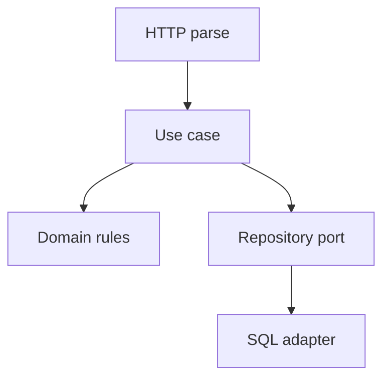

import { ConceptTemplate } from '@/features/kb/components/templates/ConceptTemplate'
import { Callout } from '@/features/kb/components/mdx/Callout'
import { ComparisonTable } from '@/features/kb/components/mdx/ComparisonTable'

export default function Layout({ children }) {
  return (
    <ConceptTemplate title="Separation of concerns">
      {children}
    </ConceptTemplate>
  )
}

**Separation of concerns** (Dijkstra) is the principle that a program should be divided so each section addresses one concern. MVC, layered architecture, and hexagonal ports are instances. A handler that parses HTTP, applies tax law, and writes SQL is three concerns in one function — cheap today, expensive at the first change.

## 1. Deep Dive and Mechanics

**Horizontal layers.** Presentation, application, domain, infrastructure. Dependencies point inward. The domain does not import the web framework.

**Vertical slices.** Some teams slice by feature (`place_order` folder with its UI, use case, and adapter). Concerns still split *inside* the slice.

**Cross-cutting.** Auth, logging, transactions. These are concerns too. Handle them with middleware, decorators, or a unit of work — not copy-paste in every handler.

**Over-separation.** A 20-line feature with seven layers is accidental complexity. Separate the concerns you actually change independently.

<Callout icon="info" title="A concern is a reason to change">
If UX copy and tax law always ship together in this product, they may live closer. If they never do, keep them apart. The principle is about change, not folder count.
</Callout>

## 2. Mathematical / Theoretical Foundation

**Orthogonality.** Two concerns are orthogonal if changing one does not require changing the other. SoC maximizes orthogonality subject to performance and team size.

**Information hiding (Parnas).** Modules hide a design decision. The concern *is* that decision (storage engine, protocol, policy).

**Aspects.** Cross-cutting concerns are the leftover that do not tile the plane. AOP and middleware exist because SoC is imperfect in a 1-D call stack.

<ComparisonTable
  headers={['Split', 'Concerns separated', 'Fails when']}
  rows={[
    ['Layers', 'Tech roles', 'Every feature touches all layers'],
    ['Vertical slice', 'Features', 'Shared domain is copied'],
    ['Hexagonal ports', 'App vs I/O', 'Ports multiply unused'],
    ['Big ball', 'None', 'Always'],
  ]}
/>

## 3. Real-World Implementation

```python
def post_order(req, repo, tax):
    cmd = PlaceOrder.parse(req.body)   # HTTP concern
    order = place(cmd, tax)            # domain concern
    repo.add(order)                    # persistence concern
    return 201, order.id
```

Three functions, three reasons to change. The handler only composes them.

## 4. Visualizations



## 5. Interview Prep

**Q: SoC versus SRP?**
**A:** SRP is usually about a *class* and one actor/reason. SoC is the broader cut (layers, features, aspects). They rhyme.

**Q: Is MVC enough?**
**A:** MVC separates UI mechanics. Business rules in the controller violate SoC even if the folder says `controllers`.

**Q: How do you know you over-split?**
**A:** You open eight files to add a field, and none of them have independent tests. Merge until a change has a home.

## 6. Production Use Cases

- **Web apps** with handlers that do not embed SQL.
- **CLI and HTTP** sharing one use-case layer.
- **Testability** (domain tests without a web server).

<Callout icon="tip" title="Compose at the edge">
`main`, the HTTP adapter, and the job runner are allowed to know everyone. The domain is not. That is SoC with a composition root.
</Callout>
