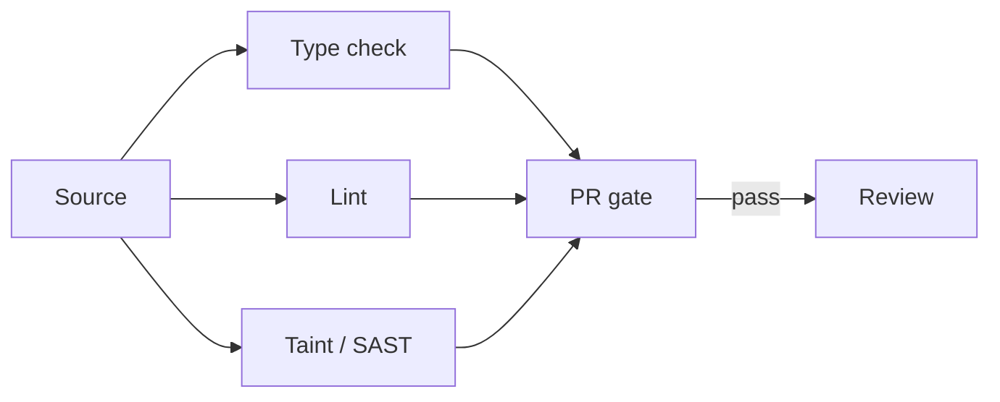

import { ConceptTemplate } from '@/features/kb/components/templates/ConceptTemplate'
import { Callout } from '@/features/kb/components/mdx/Callout'
import { ComparisonTable } from '@/features/kb/components/mdx/ComparisonTable'

export default function Layout({ children }) {
  return (
    <ConceptTemplate title="Static analysis tools">
      {children}
    </ConceptTemplate>
  )
}

**Static analysis** reasons about programs from source (or bytecode) without executing the production path. Type checkers, linters, SAST, taint engines, and complexity metrics all sit on this spectrum. They are incomplete (false positives and negatives) and still cheaper than a class of production incidents.

## 1. Deep Dive and Mechanics

**Layers.** Formatter (layout) → linter (patterns) → type checker (types) → dataflow / SAST (taint, null, security sinks) → whole-program (call graphs, unused exports). Each layer is slower and richer.

**SAST.** Flags SQL concat, XSS sinks, insecure crypto. High noise unless you tune the source/sink set. Pair with code review and DAST; do not treat a clean SAST as a security sign-off.

**Taint.** Values from HTTP are tainted until they pass a sanitizer. The tool tracks flows. Missing sanitizer models produce both misses and false hits.

**CI placement.** Fast checks on every PR. Heavy SAST on a schedule or on changed languages. Incremental analysis keeps developers from bypassing the gate.

<Callout icon="warning" title="A suppressed finding is a decision">
`# nosec` without a ticket is how known holes age. Require a reason and an owner. Expire suppressions.
</Callout>

## 2. Mathematical / Theoretical Foundation

**Undecidability.** Rice’s theorem: nontrivial semantic properties of programs are undecidable. Tools approximate (abstract interpretation, types as abstract values). Sound tools may over-approximate (false positives). Unsound tools miss bugs.

**Abstract interpretation.** Execute on abstract domains (signs, intervals, taint bits). Widen to terminate. Precision versus time is the knob.

**Types as proofs.** A type checker is a static analyzer with a language-shaped domain. `strict` TypeScript and `mypy --strict` close holes (`any`, implicit Optional).

<ComparisonTable
  headers={['Tool class', 'Domain', 'Misses']}
  rows={[
    ['Type checker', 'Types', 'Logic bugs'],
    ['Linter', 'Syntax patterns', 'Deep flows'],
    ['SAST / taint', 'Security flows', 'Unknown sinks'],
    ['Complexity metrics', 'Size / graph', 'Whether the code is right'],
  ]}
/>

## 3. Real-World Implementation

```yaml
# example CI fragment
steps:
  - run: ruff check .
  - run: mypy src
  - run: semgrep --config p/ci --error
```

Fail the build on new issues. Baseline old ones separately so the repo can adopt tools incrementally.

## 4. Visualizations



## 5. Interview Prep

**Q: Static versus dynamic analysis?**
**A:** Static: no run, whole-program possible, approximation. Dynamic (tests, DAST, fuzz): concrete executions, misses unrun paths. You want both.

**Q: Why so many false positives?**
**A:** Over-approximation and missing framework models. Tuning sources/sinks is the job, not “the tool is bad.”

**Q: Where does Sonar / CodeQL / Semgrep fit?**
**A:** Semgrep: fast pattern rules you own. CodeQL: deep queries, heavier. Sonar: metrics plus rules, often a quality gate. Name the layer, not the logo.

## 6. Production Use Cases

- **PR quality gates** (types + lint + a small SAST set).
- **Security programs** with CodeQL/Semgrep on the default branch.
- **Language migrations** (find remaining `any` or Python 2 APIs).

<Callout icon="tip" title="Own a handful of custom rules">
Banned APIs (`eval`, raw HTML, `utcnow`) as repo-local Semgrep/ruff rules beat a generic 2,000-rule pack nobody reads.
</Callout>
