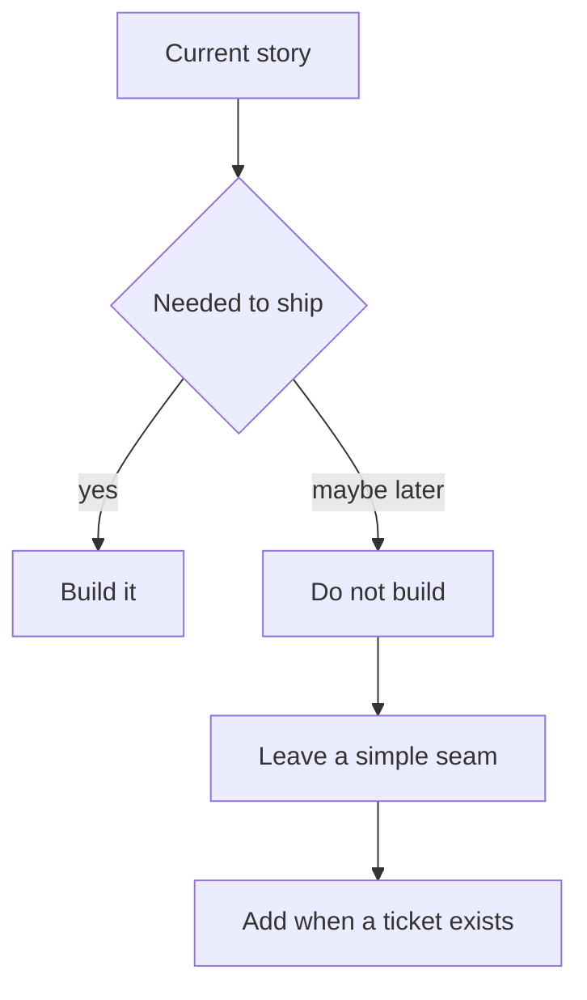

import { ConceptTemplate } from '@/features/kb/components/templates/ConceptTemplate'
import { Callout } from '@/features/kb/components/mdx/Callout'
import { ComparisonTable } from '@/features/kb/components/mdx/ComparisonTable'

export default function Layout({ children }) {
  return (
    <ConceptTemplate title="YAGNI">
      {children}
    </ConceptTemplate>
  )
}

**YAGNI** (Extreme Programming) forbids speculative features: unused configurability, a plugin system with one plugin, a microservice for a screen nobody shipped. The cost is not only the extra code. It is the options you now must test, document, and keep compatible. Build the thing the current story needs.

## 1. Deep Dive and Mechanics

**Speculative generality.** Abstract factories, `IStrategy` with one impl, `future_flags` in the schema. Delete until the second impl exists.

**Gold plating.** Extra fields, extra endpoints, extra dashboards “while we are here.” Scope them as their own stories or drop them.

**What YAGNI is not.** It is not a ban on design. A composition root, tests, and a clear module boundary are *for this* story. A Kafka cluster for a weekly batch is not.

**Reversibility.** Prefer decisions that are easy to undo (a function you can extract later) over decisions that lock you in (a public API you cannot rename). YAGNI plus reversible design is the pair.

<Callout icon="warning" title="YAGNI does not skip security or backups">
AuthN, validation, and a restore path are current requirements, not speculative ones. Do not YAGNI the incident.
</Callout>

## 2. Mathematical / Theoretical Foundation

**Option value versus carrying cost.** A speculative hook is a real option with negative cash flow (complexity) and uncertain payoff. XP’s bet: the cost of adding it later, with more information, is lower than carrying it now — *if* the code stays malleable (tests, simple design).

**Overfitting the future.** Requirements you invent have high error. The actual next request is a sample from a different distribution.

**Complementary slogans.** YAGNI (don’t build it), KISS (few parts), DRY (don’t duplicate knowledge). The failure mode is DRY+future: one abstraction that encodes three imagined variants.

<ComparisonTable
  headers={['Idea', 'Build now', 'Wait']}
  rows={[
    ['This story’s behavior', 'Yes', 'No'],
    ['Second implementation', 'No', 'Until it exists'],
    ['Public extra field', 'No', 'Until a client needs it'],
    ['Tests / auth on this path', 'Yes', 'Never'],
  ]}
/>

## 3. Real-World Implementation

```python
# YAGNI: one exporter
def export_csv(rows, path):
    write_csv(path, rows)

# later, when JSON is a real ticket:
def export(rows, path, fmt):
    if fmt == "json":
        write_json(path, rows)
    else:
        write_csv(path, rows)
```

Do not invent `ExportStrategyRegistry` on the first CSV story.

## 4. Visualizations



## 5. Interview Prep

**Q: What is YAGNI?**
**A:** You Aren’t Gonna Need It — from XP. Do not implement capability until a real customer or story requires it. Then mention the exception: safety, compliance, and reversibility.

**Q: How does it conflict with DRY?**
**A:** Premature DRY builds the abstraction YAGNI forbids. Wait for duplication of *knowledge*, then extract.

**Q: Isn’t architecture YAGNI-proof?**
**A:** Some architecture is paying for change you have evidence for (two teams, two scale profiles). Diagrams of six future services are not evidence.

## 6. Production Use Cases

- **MVP cuts** that still meet the acceptance tests.
- **Deleting unused flags** and dead endpoints.
- **Saying no** to a plugin API requested by one speculative partner.

<Callout icon="tip" title="Schedule the second one">
When you skip a generalization, file a one-line note: “if we get a second exporter, extract here.” That is cheaper than building the registry, and kinder than forgetting the seam.
</Callout>
