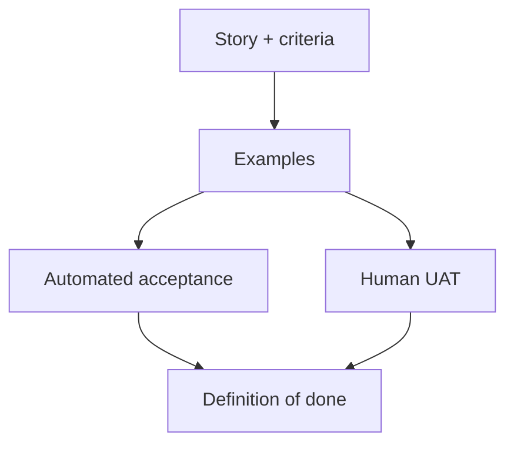

import { ConceptTemplate } from '@/features/kb/components/templates/ConceptTemplate'
import { Callout } from '@/features/kb/components/mdx/Callout'
import { ComparisonTable } from '@/features/kb/components/mdx/ComparisonTable'

export default function Layout({ children }) {
  return (
    <ConceptTemplate title="Acceptance Testing">
      {children}
    </ConceptTemplate>
  )
}

**Acceptance testing** asks whether the system meets the agreed criteria for a story or release — not whether a function returned 110. The audience is the product owner, auditor, or customer proxy. The language is outcomes: an invoice is issued, a refund is refused, a role cannot see payroll.

## 1. Deep Dive and Mechanics

**Criteria first.** A story is incomplete until Given / When / Then (or a checklist) is written. Acceptance tests automate those criteria or guide a structured UAT session.

**Automated versus UAT.** Automated acceptance sits in CI and guards regression of business rules. User acceptance testing (UAT) is a human pass on a staging-like system for judgement, look-and-feel, and unstated expectations.

**Where they run.** They may be API-level (fast, stable) or UI-level (closer to the user). Prefer API when the criterion is a business rule; use UI when the criterion is a screen or accessibility outcome.

**Ownership.** Product and engineering co-own the examples. If only QA understands the suite, it is not acceptance — it is leftover automation.

<Callout icon="info" title="Acceptance is a definition of done">
If the criterion is not executable or demoable, the team will argue about done on the last day of the sprint.
</Callout>

## 2. Mathematical / Theoretical Foundation

Think of the specification as a set of **examples** drawn from a quantified rule. "Eligible orders over 50 ship free" becomes a table of boundary examples. Acceptance tests are those examples executed against the live system or a close double.

Formal methods would prove the rule. Acceptance testing **samples** it. Completeness is a product judgement: enough examples that residual risk is acceptable.

ATDD (acceptance-test-driven development) writes the examples before code, same as TDD but at the story boundary.

<ComparisonTable
  headers={['Style', 'Author voice', 'Typical layer']}
  rows={[
    ['Acceptance test', 'Business outcome', 'API or UI'],
    ['Unit test', 'Developer of a unit', 'In-process'],
    ['UAT', 'Human stakeholder', 'Staging'],
    ['BDD scenario', 'Shared language', 'Same as acceptance'],
  ]}
/>

## 3. Real-World Implementation

```gherkin
Feature: Free shipping
  Scenario: Order clears the threshold
    Given a customer cart totalling 50.00
    When they complete checkout
    Then shipping is 0.00
    And the order is captured as eligible
```

The steps bind to API calls or a page object. Keep the Gherkin free of CSS selectors; those belong in the glue code.

## 4. Visualizations



## 5. Interview Prep

**Q: Acceptance versus end-to-end?**
**A:** E2E is a technique (drive the whole stack). Acceptance is a purpose (prove the story). An acceptance test can be an API call; an E2E test can ignore the original criterion.

**Q: Who writes them?**
**A:** Ideally three amigos: product, engineering, QA. Engineers implement glue; product confirms the examples still mean what they think.

**Q: Why do Gherkin suites rot?**
**A:** Imperative steps that describe clicks, not outcomes. Refactor to declarative language or drop Gherkin and use a readable DSL in code.

## 6. Production Use Cases

- **Regulated releases** where auditors want a mapped set of business rules to automated evidence.
- **Pricing and promotions** that product changes weekly.
- **Partner onboarding** checklists turned into API acceptance suites.

<Callout icon="tip" title="One example per rule">
A 40-row scenario outline that nobody can explain is a unit test in costume. Split by business distinction.
</Callout>
