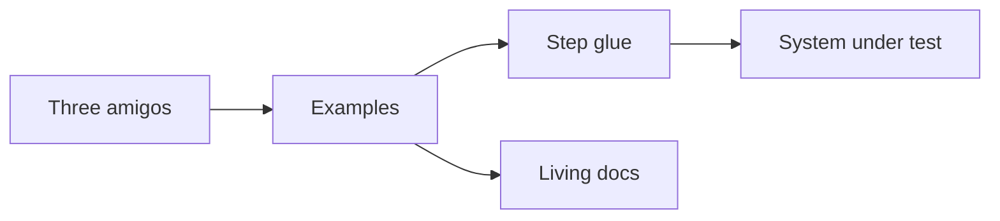

import { ConceptTemplate } from '@/features/kb/components/templates/ConceptTemplate'
import { Callout } from '@/features/kb/components/mdx/Callout'
import { ComparisonTable } from '@/features/kb/components/mdx/ComparisonTable'

export default function Layout({ children }) {
  return (
    <ConceptTemplate title="Behaviour-Driven Development (BDD)">
      {children}
    </ConceptTemplate>
  )
}

**Behaviour-driven development** grew out of TDD when Dan North noticed teams arguing about "tests" instead of *behaviour*. BDD is a conversation: three amigos invent examples in ubiquitous language, then bind those examples to automation (Cucumber, SpecFlow, Behave) or to readable tests that still sound like the domain.

## 1. Deep Dive and Mechanics

**The conversation.** Product, engineering, and QA walk a story and write concrete examples before code. Ambiguity dies in the room, not in QA week.

**Gherkin.** `Feature` / `Scenario` / Given-When-Then. Good scenarios name outcomes ("shipping is free"). Bad scenarios name clicks ("I press the blue div").

**Glue.** Step definitions map phrases to API or UI drivers. Reuse steps; do not fork a new English sentence for every CSS change.

**Living documentation.** The feature files should still make sense at a town hall. If they do not, you have a second, worse programming language.

<Callout icon="warning" title="BDD is not Cucumber">
A 2,000-step suite that no product person reads is TDD with extra regex. Drop Gherkin if the audience is only engineers — write a DSL in code.
</Callout>

## 2. Mathematical / Theoretical Foundation

BDD examples are **acceptance criteria as a partial function** from context to expected observations. Completeness is not formal; you choose a covering set of distinctions (boundaries, roles, error paths).

Ubiquitous language (DDD) is a homomorphism: words in the scenario map onto types in the model. When the mapping breaks, either the model or the language is wrong — that break is the design signal.

<ComparisonTable
  headers={['Practice', 'Primary audience', 'Artefact']}
  rows={[
    ['BDD', 'Cross-functional team', 'Examples + optional Gherkin'],
    ['TDD', 'Developers', 'Unit-level tests'],
    ['ATDD', 'Story acceptance', 'Same examples, less dogma'],
    ['UAT', 'Stakeholders', 'Manual or scripted pass'],
  ]}
/>

## 3. Real-World Implementation

```gherkin
Feature: Charge a saved card
  Scenario: Sufficient funds
    Given a customer with a saved card and a 20.00 cart
    When they confirm payment
    Then an authorisation for 20.00 is captured
    And the order is marked paid
```

```python
@when('they confirm payment')
def confirm(ctx):
    ctx.last = ctx.api.post('/checkouts/' + ctx.checkout_id + '/confirm')
```

Keep regexes boring. Put selectors in page objects, not in the English.

## 4. Visualizations



## 5. Interview Prep

**Q: How is BDD different from TDD?**
**A:** Scope and language. TDD drives a unit. BDD drives a behaviour the business can name. You can (and should) still TDD the internals.

**Q: Why do BDD suites become unmaintainable?**
**A:** Imperative steps, duplicated phrases, and UI coupling. Treat English as an API: version it, refactor it.

**Q: Must we use Gherkin?**
**A:** No. RSpec-style `describe` / `it` in the domain language is BDD if the examples came from the conversation.

## 6. Production Use Cases

- **Regulated workflows** (lending, claims) that auditors want in plain language.
- **Multi-team platforms** where product language drifts per squad.
- **Public API** behaviour published as executable examples for integrators.

<Callout icon="tip" title="One scenario, one distinction">
If you need an "and also" that introduces a second rule, write a second scenario. Tables are for the same rule at many boundaries.
</Callout>
