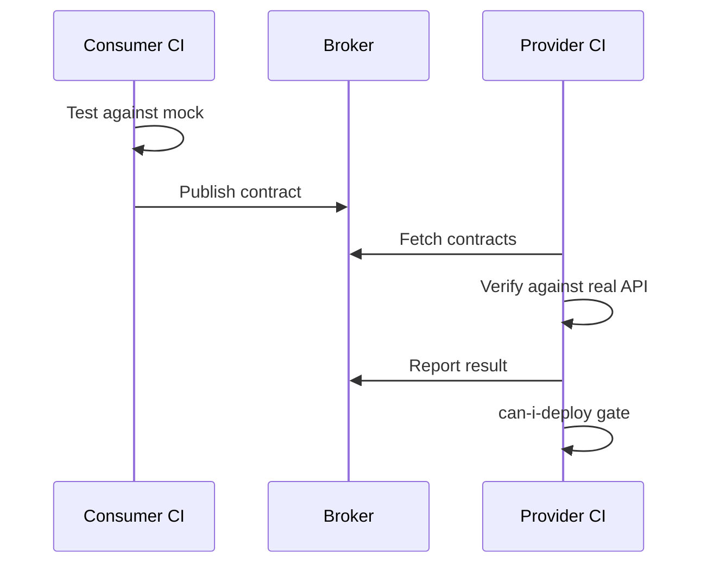

import { ConceptTemplate } from '@/features/kb/components/templates/ConceptTemplate'
import { Callout } from '@/features/kb/components/mdx/Callout'
import { ComparisonTable } from '@/features/kb/components/mdx/ComparisonTable'

export default function Layout({ children }) {
  return (
    <ConceptTemplate title="Contract Testing">
      {children}
    </ConceptTemplate>
  )
}

**Contract testing** records what a consumer needs from a provider (paths, status codes, required fields) and verifies the provider still honours that document. In a mesh of services it replaces a combinatorial E2E matrix with pairwise, versioned agreements — often via Pact and a broker.

## 1. Deep Dive and Mechanics

**Consumer side.** The UI or caller writes a test against a mock provider. The mock is generated from the expected interaction. After the test, a contract file is published.

**Provider side.** CI downloads contracts that name this provider and replays them against the real API (with test state hooks). If a required field disappeared, the provider build goes red before deploy.

**Broker.** A server stores contracts, verification results, and "can I deploy" answers. Webhooks block a pipeline when a consumer in production would break.

**Not a substitute for semantics.** Contracts check structure and a few example values. They do not prove that "total" is the right currency or that a refund is idempotent.

<Callout icon="info" title="Consumer-driven, not provider-wishful">
If the provider writes the contract alone, it will document what is convenient to implement. The consumer's actual parse path is the source of truth.
</Callout>

## 2. Mathematical / Theoretical Foundation

Treat each interaction as a pair of schemas (request, response) plus predicates (status in 2xx, field present). Provider compatibility is **schema refinement**: the provider's actual responses must be subtypes of what consumers expect (extra fields OK, missing required fields not).

Deployability is a graph: a version P of the provider is safe if every currently deployed consumer C has a contract that P verifies. "Can I deploy" is reachability in that version graph.

E2E cost grows with the product of service counts; pairwise contracts grow with the number of edges.

<ComparisonTable
  headers={['Approach', 'Coupling', 'Catches']}
  rows={[
    ['E2E two services', 'Runtime + data', 'Wiring and some logic'],
    ['OpenAPI only', 'Provider doc', 'Nothing unless linted'],
    ['Contract + broker', 'Published pact', 'Breaking wire changes'],
    ['Shared library types', 'Compile time', 'In-process only'],
  ]}
/>

## 3. Real-World Implementation

```javascript
// Consumer: records the pact
const { PactV3 } = require('@pact-foundation/pact');

const provider = new PactV3({ consumer: 'web-ui', provider: 'user-api' });

provider
  .uponReceiving('a user by id')
  .withRequest({ method: 'GET', path: '/users/42' })
  .willRespondWith({
    status: 200,
    body: { id: 42, displayName: 'Ada' },
  });
```

The provider verification job starts user-api with a known user 42 and runs `pact-provider-verifier`. Do not put object literals in narrative docs outside code fences.

## 4. Visualizations



## 5. Interview Prep

**Q: Why not just share an OpenAPI file?**
**A:** A file on a wiki does not fail CI. Contracts are executed. OpenAPI is still useful as documentation and for generated clients.

**Q: Who owns a breaking change?**
**A:** The provider versions (URL or header) and migrates consumers, or the broker shows which consumers would break and those teams move first.

**Q: Do contracts replace integrations?**
**A:** No. They replace most cross-team E2E for *shape*. Persistence and business rules still need local tests.

## 6. Production Use Cases

- **Frontend versus BFF** in a weekly release train.
- **Mobile apps** that cannot be forced to upgrade on the same day as the API.
- **Partner webhooks** where you are the provider and they publish contracts.

<Callout icon="warning" title="Stale contracts are worse than none">
If nobody verifies, the broker is a museum. Make provider verification a required check on main.
</Callout>
