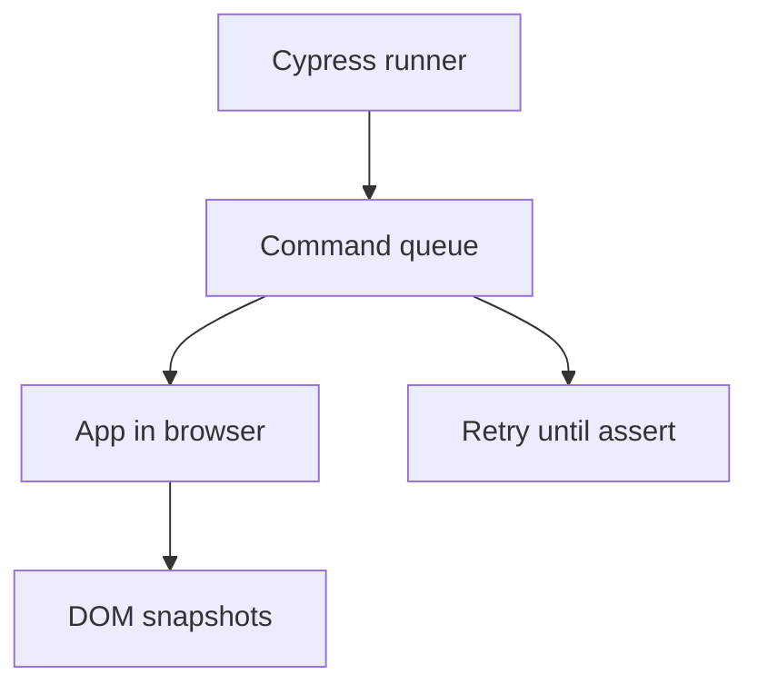

import { ConceptTemplate } from '@/features/kb/components/templates/ConceptTemplate'
import { Callout } from '@/features/kb/components/mdx/Callout'
import { ComparisonTable } from '@/features/kb/components/mdx/ComparisonTable'

export default function Layout({ children }) {
  return (
    <ConceptTemplate title="Cypress">
      {children}
    </ConceptTemplate>
  )
}

**Cypress** runs (classically) *inside* the browser alongside your app, intercepting events and taking a DOM snapshot after each command. The interactive runner made E2E approachable. Cross-origin, multi-tab, and Safari stories were historically weak; Cypress has been closing gaps, but Playwright still owns that shape.

## 1. Deep Dive and Mechanics

**Command queue.** `cy.get(...).click()` does not run immediately; it enqueues. That is why you cannot assign a value the usual way — use `.then` or aliases.

**Retries.** Assertions retry until timeout. That is Cypress's auto-wait. Prefer it over `cy.wait(5000)`.

**Network.** `cy.intercept` stubs or spies on XHR/fetch. Use it to freeze flaky backends, not to avoid testing your BFF entirely.

**Component testing.** Cypress can mount framework components in a real browser — closer to unit/integration than full E2E.

<Callout icon="info" title="The queue surprises JavaScript habits">
`const el = cy.get('button')` is not a DOM node. Think in chains and callbacks, or you will fight the runner.
</Callout>

## 2. Mathematical / Theoretical Foundation

Each command is a step in a **retry loop**: run query, check assertion, sleep, repeat until T. Flake falls when the predicate is monotonic (eventually true and stays true). Non-monotonic UI (spinners that flicker) still flakes.

In-browser architecture shares the JS heap with the app. That enables time-travel snapshots and also couples you to same-origin constraints unless you opt into newer multi-origin APIs.

<ComparisonTable
  headers={['Need', 'Cypress', 'Playwright']}
  rows={[
    ['Interactive time-travel', 'Excellent', 'Trace viewer instead'],
    ['WebKit / Safari', 'Limited historically', 'First-class'],
    ['Multiple tabs', 'Awkward', 'Native'],
    ['Language', 'JavaScript / TS', 'JS, Python, Java, C#'],
  ]}
/>

## 3. Real-World Implementation

```javascript
describe('checkout', () => {
  it('pays with a stubbed processor', () => {
    cy.intercept('POST', '/api/pay', { statusCode: 200, body: { ok: true } });
    cy.visit('/cart');
    cy.findByRole('button', { name: 'Pay' }).click();
    cy.findByText('Thanks').should('be.visible');
  });
});
```

`findByRole` comes from Testing Library's Cypress package — prefer it over raw CSS.

## 4. Visualizations



## 5. Interview Prep

**Q: Why can't I use async/await like Playwright?**
**A:** Classic Cypress owns the asynchrony via its queue. Newer versions improved promises, but idiomatic tests still chain `cy.*`.

**Q: When would you pick Cypress today?**
**A:** A team already fluent in the runner, component testing in-browser, and journeys that stay single-tab and same-site.

**Q: How do you handle auth?**
**A:** `cy.session` plus an API login. Do not type into the login form in every spec.

## 6. Production Use Cases

- **SPA happy paths** in teams that standardised on Cypress Dashboard (now Cypress Cloud) in the 2010s.
- **Component tests** for design-system widgets in a real browser.
- **Visual** plugins (Percy, Cypress screenshots) for marketing pages.

<Callout icon="warning" title="Stubbing every API hides your BFF">
A fully intercepted suite can pass while the real `/api/pay` is 500. Keep a thin unstubbed smoke against staging.
</Callout>
