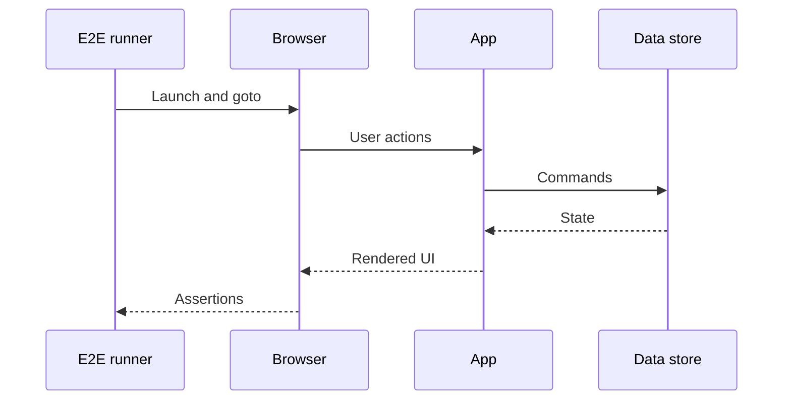

import { ConceptTemplate } from '@/features/kb/components/templates/ConceptTemplate'
import { Callout } from '@/features/kb/components/mdx/Callout'
import { ComparisonTable } from '@/features/kb/components/mdx/ComparisonTable'

export default function Layout({ children }) {
  return (
    <ConceptTemplate title="End-to-End Testing">
      {children}
    </ConceptTemplate>
  )
}

**End-to-end (E2E) testing** exercises a complete path: browser or client, gateway, services, and data stores. It answers a different question than a unit test: can a person finish the job in the assembled system?

## 1. Deep Dive and Mechanics

**The journey.** Pick a few revenue or safety paths: sign-in, checkout, provision, refund. Each test is a scripted actor with waits, retries, and explicit assertions on user-visible state.

**Why they hurt.** E2E tests see every flake in the stack: animations, feature flags, eventual consistency, third-party captchas. They are also the only tests that see CSS that covers a button or a CORS header that blocks the SPA.

**Stabilisers.** Auto-waiting (Playwright), network interception, seed data APIs, and test-only accounts. Never sleep for a magic 5 seconds if you can wait for a role or a response.

**Pyramid placement.** Few E2E, many units. A 400-case E2E suite becomes an unowned product.

<Callout icon="warning" title="E2E is a scarce budget">
Each extra journey multiplies CI minutes and flake surface. Add a path when a bug class cannot be caught lower, not because a ticket said 100 percent E2E.
</Callout>

## 2. Mathematical / Theoretical Foundation

Model the UI as a state machine. An E2E test is a path through that machine plus the backend machines it triggers. The number of paths is the product of independent choices — combinatorial explosion.

**Flake probability.** If each of k independent wait points has failure probability p, P(test flakes) ≈ 1 − (1 − p)^k. Long journeys lose. Shorter journeys and deterministic seeds shrink k and p.

**Cost.** Wall time is serialised user time unless you shard browsers. Optimal suite size balances residual risk against engineer hours spent debugging red CI that is not a product bug.

<ComparisonTable
  headers={['Layer', 'What it proves', 'Typical cost']}
  rows={[
    ['Unit', 'Local logic', 'Milliseconds'],
    ['Integration', 'A real seam', 'Seconds'],
    ['E2E', 'A user journey on the stack', 'Tens of seconds to minutes'],
    ['Manual UAT', 'Judgement and exploration', 'Hours'],
  ]}
/>

## 3. Real-World Implementation

```javascript
import { test, expect } from '@playwright/test';

test('buyer completes checkout', async ({ page }) => {
  await page.goto('/catalog');
  await page.getByRole('button', { name: 'Add to cart' }).click();
  await page.getByRole('link', { name: 'Checkout' }).click();
  await page.getByLabel('Card').fill('4242424242424242');
  await page.getByRole('button', { name: 'Pay' }).click();
  await expect(page.getByText('Order confirmed')).toBeVisible();
});
```

Seed the catalog and a test customer in beforeEach via an internal API, not by clicking through admin.

## 4. Visualizations



## 5. Interview Prep

**Q: Why not replace the pyramid with E2E only?**
**A:** Signal-to-noise and feedback time. A failed E2E does not say which layer broke. Units localise; E2E confirms assembly.

**Q: How do you handle third-party SSO in E2E?**
**A:** Stub the IdP in the test environment or use a documented test tenant. Do not automate a real production login page.

**Q: What is a flake budget?**
**A:** A measured rate of false reds. Above a small threshold the suite is ignored. Quarantine or delete; do not retry forever.

## 6. Production Use Cases

- **Checkout and billing** on every deploy candidate.
- **Admin kill-switches** and entitlement gates that must not lock customers out.
- **Smoke E2E against staging** after Terraform apply, before traffic shift.

<Callout icon="tip" title="Trace or it did not happen">
On failure, keep a video, a trace, and network log. Without artefacts, E2E failures become folklore.
</Callout>
