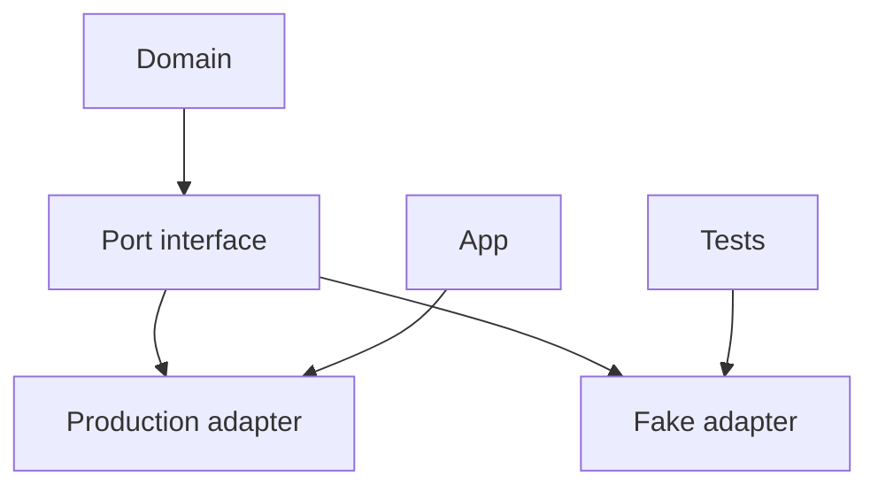

import { ConceptTemplate } from '@/features/kb/components/templates/ConceptTemplate'
import { Callout } from '@/features/kb/components/mdx/Callout'
import { ComparisonTable } from '@/features/kb/components/mdx/ComparisonTable'

export default function Layout({ children }) {
  return (
    <ConceptTemplate title="Fakes">
      {children}
    </ConceptTemplate>
  )
}

A **fake** is a double that actually implements the collaborator's contract, just in a cheaper way: a dict instead of Postgres, an in-process queue instead of Kafka, a clock you can advance. Fakes catch protocol bugs that stubs miss — unique keys, ordering, "find after save."

## 1. Deep Dive and Mechanics

**Working subset.** The fake honours the parts of the API the product uses. You can skip admin-only RPCs. Document the gaps.

**Shared with tests.** Put the fake next to the port, not copied into each test file. Production code never imports it (except perhaps a local-dev mode).

**Drift.** When you add a method to the port, the fake must gain a real implementation or the type-checker yells. That is a feature.

**Not a mock.** You do not pre-script calls. You assert on the state of the fake or the unit after acting.

<Callout icon="info" title="Fakes are production-adjacent">
An in-memory repository that ignores uniqueness will teach the domain that duplicates are fine. Implement the same constraints you rely on.
</Callout>

## 2. Mathematical / Theoretical Foundation

A fake F **simulates** a real collaborator R on a set of operations if, for those operations, observable traces match. Perfect simulation is impossible (durability, isolation levels). You choose a model: sequential consistency, last-write-wins, unique primary keys.

If the domain depends on a property the fake does not have (repeatable read), the test is **unsound** relative to production. Promote that case to an integration.

<ComparisonTable
  headers={['Need', 'Use a fake', 'Do not fake']}
  rows={[
    ['CRUD + uniqueness', 'In-memory repo', 'SQL isolation bugs'],
    ['Time travel', 'Controllable clock', 'NTP / leap seconds'],
    ['Pub-sub in-process', 'List of handlers', 'Delivery guarantees'],
    ['Payments', 'Record of charges', 'Real settlement'],
  ]}
/>

## 3. Real-World Implementation

```python
class FakeClock:
    def __init__(self, t):
        self._t = t
    def now(self):
        return self._t
    def advance(self, seconds):
        self._t += seconds

def test_invite_expires():
    clock = FakeClock(1_700_000_000)
    svc = Invites(clock)
    token = svc.issue(ttl=60)
    clock.advance(61)
    assert svc.redeem(token) is False
```

Advancing time is why expiry tests should never `sleep(61)`.

## 4. Visualizations



## 5. Interview Prep

**Q: Fake versus stub?**
**A:** A stub returns what you programmed for this test. A fake keeps state and answers consistently across calls.

**Q: Why not always fake?**
**A:** Cost of maintaining the fake, and properties you cannot simulate. Also, a fake that is harder than the real adapter is a failed abstraction.

**Q: Can a fake ship in production?**
**A:** Sometimes as an embedded mode (SQLite, in-process bus) for single-node installs. Then it is no longer only a test tool — treat it as a product.

## 6. Production Use Cases

- **Repository fakes** for domain unit tests in hexagonal architectures.
- **Email fakes** that store messages for assertion and local UI previews.
- **Feature-flag fakes** with an in-memory map for deterministic suites.

<Callout icon="tip" title="One fake per port">
Five slightly different in-memory users dictionaries means five bugs. Share the fake; parameterise the test data.
</Callout>
