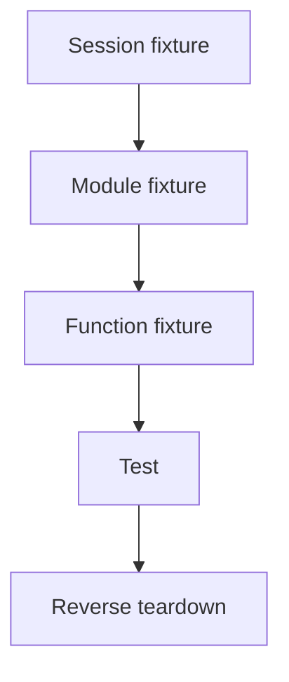

import { ConceptTemplate } from '@/features/kb/components/templates/ConceptTemplate'
import { Callout } from '@/features/kb/components/mdx/Callout'
import { ComparisonTable } from '@/features/kb/components/mdx/ComparisonTable'

export default function Layout({ children }) {
  return (
    <ConceptTemplate title="Fixtures">
      {children}
    </ConceptTemplate>
  )
}

A **fixture** is the arranged world: a user, a temp directory, a database session, a Playwright `page`. The word covers both the *data* and the *mechanism* that builds and destroys it (pytest fixtures, xUnit setup, Jest `beforeEach`). Good fixtures are explicit, narrow, and isolated.

## 1. Deep Dive and Mechanics

**Lifetime.** Function (every test), class/module, or session (once). Session-scoped database containers save minutes; function-scoped transactions keep isolation.

**Composition.** pytest injects fixtures by parameter name. A `client` fixture can depend on `app` which depends on `db`. That graph is the hidden architecture of the suite — keep it readable.

**Builders versus blobs.** `make_order(status='paid')` beats a 200-line JSON file nobody dares to edit. Use files for truly bulky payloads (an HL7 message, a HAR).

**Cleanup.** `yield` then close. Leaked containers and leftover rows are flakes. Prefer rollback or unique prefixes over "delete where 1=1" at the end.

<Callout icon="warning" title="Shared mutable fixtures">
A module-scoped list that tests append to will pass alone and fail in parallel. Isolation is part of the fixture contract.
</Callout>

## 2. Mathematical / Theoretical Foundation

Each test is a function from an initial state σ0 to a pass/fail. Fixtures construct σ0. If two tests share a mutable σ, you have a **dependence**: the suite is a partial order, not a set. Parallel runners assume a set.

Idempotent setup (create-or-replace with unique keys) makes σ0 reconstructible. That is the difference between a fixture and "whatever is in staging."

<ComparisonTable
  headers={['Style', 'How state appears', 'Risk']}
  rows={[
    ['Inline arrange', 'In the test', 'Verbose, very clear'],
    ['Builder / factory', 'Named helper', 'Low'],
    ['DI fixture (pytest)', 'Injected param', 'Hidden graph'],
    ['Golden file', 'On disk', 'Stale, huge diffs'],
    ['Shared DB seed', 'Once per suite', 'Order dependence'],
  ]}
/>

## 3. Real-World Implementation

```python
import pytest

@pytest.fixture
def db(engine):
    connection = engine.connect()
    trans = connection.begin()
    yield Session(bind=connection)
    trans.rollback()
    connection.close()

@pytest.fixture
def paid_order(db):
    order = Order(status='paid', total=20)
    db.add(order)
    db.flush()
    return order
```

Tests take `paid_order` and never see the transaction. Rollback means no leftover rows.

## 4. Visualizations



## 5. Interview Prep

**Q: Fixture versus factory?**
**A:** A factory is a function that builds objects. A fixture is that plus lifecycle (setup/teardown) managed by the runner.

**Q: Why is my suite order-dependent?**
**A:** A fixture leaked state or a test wrote to a shared resource without unique keys. Run with random order (pytest-randomly) to find it.

**Q: Should fixtures load production dumps?**
**A:** As a last resort, anonymised and trimmed. Prefer builders that encode the cases you care about; dumps hide the interesting rows.

## 6. Production Use Cases

- **pytest** session-scoped Testcontainers and function-scoped transactions.
- **Playwright** `storageState` for an already-logged-in user.
- **JUnit** `@TempDir` and `@TestInstance` lifecycles for files and expensive clients.

<Callout icon="tip" title="Name fixtures after the world">
`paid_order` and `expired_invite` document intent. `fixture1` documents nothing.
</Callout>
