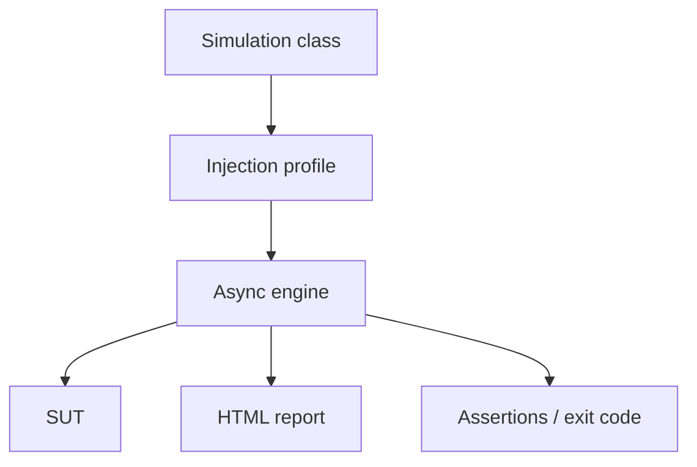

import { ConceptTemplate } from '@/features/kb/components/templates/ConceptTemplate'
import { Callout } from '@/features/kb/components/mdx/Callout'
import { ComparisonTable } from '@/features/kb/components/mdx/ComparisonTable'

export default function Layout({ children }) {
  return (
    <ConceptTemplate title="Gatling">
      {children}
    </ConceptTemplate>
  )
}

**Gatling** describes scenarios in a Scala, Java, or Kotlin DSL: users arrive, they browse, they pause, they post. The engine is asynchronous (historically Akka-style), so one generator process can hold far more virtual users than a naive thread-per-user JMeter plan. The HTML report after a run is still one of the best out-of-the-box artefacts in the category.

## 1. Deep Dive and Mechanics

**Simulation.** A class that sets the protocol (base URL, headers) and injects a population: `rampUsers`, `constantUsersPerSec`, `stressPeakUsers`.

**Scenario.** A chain of HTTP calls with `check` extractors (status, jsonPath) that feed later steps (save a token).

**Feeders.** CSV or in-memory iterators for unique credentials. Circular versus queue matters when you run out of rows.

**Enterprise.** Gatling FrontLine / Cloud adds distributed control and trends. OSS remains enough for many teams.

<Callout icon="info" title="Code is the plan">
A Gatling simulation reviews like production code. That is the product. Treat magic numbers as named constants and keep feeders in git LFS if they are huge.
</Callout>

## 2. Mathematical / Theoretical Foundation

`constantUsersPerSec` is an open arrival process. `rampUsers(N)` over T seconds is a closed injection of N sessions. Mixing them without naming which SLO you want produces pretty charts and unclear gates.

The engine multiplexes sockets on a small thread pool. Generator CPU and file-descriptor limits still bind: async is not infinite.

<ComparisonTable
  headers={['Tool', 'How you write it', 'Report']}
  rows={[
    ['Gatling', 'JVM DSL', 'Excellent local HTML'],
    ['k6', 'JavaScript', 'Summary + Grafana'],
    ['JMeter', 'GUI / XML', 'jtl + plugins'],
    ['Locust', 'Python classes', 'Web UI + charts'],
  ]}
/>

## 3. Real-World Implementation

```java
public class CatalogSimulation extends Simulation {
  HttpProtocolBuilder http = http.baseUrl("https://staging.example.com");

  ScenarioBuilder browse = scenario("browse")
      .exec(http("catalog").get("/api/catalog").check(status().is(200)));

  {
    setUp(browse.injectOpen(constantUsersPerSec(50).during(Duration.ofMinutes(5))))
        .protocols(http)
        .assertions(global().responseTime().percentile(95).lt(400));
  }
}
```

`assertions` fail the Maven/Gradle run — use them. A report that nobody gates is decoration.

## 4. Visualizations



## 5. Interview Prep

**Q: Why was Gatling faster than old JMeter?**
**A:** Non-blocking I/O versus thread-per-VU. Modern JMeter improved; the historical reason still appears in interviews.

**Q: Scala or Java DSL?**
**A:** Java/Kotlin are fine and hireable. Scala is concise if the team already speaks it. Pick one per repo.

**Q: How do you share a token across requests?**
**A:** `check(jsonPath(...).saveAs("token"))` then a header from the session. Session is per virtual user, not global.

## 6. Production Use Cases

- **JVM shops** that want load tests in the same language as the service.
- **Release reports** attached to a change ticket (HTML zip).
- **Open injection** profiles that must sit next to Maven modules.

<Callout icon="tip" title="Name every request">
Anonymous GETs collapse into one line in the report. `http("catalog")` is how you find the slow route.
</Callout>
