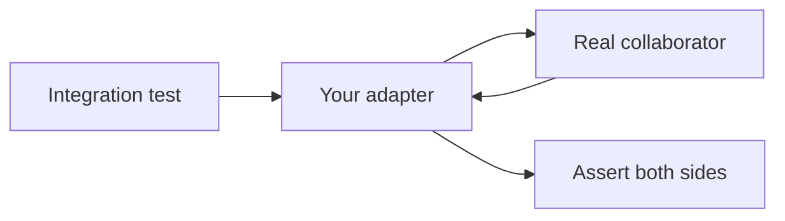

import { ConceptTemplate } from '@/features/kb/components/templates/ConceptTemplate'
import { Callout } from '@/features/kb/components/mdx/Callout'
import { ComparisonTable } from '@/features/kb/components/mdx/ComparisonTable'

export default function Layout({ children }) {
  return (
    <ConceptTemplate title="Integration Testing">
      {children}
    </ConceptTemplate>
  )
}

**Integration testing** verifies that two or more real components honour a shared contract when they run together. Units prove functions. Integrations prove that the ORM, the queue client, and the HTTP adapter actually agree.

## 1. Deep Dive and Mechanics

**Narrow versus broad.** A narrow integration starts one real collaborator (Postgres in Docker, a local Redis) and doubles the rest. A broad integration starts several services. Narrow tests stay diagnosable; broad tests start to look like end-to-end.

**The seam.** Typical seams: repository to database, producer to broker, client to HTTP API, worker to filesystem. The test writes through the public port and reads the other side, or the reverse.

**State.** Integrations are stateful. Isolate with transactions that roll back, unique key prefixes, or ephemeral containers (Testcontainers). Shared leftover rows are the usual source of flakes.

**Contract overlap.** If two services are owned by different teams, prefer consumer-driven contracts for the wire shape and keep a few integrations for persistence and operational behaviour.

<Callout icon="info" title="Test the adapter, not the vendor">
Assert that your repository maps a row to a domain object. Do not re-test that Postgres can SELECT. That distinction keeps the suite cheap.
</Callout>

## 2. Mathematical / Theoretical Foundation

Composition is not associative with correctness. If A satisfies spec SA and B satisfies SB, A composed with B satisfies SA compose SB only if the **interface refinement** holds: every guarantee A relies on is a guarantee B actually provides.

Schema drift is a type error discovered at runtime. An integration test is a **dynamic type check** of that refinement on a live driver.

Cost model: time is dominated by process start and I/O, not assertion logic. Parallelise by sharding databases or using one container per worker.

<ComparisonTable
  headers={['Kind', 'What is real', 'What you learn']}
  rows={[
    ['Narrow integration', 'One dependency', 'Your adapter and schema'],
    ['Broad integration', 'Several services', 'Partial topology'],
    ['Contract test', 'Stubbed peer, recorded pact', 'Wire shape agreement'],
    ['End-to-end', 'Full stack plus UI', 'User-visible journeys'],
  ]}
/>

## 3. Real-World Implementation

```python
import pytest
from sqlalchemy import text

@pytest.fixture
def db_session(engine):
    connection = engine.connect()
    trans = connection.begin()
    session = Session(bind=connection)
    yield session
    session.close()
    trans.rollback()
    connection.close()

def test_user_round_trip(db_session, user_repo):
    user_repo.save(User(email='a@example.com'))
    found = user_repo.find_by_email('a@example.com')
    assert found.email == 'a@example.com'
    row = db_session.execute(text('select count(*) from users')).scalar()
    assert row == 1
```

Rollback-after-test beats truncate-all when tests share a server.

## 4. Visualizations



## 5. Interview Prep

**Q: Unit versus integration — where do you draw the line?**
**A:** If the failure could be caused by a downed Docker daemon, it is an integration. If it can run in a pure in-process heap, it is a unit.

**Q: Why are integration tests flaky?**
**A:** Shared mutable state, unwaited async I/O, port collisions, and clocks. Fix isolation before you retry.

**Q: Do you still need integrations if you have Pact?**
**A:** Yes for persistence, migrations, and behaviour the contract does not encode (transactions, uniqueness, idempotency).

## 6. Production Use Cases

- **Repository and migration suites** against the same engine you ship.
- **Outbox or queue publishers** that write a real topic and consume it in-process.
- **Payment or email adapters** pointed at a vendor sandbox, gated to nightly if they are slow.

<Callout icon="warning" title="Do not promote a unit suite by adding a live database">
That hides the cost in the wrong job. Keep a fast unit shard required, and a slower integration shard required only if it is stable.
</Callout>
