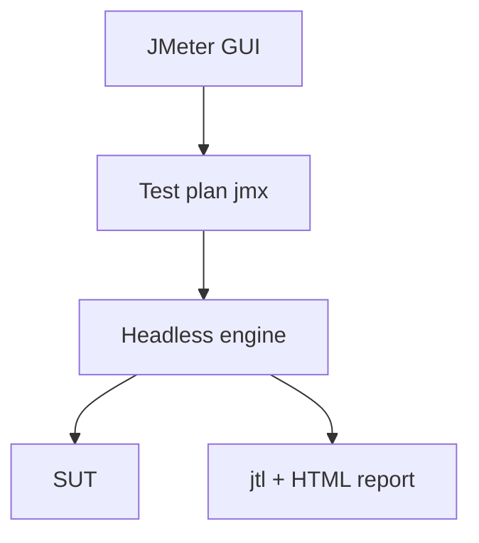

import { ConceptTemplate } from '@/features/kb/components/templates/ConceptTemplate'
import { Callout } from '@/features/kb/components/mdx/Callout'
import { ComparisonTable } from '@/features/kb/components/mdx/ComparisonTable'

export default function Layout({ children }) {
  return (
    <ConceptTemplate title="JMeter">
      {children}
    </ConceptTemplate>
  )
}

**Apache JMeter** is a desktop GUI that builds an XML **test plan**: thread groups (users), samplers (HTTP, JDBC, JMS), timers, assertions, and listeners. The same plan runs headless (`jmeter -n`) in CI or on a farm of generators. It is older than k6 and Gatling and still everywhere in enterprises that standardised on Java tooling.

## 1. Deep Dive and Mechanics

**Thread group.** N threads, ramp, loop count. This is a **closed** model: when the SUT slows, threads wait, so offered load drops. Complement with precise timers if you need a steadier arrival rate.

**Samplers and controllers.** HTTP Request sampler plus if/while/foreach controllers. CSV data set config feeds unique users.

**GUI versus engine.** Design in the GUI; never generate load from the GUI on a laptop — listeners eat heap. Headless + backend listener (Influx) for real runs.

**Distributed.** Master/slave (now controller/worker) mode. Clock skew and network between generators become your problem.

<Callout icon="warning" title="Listeners in GUI mode lie about capacity">
A View Results Tree during a 2,000-thread run will OOM the generator and you will blame the SUT. Disable heavy listeners for the real test.
</Callout>

## 2. Mathematical / Theoretical Foundation

Closed load: throughput ≤ threads / (response + think). To hit a target RPS you size threads with Little's Law and then **measure** — JMeter does not magically become open-loop.

The plan is a tree; each sampler execution is a timed event. Aggregate reports compute mean, median, and percentiles from those samples. Percentiles on a short run are noisy.

<ComparisonTable
  headers={['Tool', 'Script', 'Model bias']}
  rows={[
    ['JMeter', 'XML plan + GUI', 'Closed thread groups'],
    ['k6', 'JavaScript', 'Open arrival-rate easy'],
    ['Gatling', 'Code DSL', 'Strong reports, JVM'],
    ['Locust', 'Python tasks', 'Distributed swarms'],
  ]}
/>

## 3. Real-World Implementation

```xml
<!-- excerpt: HTTP sampler inside a Thread Group -->
<HTTPSamplerProxy testname="GET catalog">
  <stringProp name="HTTPSampler.domain">staging.example.com</stringProp>
  <stringProp name="HTTPSampler.path">/api/catalog</stringProp>
  <stringProp name="HTTPSampler.method">GET</stringProp>
</HTTPSamplerProxy>
```

```bash
jmeter -n -t catalog.jmx -l results.jtl -e -o report/
```

Commit the `.jmx`, not a screenshot of the GUI. Review XML diffs like code.

## 4. Visualizations



## 5. Interview Prep

**Q: Why did we not hit the RPS we configured?**
**A:** Closed model, think times, or the generator saturated. Check generator CPU first.

**Q: JMeter versus k6?**
**A:** JMeter: protocol breadth, GUI designers, existing plans. k6: as-code, modern thresholds, nicer DevOps fit. Both can load-test HTTP well.

**Q: How do you assert SLO in JMeter?**
**A:** Duration Assertion, or post-process the jtl (or use Taurus / Jenkins perf plugin) and fail the job if p95 exceeds a number.

## 6. Production Use Cases

- **Banks and telcos** with decade-old `.jmx` libraries.
- **JDBC and JMS** load that k6 does not speak natively.
- **Vendor bake-offs** where the other side already speaks JMeter.

<Callout icon="tip" title="Version the plan and the data file">
A CSV of users that expired last quarter makes a perfect-looking test that only hits 401s. Treat data as part of the artefact.
</Callout>
