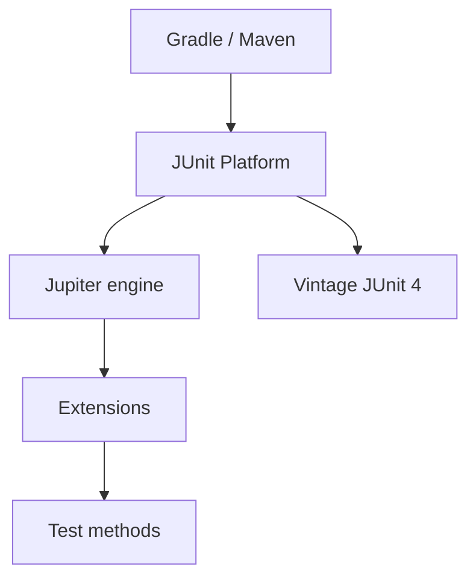

import { ConceptTemplate } from '@/features/kb/components/templates/ConceptTemplate'
import { Callout } from '@/features/kb/components/mdx/Callout'
import { ComparisonTable } from '@/features/kb/components/mdx/ComparisonTable'

export default function Layout({ children }) {
  return (
    <ConceptTemplate title="JUnit">
      {children}
    </ConceptTemplate>
  )
}

**JUnit** is how the JVM says "test." JUnit 5 is a platform (the launcher) plus **Jupiter** (the programming model: `@Test`, `@ParameterizedTest`, `@ExtendWith`). JUnit 4 still exists in legacy modules; new code should be Jupiter.

## 1. Deep Dive and Mechanics

**Platform.** IDEs and Maven/Gradle talk to the JUnit Platform, which can run Jupiter, Vintage (JUnit 4), and third-party engines (Spock, Kotest).

**Lifecycle.** `@BeforeEach` / `@AfterEach` per method; `@BeforeAll` on static methods unless you use `@TestInstance(PER_CLASS)`.

**Extensions.** `@ExtendWith` replaces JUnit 4 `@Rule` and `@RunWith`. Spring's `SpringExtension`, Testcontainers, and Mockito all plug in here.

**Assertions.** Jupiter's `Assertions` plus AssertJ in most codebases for fluent lists and exceptions.

<Callout icon="info" title="Vintage is a bridge, not a destination">
The Vintage engine lets JUnit 4 tests run on the platform. Migrate package by package; do not add new `@RunWith`.
</Callout>

## 2. Mathematical / Theoretical Foundation

The platform is a **service provider** architecture: engines discover tests, execute, and report events. Isolation is typically per-class classloader in some runners, but static mutable state still leaks — treat statics as shared memory.

Parameterized tests are a Cartesian or explicit product of arguments, same explosion risk as pytest.

<ComparisonTable
  headers={['Generation', 'Model', 'Extension']}
  rows={[
    ['JUnit 3', 'Naming conventions', 'Subclass TestCase'],
    ['JUnit 4', 'Annotations', 'Runners and Rules'],
    ['JUnit 5 Jupiter', 'Annotations', 'Extensions'],
    ['TestNG', 'More config', 'Still seen in some orgs'],
  ]}
/>

## 3. Real-World Implementation

```java
@Test
void totalIncludesTax() {
    var cart = new Cart();
    cart.add(new Line(100, 1));
    assertEquals(110, cart.total(new FixedTax(0.10)));
}

@ParameterizedTest
@ValueSource(ints = {-1, -5})
void rejectsNegativeQty(int qty) {
    assertThrows(IllegalArgumentException.class, () -> new Line(10, qty));
}
```

## 4. Visualizations



## 5. Interview Prep

**Q: JUnit 4 versus 5?**
**A:** 5 is modular: platform + Jupiter. Extensions beat runners. Vintage runs old tests. New modules should be Jupiter.

**Q: How do you inject a Spring context?**
**A:** `@ExtendWith(SpringExtension.class)` or `@SpringBootTest`. Slice tests (`@WebMvcTest`) keep the context small.

**Q: Why is `@BeforeAll` static?**
**A:** Default instance lifecycle is per-method. `@TestInstance(Lifecycle.PER_CLASS)` allows instance `@BeforeAll`.

## 6. Production Use Cases

- **Spring Boot** slice and integration tests.
- **Plain domain** modules with no Spring in sight — keep them fast.
- **Architecture tests** (ArchUnit) running as Jupiter tests in CI.

<Callout icon="tip" title="Name tests as predicates">
`totalIncludesTax` reads in the failure report. `test1` does not. Jupiter allows spaces in `@DisplayName` if you want prose.
</Callout>
