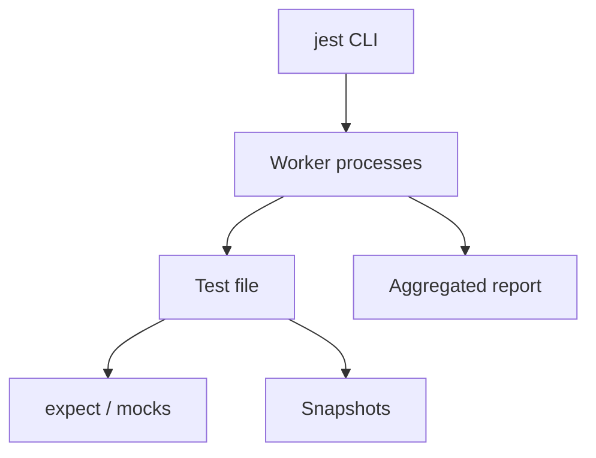

import { ConceptTemplate } from '@/features/kb/components/templates/ConceptTemplate'
import { Callout } from '@/features/kb/components/mdx/Callout'
import { ComparisonTable } from '@/features/kb/components/mdx/ComparisonTable'

export default function Layout({ children }) {
  return (
    <ConceptTemplate title="Jest">
      {children}
    </ConceptTemplate>
  )
}

**Jest** (Meta, now OpenJS) collapsed the old Mocha + Chai + Sinon + Istanbul stack into one runner. You get a CLI, `expect`, `jest.fn()`, jsdom, coverage, and snapshots with almost no config — which is why it became the default for React apps.

## 1. Deep Dive and Mechanics

**Workers.** Each test file runs in its own worker process. Global pollution in file A does not leak into file B. Isolation costs RAM; huge monorepos tune `maxWorkers`.

**Transform.** Historically Babel or ts-jest compiled on the fly. Today many teams use `jest` with `babel-jest` or migrate to Vitest for native ESM/Vite. Jest's ESM story exists but is still the sharp edge.

**Mocking.** `jest.mock('module')` hoists and replaces the module registry for that file. Powerful and easy to overuse. Prefer injecting ports.

**Watch mode.** Jest's interactive watch and `onlyChanged` made TDD comfortable in JS. Failed tests rerun first.

<Callout icon="info" title="jsdom is not a browser">
Layout, cookies, and some Web APIs are missing or fake. Component logic belongs in Jest; real clicking belongs in Playwright.
</Callout>

## 2. Mathematical / Theoretical Foundation

Parallelism: if files are independent, wall time ≈ (sum of file times) / workers, plus transform cache. Shared mutable modules (singletons) violate independence and create heisenfails.

Snapshot equality is string (or tree) identity. Mock call records are traces. Coverage is a projection of executed statements — see the mutation-testing page for why that is not adequacy.

<ComparisonTable
  headers={['Runner', 'Sweet spot', 'Watch-out']}
  rows={[
    ['Jest', 'React/CRA-era apps, isolation', 'ESM, speed vs Vite'],
    ['Vitest', 'Vite apps, ESM-native', 'Some Jest-only plugins'],
    ['Node test runner', 'No deps, simple libs', 'Fewer conveniences'],
    ['Mocha', 'Flexible plugins', 'You assemble the stack'],
  ]}
/>

## 3. Real-World Implementation

```javascript
test('formats cents', () => {
  expect(formatMoney(1099, 'USD')).toBe('$10.99');
});

test('charges once', () => {
  const charge = jest.fn().mockResolvedValue({ id: 'ch_1' });
  const svc = new Billing(charge);
  return svc.pay(1099).then(() => {
    expect(charge).toHaveBeenCalledTimes(1);
  });
});
```

Keep `jest.mock` at file top only for modules you truly cannot inject.

## 4. Visualizations



## 5. Interview Prep

**Q: Why does Jest hoist jest.mock?**
**A:** So the replacement exists before imports run. That is also why mock calls look "out of order" in the file — understand hoisting or you will debug ghosts.

**Q: Jest versus Vitest?**
**A:** Same assertion style. Vitest is faster in Vite repos and treats ESM as native. Jest still dominates older CRA and many enterprise codebases.

**Q: How do you test timers?**
**A:** `jest.useFakeTimers()` and `advanceTimersByTime`. Do not real-sleep.

## 6. Production Use Cases

- **React component** unit and RTL tests in existing Jest repos.
- **Node services** that already standardised on Jest in CI.
- **Snapshot** of small presentational components (used sparingly).

<Callout icon="tip" title="Fail the build on coverage only for hot paths">
A global 90 percent gate produces junk tests. Threshold the `src/domain` glob; leave UI chrome alone.
</Callout>
