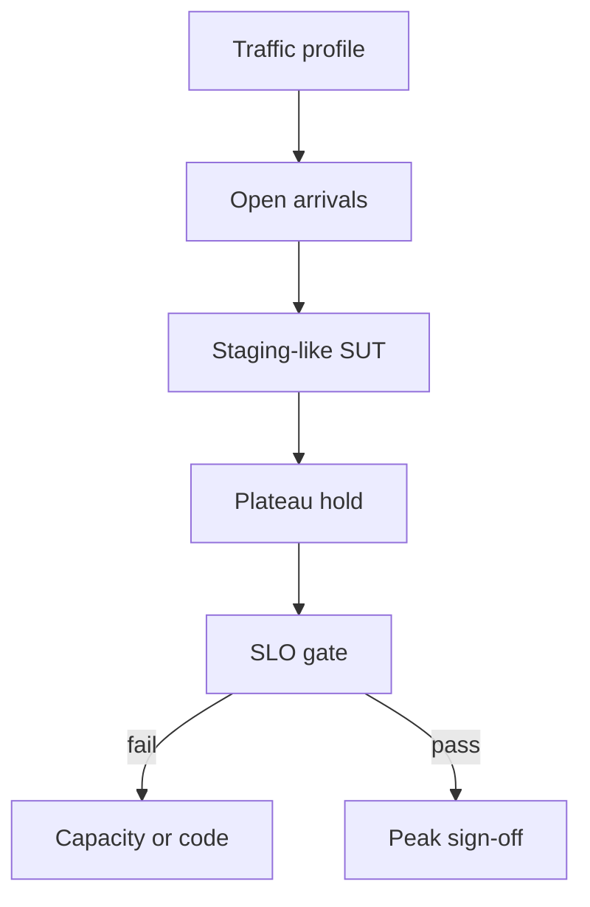

import { ConceptTemplate } from '@/features/kb/components/templates/ConceptTemplate'
import { Callout } from '@/features/kb/components/mdx/Callout'
import { ComparisonTable } from '@/features/kb/components/mdx/ComparisonTable'

export default function Layout({ children }) {
  return (
    <ConceptTemplate title="Load Testing">
      {children}
    </ConceptTemplate>
  )
}

**Load testing** replays or synthesises the traffic you *expect* to serve: Black Friday peak, Monday 9am batch, the hour after a push notification. The question is "can we hold the published SLO at that shape?" Stress testing is the sibling that pushes past that shape on purpose.

## 1. Deep Dive and Mechanics

**Profile.** Arrival rate over time (ramp, plateau, cool-down), mix of endpoints, payload sizes, think time, and geographic origins if latency to the edge matters.

**Closed versus open model.** Closed: a fixed pool of virtual users who loop. Open: arrivals from a Poisson or recorded process regardless of how slow the SUT is. Closed models self-throttle when the system slows (users wait); open models pile queues. Production is usually closer to open.

**Data.** Unique users, unique carts, warmed caches. Reusing one row serialises on a single lock and lies about throughput.

**Pass criteria.** Error rate, quantile latency, and saturation (CPU, DB connections) all stay inside budget for the full plateau.

<Callout icon="info" title="Ramp exists for a reason">
A vertical jump to peak confuses cold JIT, empty caches, and autoscalers. Ramp, then hold long enough for scale-out to finish.
</Callout>

## 2. Mathematical / Theoretical Foundation

**Arrival process.** A homogeneous Poisson process with rate λ is the textbook open model. For a recorded trace, use a counting process N(t) and replay with a speed factor.

**Little's Law** again: to sustain λ you need concurrency ≈ λ × (service + think). Under-VU closed tests cannot reach the target rate.

**Stability.** If offered load exceeds service capacity μ, the queue grows without bound. A load test that "passes" while the heap and connection pool climb is a soak failure waiting for a longer hold.

<ComparisonTable
  headers={['Model', 'Arrival', 'Risk if misused']}
  rows={[
    ['Closed (VU loop)', 'Limited by think time', 'Hides overload — users wait'],
    ['Open (constant rate)', 'Independent of SUT', 'Can melt the lab'],
    ['Trace replay', 'Historical shape', 'Stale mix, missing new endpoints'],
    ['Spike', 'Step function', 'Not a substitute for a plateau'],
  ]}
/>

## 3. Real-World Implementation

```javascript
import http from 'k6/http';
import { sleep } from 'k6';

export const options = {
  scenarios: {
    peak: {
      executor: 'ramping-arrival-rate',
      startRate: 10,
      timeUnit: '1s',
      preAllocatedVUs: 200,
      stages: [
        { target: 200, duration: '3m' },
        { target: 200, duration: '10m' },
        { target: 0, duration: '1m' },
      ],
    },
  },
  thresholds: {
    http_req_failed: ['rate<0.01'],
    http_req_duration: ['p(95)<400'],
  },
};

export default function () {
  http.get('https://staging.example.com/api/catalog');
  sleep(1);
}
```

`ramping-arrival-rate` is an open model. Pair it with a realistic catalog size.

## 4. Visualizations



## 5. Interview Prep

**Q: Load versus stress?**
**A:** Load = expected peak and the SLO. Stress = keep going until something breaks and watch the failure mode.

**Q: Why did we hit the RPS cap with 50 VUs?**
**A:** Closed model plus think time. Raise VUs or switch to an arrival-rate executor.

**Q: How long should the plateau be?**
**A:** Longer than autoscaler cooldown and longer than the slowest cache fill. Minutes, not ten seconds.

## 6. Production Use Cases

- **Seasonal retail peaks** signed off weeks ahead.
- **Ticket-on-sale** events with a known start instant.
- **API partners** whose contract includes a committed RPS.

<Callout icon="tip" title="Include the write path">
Read-only load tests bless a CDN and miss the checkout lock. Always weight a slice of creates and updates.
</Callout>
