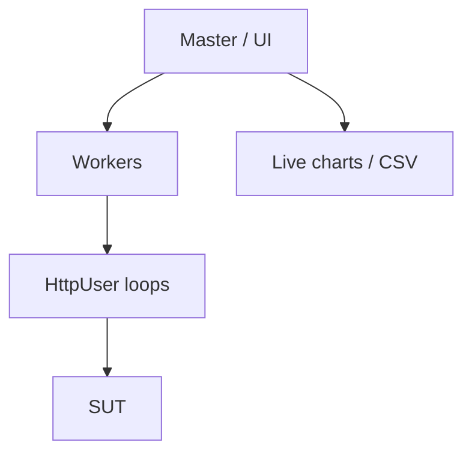

import { ConceptTemplate } from '@/features/kb/components/templates/ConceptTemplate'
import { Callout } from '@/features/kb/components/mdx/Callout'
import { ComparisonTable } from '@/features/kb/components/mdx/ComparisonTable'

export default function Layout({ children }) {
  return (
    <ConceptTemplate title="Locust">
      {children}
    </ConceptTemplate>
  )
}

**Locust** expresses load as Python: a `HttpUser` subclass, `@task` methods with weights, and `wait_time` between actions. You can click a web UI to spawn users, or pass flags in CI. Workers scale out over the network. If the team already lives in pytest, Locust feels like home.

## 1. Deep Dive and Mechanics

**Users and tasks.** Each virtual user loops: pick a task by weight, run it, wait. That is a **closed** model per user. Shape the population from the UI or `--users` / `--spawn-rate`.

**Events and hooks.** `on_start` for login. Custom clients exist for gRPC and others.

**Distributed.** One master, many workers. The master should not do heavy work; workers generate traffic.

**Headless.** `--headless -u 200 -r 20 -t 10m --csv out` for pipelines. Fail with a shape listener or by post-processing CSV.

<Callout icon="info" title="Python is the ceiling">
A slow task function (parsing huge JSON on the generator) caps RPS. Keep VU code thin; let the SUT be the bottleneck you measure.
</Callout>

## 2. Mathematical / Theoretical Foundation

Weighted tasks approximate a categorical mix: P(task i) = w_i / sum(w). Combined with `wait_time` this yields an offered load that *depends on response time* (closed). For a true open rate, use custom load shapes (`LoadTestShape`) that adjust user count over time — still not identical to k6 arrival-rate.

Distributed aggregation is a reduce over worker metrics. Clock skew affects only traces you correlate elsewhere.

<ComparisonTable
  headers={['Need', 'Locust', 'k6']}
  rows={[
    ['Language', 'Python', 'JavaScript'],
    ['Interactive spawn', 'Web UI', 'Cloud / less local UI'],
    ['Open-loop RPS', 'Via shapes', 'Native executors'],
    ['Team fit', 'pytest shops', 'JS / Grafana shops'],
  ]}
/>

## 3. Real-World Implementation

```python
from locust import HttpUser, task, between

class Buyer(HttpUser):
    wait_time = between(1, 3)

    @task(3)
    def catalog(self):
        self.client.get('/api/catalog')

    @task(1)
    def quote(self):
        self.client.post('/api/quote', json={'sku': 'abc', 'qty': 1})
```

```bash
locust -f locustfile.py --headless -u 100 -r 10 -t 5m --host https://staging.example.com
```

Add a check on `environment.stats.total.fail_ratio` in a listener if you need a hard CI gate.

## 4. Visualizations



## 5. Interview Prep

**Q: Locust versus k6?**
**A:** Locust if the team wants Python and a spawn UI. k6 if you want arrival-rate executors and thresholds as the default gate.

**Q: Why did adding workers not raise RPS?**
**A:** Master overloaded, workers CPU-bound in Python, or the SUT already saturated. Measure generator CPU.

**Q: How do you do unique logins?**
**A:** A feeder (CSV, queue) in `on_start`. Reusing one account serialises on that row's locks.

## 6. Production Use Cases

- **Python monorepos** that already share client models with the app.
- **Game days** where someone should be able to drag a slider without editing JS.
- **Custom protocols** wrapped in a Python client faster than waiting for an xk6 extension.

<Callout icon="tip" title="Weight the write path">
Three catalog GETs and one POST is closer to reality than a single hammered URL. Read the access log before you guess the weights.
</Callout>
