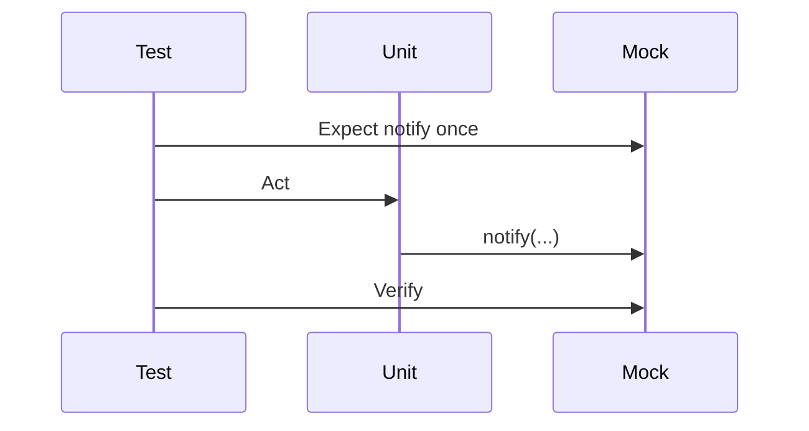

import { ConceptTemplate } from '@/features/kb/components/templates/ConceptTemplate'
import { Callout } from '@/features/kb/components/mdx/Callout'
import { ComparisonTable } from '@/features/kb/components/mdx/ComparisonTable'

export default function Layout({ children }) {
  return (
    <ConceptTemplate title="Mocking">
      {children}
    </ConceptTemplate>
  )
}

**Mocking** is a style of test double: you declare that `notifier.notify` must be called once with a given payload, run the unit, and fail if the conversation differed. Jest's `jest.fn()`, Mockito, and unittest.mock all implement this. Used on a narrow port, mocks document side effects. Used on everything, they fossilise implementation.

## 1. Deep Dive and Mechanics

**Expect then act.** Classic mock: set expectations, exercise the unit, verify. Loose mocks (many Jest tests) record everything and you assert afterwards — closer to a spy.

**What to mock.** Types you own that represent a side effect (email, payments, a clock). Do not mock the ORM, the filesystem driver, or a third-party SDK unless you wrap them.

**Argument matchers.** Exact equality is brittle for rich objects. Match on the fields that matter, or compare a value object.

**Partial mocks.** Mocking one method of a real object is a smell: the real methods may call the mocked one, or not, depending on refactors.

<Callout icon="warning" title="Mocks of types you do not own">
When Stripe's SDK adds a required argument, your green mocks still pass and production dies. Wrap the SDK; mock the wrapper.
</Callout>

## 2. Mathematical / Theoretical Foundation

A mock specifies a **trace** of the interface: a sequence of messages and allowed arguments. The unit is correct *with respect to that trace*, not with respect to the collaborator's real semantics.

Two traces can implement the same state machine (save then find versus upsert). A strict mock picks one trace and punishes the other — **over-specification**.

Behaviour-style tests specify a **postcondition** on state, which is stable under trace-equivalent refactors.

<ComparisonTable
  headers={['Style', 'Oracle', 'Best for']}
  rows={[
    ['Mock / spy', 'Calls and args', 'Fire-and-forget side effects'],
    ['Stub', 'Returned values', 'Inputs from a peer'],
    ['Fake', 'Resulting state', 'Rich in-memory protocols'],
    ['Integration', 'Real peer', 'SQL, HTTP, disks'],
  ]}
/>

## 3. Real-World Implementation

```javascript
test('emits an audit event once on refund', () => {
  const audit = { record: jest.fn() };
  const refunds = new RefundService(audit);
  refunds.refund('pay_1', 500);
  expect(audit.record).toHaveBeenCalledTimes(1);
  expect(audit.record).toHaveBeenCalledWith(
    expect.objectContaining({ type: 'refund', amount: 500 }),
  );
});
```

`objectContaining` keeps the mock from caring about timestamps you do not own.

## 4. Visualizations



## 5. Interview Prep

**Q: When is a mock the right double?**
**A:** When the only observable is that a side effect happened (send a message, charge a card) and you do not want a fake bus.

**Q: Why did a rename of a private method break 40 tests?**
**A:** You mocked internals. Mock ports, test through the public API.

**Q: Mock versus spy in Jest?**
**A:** `jest.fn()` is a spy you can also stub. Classic "mock" means failing on unexpected calls — Jest is usually loose unless you `toHaveBeenCalled`.

## 6. Production Use Cases

- **Notification and billing** ports in unit tests.
- **Time and randomness** injected as functions and mocked to a fixed value.
- **UI handlers** that must not hit the network; mock the API module at the boundary.

<Callout icon="tip" title="Count the mocks">
More than two mocks in one test usually means the unit does too much or you wanted a fake.
</Callout>
