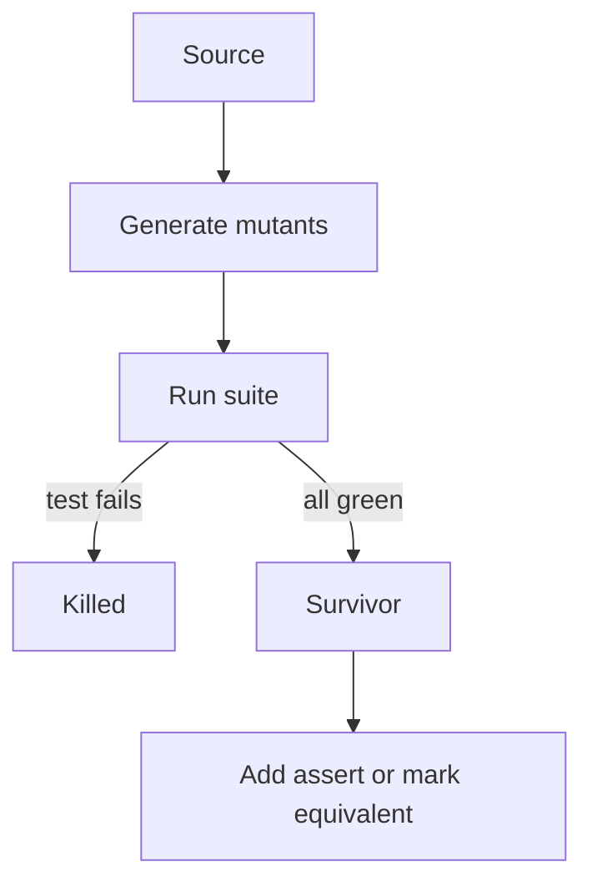

import { ConceptTemplate } from '@/features/kb/components/templates/ConceptTemplate'
import { Callout } from '@/features/kb/components/mdx/Callout'
import { ComparisonTable } from '@/features/kb/components/mdx/ComparisonTable'

export default function Layout({ children }) {
  return (
    <ConceptTemplate title="Mutation Testing">
      {children}
    </ConceptTemplate>
  )
}

**Mutation testing** answers a question coverage cannot: if this line were wrong, would any test fail? Tools (Stryker, PIT, mutmut) rewrite operators, constants, and conditions, run the suite, and score how many **mutants** died.

## 1. Deep Dive and Mechanics

**Mutant.** A small syntactic change: `>` becomes `>=`, `true` becomes `false`, a statement is deleted. Equivalent mutants (the program is still correct) are the hard case — they cannot be killed.

**Kill, survive, timeout.** A mutant is killed if a test fails. Survivors are either untested behaviour or equivalent code. Timeouts often mean you introduced an infinite loop.

**Where to run.** Mutation is expensive (suite × mutants). Restrict to a package, a PR diff, or a nightly job. PIT and Stryker cache and only mutate covered lines.

**Culture.** A 40 percent score on a new module is a teaching moment, not a shame metric. Do not gate merge on 100 percent.

<Callout icon="info" title="Coverage can be a liar">
A test that calls a function and asserts true is 100 percent line coverage and 0 percent mutation score. Mutants survive because nothing checked the result.
</Callout>

## 2. Mathematical / Theoretical Foundation

The **competent programmer hypothesis** says real bugs are often small syntactic deviations — the same neighbourhood mutants explore. The **coupling effect** claims that tests which kill simple mutants tend to catch more complex faults.

Mutation score = killed / (total − equivalent). Equivalent mutants make the denominator uncertain; in practice teams treat stubborn survivors as review items.

This is a dynamic **adequacy** criterion, stronger than branch coverage, still incomplete (it cannot invent missing requirements).

<ComparisonTable
  headers={['Metric', 'What it counts', 'Blind spot']}
  rows={[
    ['Line coverage', 'Executed lines', 'No oracle'],
    ['Branch coverage', 'Boolean outcomes', 'Weak asserts'],
    ['Mutation score', 'Killed faults', 'Equivalent mutants, cost'],
    ['Production incidents', 'Escaped faults', 'Hindsight only'],
  ]}
/>

## 3. Real-World Implementation

```javascript
// stryker.conf.json
{
  "mutate": ["src/pricing/**/*.ts"],
  "testRunner": "vitest",
  "thresholds": { "high": 80, "low": 60, "break": 50 }
}
```

Start on one directory. Read a surviving mutant: either add an assert or accept that the change is equivalent and ignore it.

## 4. Visualizations



## 5. Interview Prep

**Q: Why is mutation better than coverage?**
**A:** Coverage says a line ran. Mutation says a fault on that line was observed. Weak tests inflate coverage.

**Q: What is an equivalent mutant?**
**A:** A change that cannot affect any specified behaviour — for example removing a redundant `+ 0`. You cannot kill it without a vacuous test.

**Q: Can we run mutation on every PR?**
**A:** On the diff, sometimes. On the whole repo, almost never. Incremental mutation is the practical design.

## 6. Production Use Cases

- **Pricing, tax, and access-control** modules where a silent operator flip is catastrophic.
- **Coaching** a team that writes tests after the fact and asserts only "no throw."
- **Nightly quality** reports next to coverage, not instead of it.

<Callout icon="tip" title="Kill the mutant with a behaviour, not a white-box peek">
If the only way to kill it is to assert a private field, the unit's API is incomplete — or the mutant is equivalent.
</Callout>
