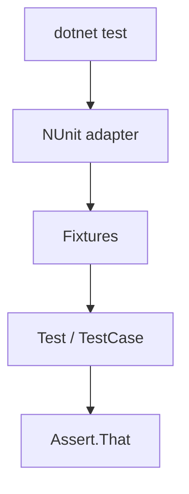

import { ConceptTemplate } from '@/features/kb/components/templates/ConceptTemplate'
import { Callout } from '@/features/kb/components/mdx/Callout'
import { ComparisonTable } from '@/features/kb/components/mdx/ComparisonTable'

export default function Layout({ children }) {
  return (
    <ConceptTemplate title="NUnit">
      {children}
    </ConceptTemplate>
  )
}

**NUnit** brought JUnit-style attributes to .NET (`[Test]`, `[SetUp]`, `[TestCase]`). It remains a first-class citizen in Visual Studio, `dotnet test`, and Azure Pipelines. Newer greenfield code often picks xUnit.net; existing line-of-business apps are still NUnit for miles.

## 1. Deep Dive and Mechanics

**Attributes.** `[TestFixture]` on a class (optional in modern NUnit), `[Test]` on methods, `[SetUp]` / `[TearDown]`, `[OneTimeSetUp]` for expensive clients.

**Cases.** `[TestCase(1, 2, 3)]` or `[TestCaseSource]` for generated rows. `[Values]` and `[Combinatorial]` will Cartesian-explode if you are not careful.

**Assert.** Classic `Assert.That(actual, Is.EqualTo(expected))` constraint model, plus multiple asserts in one test via `Assert.Multiple` so you see every failure.

**Parallel.** `[Parallelizable]` at fixture or method level. Shared statics will bite.

<Callout icon="info" title="dotnet test is the runner">
NUnit is the framework. The VSTest adapter plus `dotnet test` is how CI sees it. A green Visual Studio session and a red pipeline usually means the adapter or the filter, not NUnit itself.
</Callout>

## 2. Mathematical / Theoretical Foundation

Same product-space story as other runners: n `[Values]` on k parameters is n^k tests. Constraint assertions compose (And, Or, Not) as a small algebra over predicates — readable, easy to over-nest.

Fixture lifecycle is a state machine: OneTimeSetUp → (SetUp → Test → TearDown)* → OneTimeTearDown. Exceptions in SetUp skip the test; exceptions in TearDown fail the test after the fact.

<ComparisonTable
  headers={['Framework', 'Style', 'Typical home']}
  rows={[
    ['NUnit', 'Attributes + constraints', 'Legacy and many enterprises'],
    ['xUnit.net', 'Constructor injection, [Fact]', 'New .NET libraries'],
    ['MSTest', 'Inbox Microsoft', 'Some Azure-heavy shops'],
    ['TUnit', 'Newer AOT-friendly', 'Early adopters'],
  ]}
/>

## 3. Real-World Implementation

```csharp
[TestFixture]
public class CartTests
{
    [TestCase(100, 0.1, 110)]
    [TestCase(0, 0.1, 0)]
    public void TotalAppliesTax(decimal subtotal, decimal rate, decimal expected)
    {
        var cart = new Cart();
        cart.Add(subtotal);
        Assert.That(cart.Total(rate), Is.EqualTo(expected));
    }
}
```

Put `[Category("Integration")]` on tests that need SQL and filter them in CI (`--filter TestCategory=Integration`).

## 4. Visualizations



## 5. Interview Prep

**Q: NUnit versus xUnit?**
**A:** xUnit uses constructor setup and `[Fact]`/`[Theory]`, no `[SetUp]`. NUnit's lifecycle attributes are more explicit and more familiar to JUnit migrants. Neither is "more correct."

**Q: How do you share a database across tests?**
**A:** `[OneTimeSetUp]` for the container, `[SetUp]` for a transaction or a unique key. Parallelise only if isolation holds.

**Q: What is `Assert.Multiple` for?**
**A:** Collecting several independent checks so the first failure does not hide the second. Do not use it to smuggle two scenarios into one method.

## 6. Production Use Cases

- **.NET Framework** line-of-business apps that standardised on NUnit 3.
- **SpecFlow** (BDD) historically paired with NUnit as the runner.
- **Desktop and embedded** tests where the NUnit console still runs on a lab machine.

<Callout icon="tip" title="Keep TestCase readable">
If the argument list needs a comment per row, switch to `TestCaseSource` with named objects. Magic numbers in attributes rot.
</Callout>
