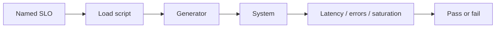

import { ConceptTemplate } from '@/features/kb/components/templates/ConceptTemplate'
import { Callout } from '@/features/kb/components/mdx/Callout'
import { ComparisonTable } from '@/features/kb/components/mdx/ComparisonTable'

export default function Layout({ children }) {
  return (
    <ConceptTemplate title="Performance Testing">
      {children}
    </ConceptTemplate>
  )
}

**Performance testing** asks whether the system is fast and cheap enough under a stated load. Functional tests ignore time. Performance tests treat time, queue depth, and hardware as first-class oracles. Without an SLO, you are just drawing charts.

## 1. Deep Dive and Mechanics

**The oracle.** An SLO such as "p99 checkout under 300 ms at 200 RPS" is a pass/fail line. Average latency hides the tail that users feel.

**Kinds.** Load (expected peak), stress (beyond peak), soak (hours, leaks), spike (sudden jump), scalability (add nodes, does work grow linearly).

**Environment.** A laptop is not production. Use production-like data volumes, warmed caches, and realistic mix (reads versus writes). Otherwise you tune a fantasy.

**Observability.** Pair the load generator with traces and profiles. A failed SLO without a flame graph is a ticket, not a diagnosis.

<Callout icon="warning" title="Never load-test production blindly">
Shared databases, rate limits, and real customers will notice. Use a dedicated cell, a replay of anonymised traffic, or a carefully capped canary.
</Callout>

## 2. Mathematical / Theoretical Foundation

**Little's Law:** L = λ W. Concurrent users L equal arrival rate λ times mean time in system W. If you want 2 seconds think time and 200 RPS, you need enough VUs to sustain λ.

**Percentiles.** p99 is the 0.99 quantile of the latency distribution. Means are pulled by both tails; SLOs should name quantiles and a window.

**Utilization.** For an M/M/1 queue, mean wait blows up as ρ → 1. Performance tests hunt the knee where latency goes nonlinear — that is capacity.

<ComparisonTable
  headers={['Discipline', 'Question', 'Typical tool']}
  rows={[
    ['Performance', 'Do we meet the SLO?', 'k6, Gatling, JMeter'],
    ['Load', 'Survive expected peak?', 'Same tools, peak profile'],
    ['Stress', 'Where and how do we break?', 'Ramp past capacity'],
    ['Profiling', 'Which function burns CPU?', 'perf, pprof, py-spy'],
  ]}
/>

## 3. Real-World Implementation

```javascript
import http from 'k6/http';
import { check } from 'k6';

export const options = {
  vus: 50,
  duration: '2m',
  thresholds: {
    http_req_duration: ['p(99)<300'],
    http_req_failed: ['rate<0.01'],
  },
};

export default function () {
  const res = http.get('https://staging.example.com/catalog');
  check(res, { ok: (r) => r.status === 200 });
}
```

Fail the pipeline if thresholds trip. Charts without a gate will be ignored.

## 4. Visualizations



## 5. Interview Prep

**Q: Why p99 instead of average?**
**A:** Users feel the slow requests. A 50 ms mean with a 4 s tail is a broken checkout for 1 in 100.

**Q: How do you make a performance test deterministic enough for CI?**
**A:** Pin the mix, warm up, use a stable staging size, and compare against a band — not a single millisecond. Nightly is fine if PR CI is too noisy.

**Q: Performance versus load versus stress?**
**A:** Performance is the family. Load is expected traffic. Stress is past the knee. Interviews reward that vocabulary.

## 6. Production Use Cases

- **Release gates** on search, checkout, and login.
- **Capacity planning** before a marketing spike.
- **Regression of a hot path** after a dependency upgrade.

<Callout icon="tip" title="Test the mix, not a single URL">
A catalog GET is not a checkout. Weighted scenarios (browse, search, buy) expose lock and cache behaviour that a ping never will.
</Callout>
