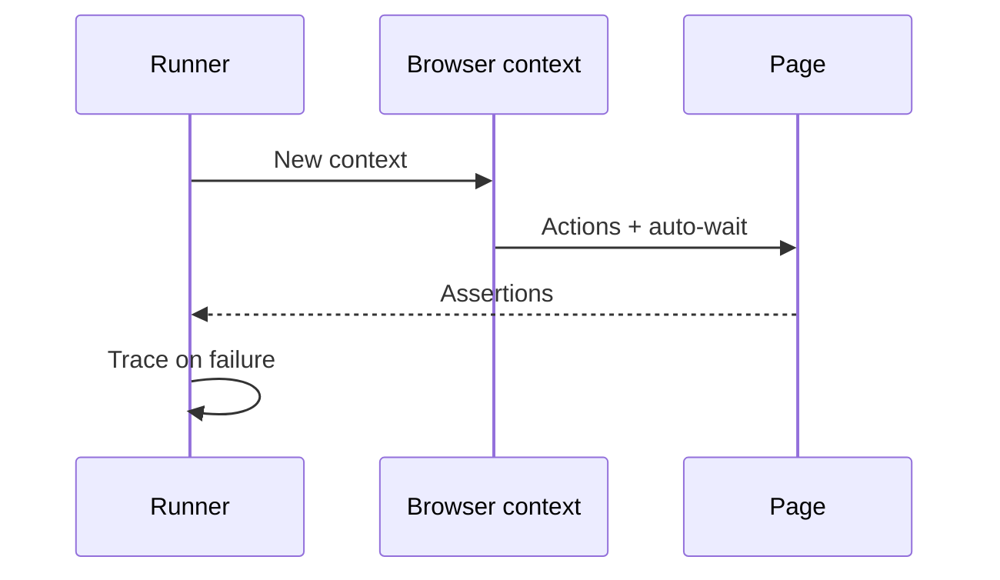

import { ConceptTemplate } from '@/features/kb/components/templates/ConceptTemplate'
import { Callout } from '@/features/kb/components/mdx/Callout'
import { ComparisonTable } from '@/features/kb/components/mdx/ComparisonTable'

export default function Layout({ children }) {
  return (
    <ConceptTemplate title="Playwright">
      {children}
    </ConceptTemplate>
  )
}

**Playwright** drives browsers from the outside via DevTools-style protocols, not from a script injected into the page (Cypress's original model). That design gives you multiple tabs, WebKit, contexts that mimic users, and a trace you can scrub when CI goes red.

## 1. Deep Dive and Mechanics

**Auto-wait.** Actions wait for actionability (visible, stable, enabled). You rarely `waitForTimeout`. Prefer `getByRole` over CSS soup.

**Contexts.** A `BrowserContext` is an isolated profile: cookies, storage, permissions. Parallel tests get separate contexts, not separate laptops.

**Network.** Route, abort, or fulfill requests. Stub the payment iframe; keep your app real.

**Trace viewer.** A zip of DOM snapshots, network, and console. Required artefact on failure — otherwise E2E is folklore.

<Callout icon="tip" title="Roles over selectors">
`getByRole('button', name: 'Pay')` survives a redesign. `#btn-17` does not. Accessibility trees are a stability feature.
</Callout>

## 2. Mathematical / Theoretical Foundation

The page is a state machine; auto-wait is polling a predicate until a timeout T. Flake rate falls when predicates are *conditions* (attached, visible) rather than wall-clock sleeps.

Isolation: n tests × 1 context each is n independent heaps. Shared `storageState` (logged-in cookie) is a controlled leak of auth, not of mutable app data.

<ComparisonTable
  headers={['Tool', 'Architecture', 'Strength']}
  rows={[
    ['Playwright', 'Out-of-process, multi-engine', 'Tabs, WebKit, traces'],
    ['Cypress', 'In-browser runner historically', 'Time-travel DX'],
    ['Selenium', 'W3C WebDriver', 'Grid, any language'],
    ['Puppeteer', 'CDP, Chromium-first', 'Scraping and Chrome'],
  ]}
/>

## 3. Real-World Implementation

```javascript
import { test, expect } from '@playwright/test';

test('checkout', async ({ page }) => {
  await page.goto('/cart');
  await page.getByRole('button', { name: 'Pay' }).click();
  await expect(page.getByRole('heading', { name: 'Thanks' })).toBeVisible();
});
```

Enable `trace: 'retain-on-failure'` in `playwright.config.ts`. Seed data through an API in `beforeEach`, not through the admin UI.

## 4. Visualizations



## 5. Interview Prep

**Q: Why is Playwright less flaky than old Selenium scripts?**
**A:** Auto-waiting and modern protocols, plus first-class traces. You can still write flakes with arbitrary sleeps and shared users.

**Q: Cypress versus Playwright?**
**A:** Playwright wins multi-tab, Safari/WebKit, and multiple origins. Cypress still has fans for its runner UI. New greenfield E2E is often Playwright.

**Q: How do you test file download?**
**A:** Wait for the download event, then read the suggested filename or path. Do not assert only that a button existed.

## 6. Production Use Cases

- **Required smoke E2E** on staging after deploy.
- **Visual comparisons** (Playwright screenshots) for a design system, with tight viewports.
- **API + UI** hybrid tests using `request` fixture to set up state.

<Callout icon="warning" title="Do not login through the UI in every test">
Reuse `storageState` from a setup project. Login UI deserves one or two tests, not 80 × 8 seconds.
</Callout>
